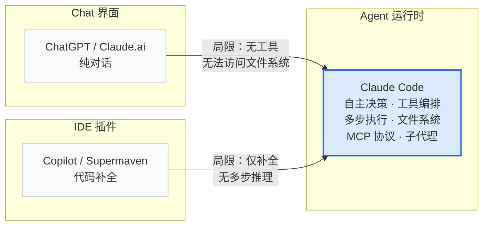
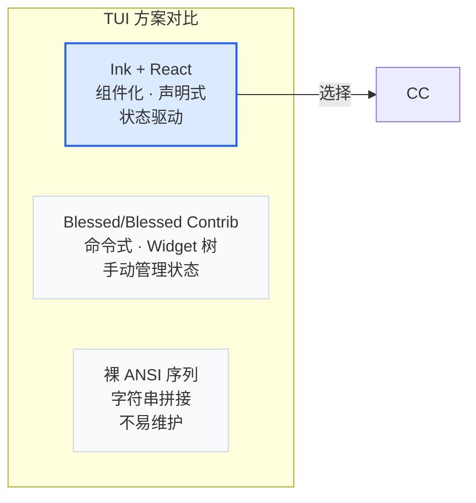
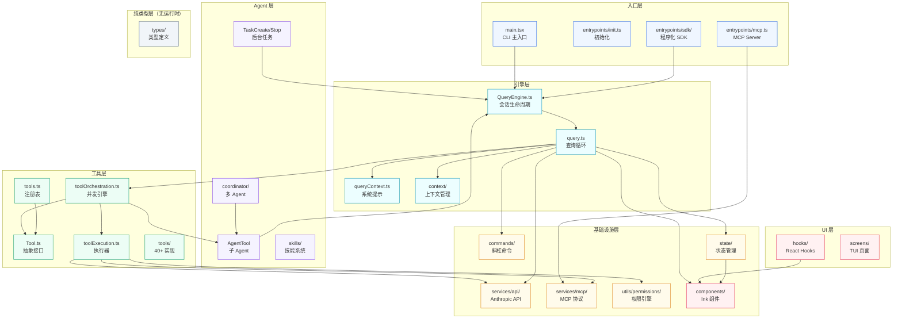
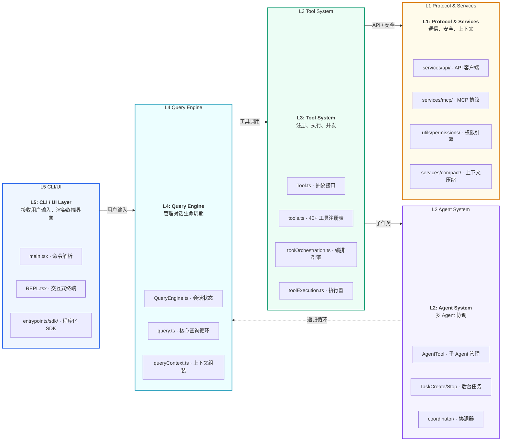
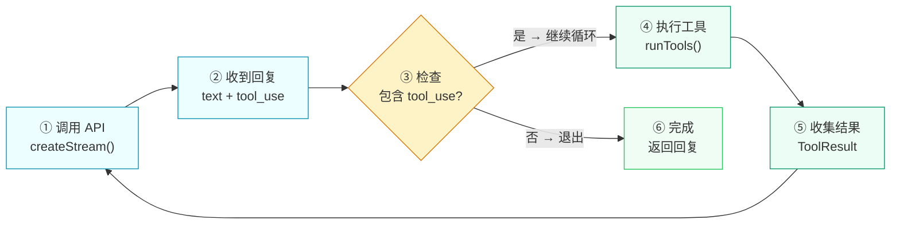
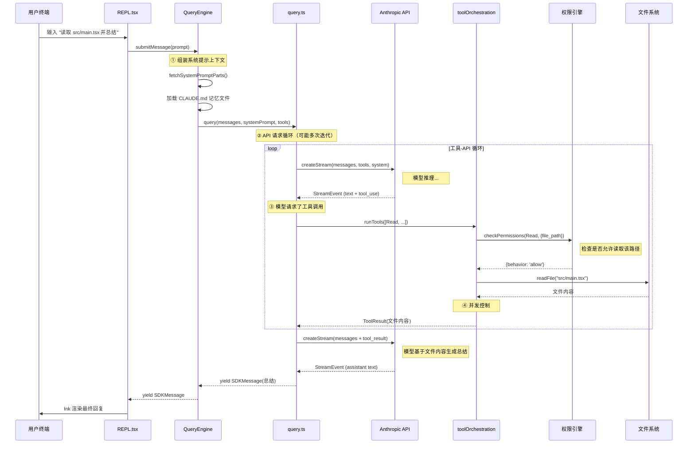
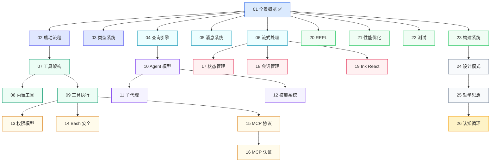

# Claude Code — 全景概览

> "理解一个大型系统，首先要站在足够高的地方俯瞰全局。"


## 引导思考

| 思考维度 | 内容 |
|----------|------|
| **它为什么存在** | <ul><li>读一个 49 万行的大型系统，最怕的就是一头扎进去迷失方向——这章就是你的全局地图</li><li>先搞清楚 Claude Code 整体长什么样，再深入到每个子系统——先整体后局部</li><li>没有全局坐标系，后面 25 章的细节就只是零碎的知识点</li></ul> |
| **它解决什么问题** | <ul><li>大型系统学习最怕的就是秒针故事——只知道某个功能怎么实现，不知道为什么这么设计</li><li>这章把 49 万行抽象成一张心智地图：技术栈选了什么、架构怎么分层、数据怎么流——读完心里有数</li></ul> |
| **它在系统中的位置** | <ul><li>对应的就是 src/ 根目录——不是指向某一个模块，而是划出整个系统的边界</li><li>说清楚了技术底座（Bun/React/Zod）、五层架构建模（L1-L5）、核心数据流怎么转</li><li>全书 25 章怎么看、子系统之间什么关系——这章就是索引和导航</li></ul> |
| **它如何工作** | <ul><li>先横向比：把 ChatGPT、Copilot、Claude Code 放在一起——纯对话 vs 代码补全 vs Agent 运行时</li><li>再纵向拆：从 CLI 一路拆到底层服务，五层结构每层管什么清清楚楚</li><li>最后动态串：拿一条完整的请求走一遍——用户输入是怎么变成模型回复的</li></ul> |
| **它如何实现** | <ul><li>Markdown + Mermaid + TypeScript 伪代码三件套——图展示关系、代码展示骨架</li><li>点到为止不深入——具体实现留给后续章节，但每个模块都标了精确的源码路径，按图索骥</li></ul> |
| **不同平台如何做** | <ul><li>同为 AI 编码助手，Claude Code、Cursor Agent、OpenClaw、Harness Agent 的架构理念截然不同：</li><li><strong>Claude Code（终端原生 Agent 运行时）</strong>——独立 TUI 应用，40+ 工具 + MCP + 子 Agent，终端里干完所有事</li><li><strong>Cursor Agent（AI 增强的 IDE，Agent 模式）</strong>——VS Code 深度改造，AI 嵌入编辑器每个角落，用户不离开 IDE</li><li><strong>OpenClaw（分布式 Agent 网络）</strong>——Agent 集群协作、跨机器通信、动态组队，更像 Agent 操作系统</li><li><strong>Harness Agent（DevOps 流水线集成）</strong>——CI/CD 生态的一等公民，构建测试部署一把抓</li></ul> |
| **优势是什么？** | <ul><li><strong>优势</strong><ul><li>俯瞰视角够高，五层抽象合理好理解</li><li>Mermaid 图让依赖关系一目了然</li><li>技术栈对比帮读者理解选型权衡</li></ul></li></ul> |

---

## 1.1 Claude Code 是什么

Claude Code 本质上是一个**终端原生的 AI Agent 运行时**。它不是聊天界面，不是代码补全插件，而是一个完整的、可以自主执行复杂多步任务的智能体系统。

### 核心定位



Claude Code 区别于纯对话界面和 IDE 插件的本质差异在于：**它能自主决策、调用工具、执行多步任务，并在循环中不断自我修正**。它的核心能力包括：

| 能力 | 说明 | 对应章节 |
|------|------|----------|
| **文件系统操作** | 读写文件、搜索代码库、带精确语义的编辑 | [09-TOOL-EXECUTION](./09-TOOL-EXECUTION) |
| **命令执行** | 在沙箱环境中运行 Bash/PowerShell | [14-BASH-SECURITY](./14-BASH-SECURITY) |
| **多轮对话** | 维护上下文窗口，自动压缩，会话恢复 | [18-CONVERSATION](./18-CONVERSATION) |
| **工具编排** | 并发执行多工具调用，安全控制 | [09-TOOL-EXECUTION](./09-TOOL-EXECUTION) |
| **权限系统** | 四层权限模型 | [13-PERMISSION-MODEL](./13-PERMISSION-MODEL) |
| **MCP 协议** | 连接外部工具和资源 | [15-MCP-PROTOCOL](./15-MCP-PROTOCOL) |
| **子 Agent** | 任务分解和多 Agent 协作 | [11-SUBAGENT](./11-SUBAGENT) |
| **认知循环** | Agent 生命周期组织、上下文管理、工具调用、任务执行、状态维护 | [26-COGNITIVE-LOOP](./26-COGNITIVE-LOOP) |

<div class="thinking-note">
### 思考笔记

Claude Code 的本质定位决定了后面所有章节的走向。理解它是什么，比理解它怎么实现更重要：

- **不是聊天界面** — 它不需要你逐条输入，它可以自主决策。你给一个目标，它自己规划步骤、执行工具、观察结果、调整策略。
- **不是代码补全** — 它不只是在编辑器里给你建议，而是直接在文件系统上操作、在终端里执行命令、通过 MCP 协议与外部服务交互。
- **是 Agent 运行时** — 这是一个完整的运行时环境，管理 Agent 的生命周期（QueryEngine）、工具系统（Tool）、上下文窗口（Compact）、安全边界（Permission）。所有后续章节讨论的架构，都是这个运行时的组成部分。

全书 26 章，就是围绕这个 Agent 运行时的六个核心问题展开的：生命周期怎么管、上下文怎么控、工具怎么调、任务怎么执、状态怎么维、循环怎么转。

</div>

系统注册了超过 40 种内置工具，工具列表**根据 feature flag、环境变量和运行时状态动态组装**：

```typescript
// src/tools.ts — 工具按 feature flag 条件编译
const SleepTool =
  feature('PROACTIVE') || feature('KAIROS')
    ? require('./tools/SleepTool/SleepTool.js').SleepTool
    : null
```

同一份代码可以构建出面向不同用户群体（内部员工 `ant` vs 外部用户 `external`）的不同产品形态。这种能力源于它独特的技术栈选型。

---

## 1.2 技术栈选型

### Bun 运行时

Claude Code 选用 Bun 而非 Node.js 作为运行时，核心考量有三：

**1. 编译时 Feature Flag（`bun:bundle`）**

```typescript
// src/tools.ts — DCE（死代码消除）示例
import { feature } from 'bun:bundle'

const OverflowTestTool = feature('OVERFLOW_TEST_TOOL')
  ? require('./tools/OverflowTestTool/OverflowTestTool.js').OverflowTestTool
  : null
```

当构建外部版本时，`OVERFLOW_TEST_TOOL` 为 `false`，整个工具模块被 tree-shaker 完全移除：
- 外部 binary 中不包含任何内部功能代码
- **零运行时开销** — 条件分支在编译时已消除
- **天然安全** — 内部功能不可能被意外激活

**2. 单文件可执行二进制**

`bun build --compile` 将整个应用（TypeScript + React + Ink）打包为一个独立二进制，无需用户安装 Node.js 或 npm 依赖。

**3. 启动性能**

Bun 的模块加载速度是 Node.js 的数倍，这对 CLI 工具至关重要——用户感知的"启动延迟"直接影响体验。

| 维度 | Bun | Node.js |
|------|-----|---------|
| 模块加载 | 内置模块缓存，~ms 级 | 需文件系统 I/O，~10ms+ |
| 打包 | 原生支持 `--compile` | 需 esbuild/webpack |
| Feature Flag | `bun:bundle` 编译时 DCE | 需额外工具链 |
| 类型检查 | 内置 TS 运行 | ts-node/tsx 桥接 |

### React + Ink 作为 TUI 框架

终端 UI 有多种实现路径，Claude Code 选择了 React + Ink：

```typescript
// 每个工具需定义多种渲染方法
export type Tool<Input, Output, P> = {
  renderToolResultMessage?(content: Output, ...): React.ReactNode
  renderToolUseMessage(input: Partial<z.infer<Input>>, ...): React.ReactNode
  renderToolUseProgressMessage?(...): React.ReactNode
}
```



React 的声明式组件模型使复杂的 TUI 组合变得可管理：工具执行的进度条、并行任务的拆分展示、流式输出——这些用命令式方式实现会迅速变得不可维护。

### Zod 作为运行时类型验证

```typescript
// src/types/hooks.ts — 使用 Zod v4 进行运行时类型校验
import { z } from 'zod/v4'

export const syncHookResponseSchema = lazySchema(() =>
  z.object({
    continue: z.boolean().optional(),
    suppressOutput: z.boolean().optional(),
    decision: z.enum(['approve', 'block']).optional(),
  }),
)
```

TypeScript 的类型系统只在编译期生效，运行时并不存在。Zod 在运行时接过了类型验证的责任——这对涉及用户输入和外部系统交互的场景（Hook 回调、MCP 消息、工具参数）至关重要。

> 详细分析见：[03-TYPE-SYSTEM](./03-TYPE-SYSTEM)

<div class="thinking-note">
### 思考笔记

技术栈选型看似是工程决策，实则是产品定位的折射：

- **Bun 的 Feature Flag 编译时 DCE** — 不是性能优化，而是安全策略。同一份代码可以构建出面向不同用户群体的版本，内部功能在外部构建中物理上不存在。这比运行时条件判断安全了一个数量级。
- **React + Ink 声明式 TUI** — 不是前端开发者的惯性选择，而是应对工具系统复杂性的必然。30+ 种工具各有不同的渲染需求（进度条、任务列表、流式输出），命令式 TUI 框架很快就会不可维护。
- **Zod 运行时验证** — 不是重复 TypeScript 的工作，而是弥补 TypeScript 的空白。编译期的类型安全在 API 边界处失效，Zod 在运行时接过了这个责任。

技术选型决定了系统的能力边界和可维护性。后面看到的各种设计——从 StreamingToolExecutor 到 Compact 系统——都是建立在这些底座之上的。

</div>

---

## 1.3 代码库全景

整个源代码按照**分层职责**组织，`src/` 目录结构如下：



`types/` 目录作为一个关键设计模式，只包含类型定义，没有运行时代码，用于打破模块间的循环依赖：

```typescript
// src/types/permissions.ts
/**
 * Pure permission type definitions extracted to break import cycles.
 *
 * This file contains only type definitions and constants with no
 * runtime import of implementation modules.
 */
```

> 类型系统设计的详细分析见 [03-TYPE-SYSTEM](./03-TYPE-SYSTEM)

<div class="thinking-note">
### 思考笔记

代码库全景展示的不只是文件结构，更是一个清晰的**架构分层**：

- **入口层**是系统的"皮肤"——它决定了系统怎么被调用。CLI、SDK、MCP Server 三种入口对应三种不同的使用场景。
- **引擎层**是系统的"大脑"——QueryEngine 管理会话生命周期，query.ts 驱动核心循环，context/ 管理上下文窗口。
- **工具层**是系统的"手"——40+ 工具各自负责一项具体操作，通过统一的 Tool 接口集成。
- **Agent 层**是系统的"决策层"——决定什么时候调什么工具、要不要创建子 Agent、怎么分配任务。
- **基础设施层**是系统的"骨架"——MCP 协议、权限系统、会话管理、紧凑策略，支撑上面所有层的运转。

这个分层结构不是理论模型，而是源码中物理存在的目录划分。每一层都有明确的职责和依赖方向，层与层之间通过接口而非实现耦合。

</div>

---

## 1.4 架构分层

Claude Code 的代码组织有很强的层次性。从入口到基础设施，共分五个清晰的层级，每一层只依赖下层、对上层提供服务。

### L1-L5 五层架构



| Layer | 职责 | 关键文件 | 依赖方向 |
|-------|------|----------|----------|
| **L5** CLI/UI | 接收输入、渲染输出 | `main.tsx`, `REPL.tsx`, `entrypoints/sdk/` | → L4 |
| **L4** Query Engine | 会话生命周期、API-工具循环 | `QueryEngine.ts`, `query.ts`, `queryContext.ts` | → L3 |
| **L3** Tool System | 工具注册、编排、执行 | `Tool.ts`, `tools.ts`, `toolOrchestration.ts` | → L2, L1 |
| **L2** Agent System | 子 Agent、后台任务、协调 | `AgentTool`, `coordinator/` | → L4 (递归) |
| **L1** Protocol/Services | 外部交互基础设施 | `services/api/`, `services/mcp/`, `permissions/`, `compact/` | 无 |

### 层间的关键交互

上图展示了静态的依赖关系，但系统的生命力在于层间动态交互。三个关键模式贯穿始终：

---

**模式一：查询循环（L4 → L3）**

L4 的查询循环是系统的心脏——它不断向 API 发送请求、接收响应，并在模型请求工具时将执行权交给 L3。



第 ④ 步在执行工具时，L3 会进一步将工具分为**并发安全**和**非并发安全**两类：

```typescript
for (const { isConcurrencySafe, blocks } of partitionToolCalls(toolUseMessages)) {
  if (isConcurrencySafe) {
    // 并发安全工具（Glob、Grep、Read）并行执行
    for await (const update of runToolsConcurrently(blocks, ...)) { ... }
  } else {
    // 非并发安全工具串行执行
  }
}
```

---

**模式二：子 Agent 递归（L3 → L2 → L4）**

当需要执行复杂任务时，L3 的工具执行器创建一个 AgentTool（L2），该工具会启动一个**全新的查询循环（L4）**来处理子任务。

```
用户请求 → L5 → L4(主) → L3 → L2(AgentTool) → L4(子) → L3(子工具) → L1
                                                      ↓
                                               结果返回主循环
```

这种递归扩展是 Claude Code 处理复杂伸缩性任务的根基——子 Agent 可以再创建自己的子 Agent，理论上可以无限嵌套。

---

**模式三：基础设施下沉（L3 → L1）**

工具执行时，L3 不直接处理外部交互，而是委托给 L1 的各个服务模块：

| 工具职责 | L1 支撑模块 |
|----------|-------------|
| 调用大模型 | `services/api/` → Anthropic API |
| 连接外部服务 | `services/mcp/` → MCP 协议 |
| 用户授权检查 | `utils/permissions/` → 权限引擎 |
| 上下文裁剪 | `services/compact/` → Auto Compact |

这种分离使工具实现可以专注于业务逻辑，而不用关心通信细节和安全策略。

> 深入阅读：查询循环 [04-QUERY-ENGINE](./04-QUERY-ENGINE)、工具执行 [09-TOOL-EXECUTION](./09-TOOL-EXECUTION)、子 Agent [11-SUBAGENT](./11-SUBAGENT)、权限模型 [13-PERMISSION-MODEL](./13-PERMISSION-MODEL)

---


<div class="thinking-note">
### 思考笔记

五层架构建模是理解 49 万行代码的"索引系统"——没有这个索引，你会在 src/ 的迷宫里迷路。

- L5（CLI/UI）是最薄的 layer——只负责接收输入和渲染输出，不含任何业务逻辑，是"关注点分离"的极致体现。
- L4（Query Engine）是整个系统的"循环泵"——所有消息、工具调用、状态变更都通过它流转。
- L3（Tool System）到 L2（Agent System）到 L1 的依赖是单向的——上层依赖下层，下层不知道上层存在。
- 子 Agent 的递归调用是唯一的逆向依赖——通过接口而非实现来解耦。

</div>

---
## 1.5 核心数据流：一次完整的对话生命周期

以一个完整请求为例，展示数据在各层之间的流转：



### 关键阶段说明

| 阶段 | 发生什么 | 涉及模块 |
|------|----------|----------|
| **① 上下文组装** | 加载系统提示、CLAUDE.md、用户设置，合并为完整 `system` 参数 | `QueryEngine.ts`, `queryContext.ts` |
| **② API 请求** | 将消息 + 工具描述发送给 Anthropic API，接收 SSE 流 | `services/api/` |
| **③ 工具决策** | 模型返回 `tool_use` 块，指示要调用的工具和参数 | `query.ts` |
| **④ 工具执行** | 按并发安全分组执行工具，收集结果反馈给模型 | `toolOrchestration.ts` |
| **⑤ 循环终止** | 模型不再产生 `tool_use`，输出最终文本回复 | `query.ts` |

### 核心查询循环（伪代码）

```typescript
export async function* query(params: QueryParams): AsyncGenerator<Message | StreamEvent> {
  while (true) {
    // 步骤 1：调用 API
    const stream = createStream(messages, systemPrompt, tools)
    for await (const event of stream) {
      yield event
    }
    // 步骤 2：检查是否需要调用工具
    if (hasToolUse(lastAssistantMessage)) {
      // 按并发安全策略分组执行
      for await (const update of runTools(toolUseBlocks, ...)) {
        yield update.message
      }
      continue  // 带上工具结果继续循环
    }
    break  // 模型完成回复，退出循环
  }
}
```

**关键特性**：自动继续——模型输出 `tool_use` 块时自动执行工具并反馈结果，用户无需干预。这意味着一个简单的问题可能触发 3-5 次 API 调用和 10+ 次工具执行。

### 权限决策模型

```typescript
export type PermissionResult<Input> =
  | PermissionAllowDecision<Input>   // behavior: 'allow'  — 直接放行
  | PermissionAskDecision<Input>     // behavior: 'ask'    — 请求用户确认
  | PermissionDenyDecision           // behavior: 'deny'   — 拒绝
  | { behavior: 'passthrough'; ... }                       // 透传
```

> 详见 [13-PERMISSION-MODEL](./13-PERMISSION-MODEL)

### 流式输出管道

```mermaid
%%{init: {"theme": "base", "themeVariables":{"primaryColor":"#3b82f6","primaryTextColor":"#1e293b","primaryBorderColor":"#60a5fa","lineColor":"#94a3b8","secondaryColor":"#f1f5f9","tertiaryColor":"#ffffff","fontFamily":"-apple-system, BlinkMacSystemFont, 'Segoe UI', 'PingFang SC', sans-serif"}}}%%
flowchart LR
    A["API Stream<br/>(SSE Event Stream)"] -->|"yield"| B["query()<br/>AsyncGenerator"]
    B -->|"yield"| C["QueryEngine<br/>.submitMessage()"]
    C -->|"yield"| D["REPL / SDK<br/>消息消费者"]
    D -->|"React render"| E["终端输出<br/>(Ink 组件树)"]

    style A fill:#fffbeb,stroke:#d97706
        style B fill:#ecfeff,stroke:#0891b2
    style C fill:#ecfeff,stroke:#0891b2
        style D fill:#eff6ff,stroke:#2563eb
    style E fill:#f0fdf4,stroke:#22c55e
```



整个数据管道贯彻三个设计原则：

- **背压控制**：消费者未拉取时，生产者暂停（AsyncGenerator 天然支持）
- **惰性计算**：只有被消费的消息才会触发处理
- **流式渲染**：模型还在生成时用户就能看到部分输出，不必等待完整回复

> 流式处理的深入分析见 [06-STREAMING](./06-STREAMING)

---


<div class="thinking-note">
### 思考笔记

一次完整的请求-响应周期是理解架构的最佳"测试用例"——它能串起从 L5 到 L1 的所有 layer。

- 整个数据流是一个"用户输入 → API → 工具 → API → 输出"的循环，不是"请求-响应"的一次往返。
- 流式处理让模型还在推理时用户就能看到部分输出——这改变了等待的心理感受。
- 权限检查在每次工具调用前执行，而不是请求开始时统一检查——"按需检查"而非"预先审批"。
- 每条路径都有明确的错误处理策略：API 超时重试、工具失败级联中止、输出超限截断。

</div>

---
## 1.6 学习路线图

本章俯瞰了整个系统的全貌。接下来的 25 章将按以下路线深入每个子系统：



| 模块分组 | 章节 | 核心主题 |
|----------|------|----------|
| **入门** | 02 | 启动流程、Feature Flag 初始化 |
| **类型系统** | 03 | 泛型设计、循环依赖破解 |
| **引擎核心** | 04-06 | 查询循环、消息模型、SSE 流 |
| **工具系统** | 07-09 | 架构、内置工具、执行流程 |
| **Agent 模型** | 10-12 | 决策循环、子代理、技能系统 |
| **基础设施** | 13-16 | 权限、安全、MCP 协议栈 |
| **UI & 状态** | 17-19 | 状态管理、会话、Ink 渲染 |
| **工程实践** | 20-23 | REPL、性能、测试、构建 |
| **升华** | 24-25 | 设计模式、哲学思想 |
| **认知框架** | 26 | Agent 生命周期、上下文管理、工具调用、任务执行、状态维护、认知循环 |

---

---

_Last updated: 2026-05-17_

---

**下一章 → [02-启动流程](./02-BOOTSTRAP)**


<div class="thinking-note">
### 思考笔记

学习路线图不只是一份阅读指南，更是架构的"导航图"——告诉你先学什么、后学什么。

- 从全景概览开始，按"启动 → 类型 → 引擎 → 消息 → 流"的顺序深入——由外到内的学习路径。
- 工具系统和 Agent 模型是承上启下的关键，理解了它们就理解了 Claude Code 的能力边界。
- 基础设施（权限、安全、MCP）是最容易被跳过但最重要的部分——它们是生产级系统的基石。
- 设计模式和哲学在最后，因为需要前面所有章节的上下文才能理解。

</div>

---