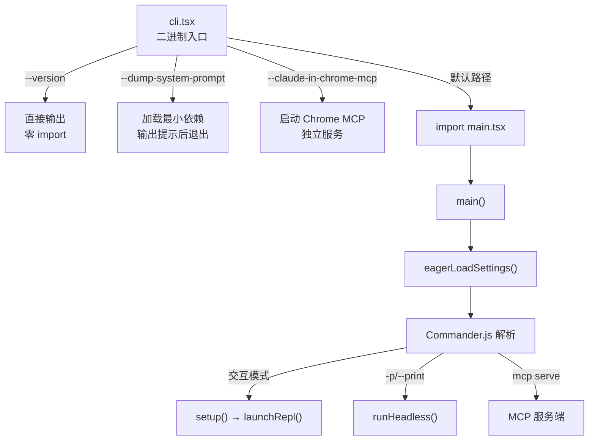
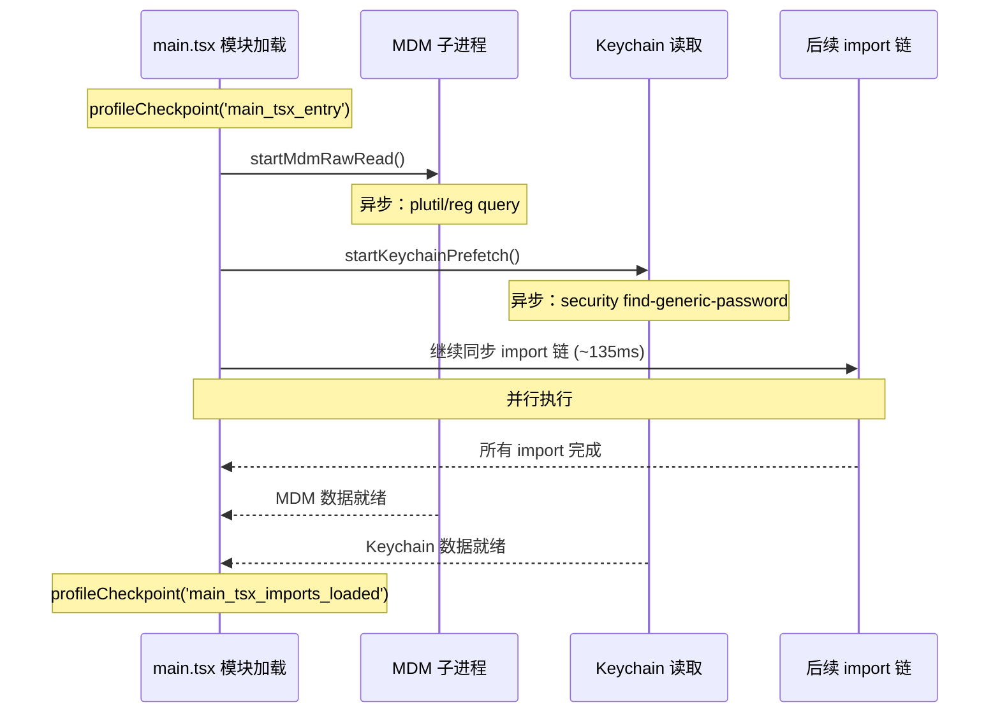
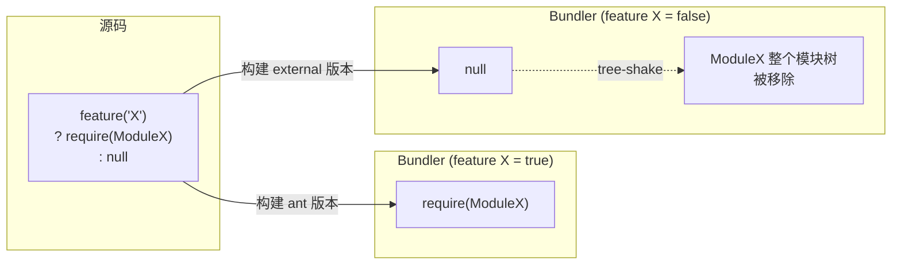
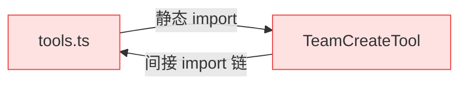
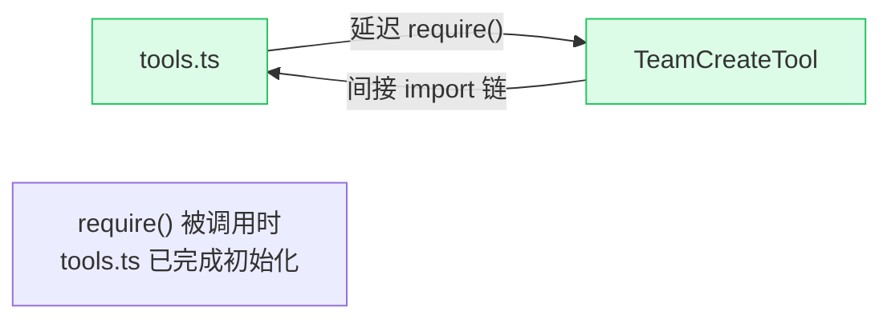
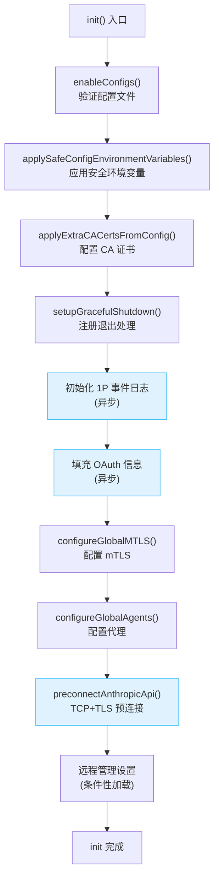

# Claude Code — 启动流程

> “一个 CLI 工具的启动时间决定了它能否被程序员日常使用。每多 100 毫秒的等待，就多一份切换回浏览器的冲动。”

## 引导思考

| 思考维度 | 内容 |
|----------|------|
| **它为什么存在** | <ul><li>用户敲完 claude 到出现提示符这 300ms 里发生了什么——这章就是在讲这个</li><li>一个 CLI 工具怎么从进程启动到完全就绪——编译时优化、并行预取、延迟加载，300ms 内全搞定</li></ul> |
| **它解决什么问题** | <ul><li>没有优化的 Node CLI 要 1-2 秒——等得人心烦</li><li>Claude Code 通过各种技术压到 300ms——到了"瞬间响应"的感知阈值</li></ul> |
| **它在系统中的位置** | <ul><li>沿 entrypoints/cli.tsx → main.tsx → init() 这条路径展开</li><li>在五层架构的 L5 层，REPL 交互开始之前——后面所有功能都依赖这个阶段完成的初始化</li></ul> |
| **它如何工作** | <ul><li>快速路径优先：--version 直接返回，连模块都不加载——零成本</li><li>并行预取：import 链在走的时候，后台已经把 MDM 和 Keychain 数据读好了——等待时间被藏起来了</li><li>分阶段：安全变量在信任确认前设好，完整变量在确认后设，迁移在配置加载后——每一步时序都有道理</li></ul> |
| **它如何实现** | <ul><li>cli.tsx 先判断你是要 --version、--mcp 还是正常启动，不同路径不同处理</li><li>main.tsx 在最顶部就启动了异步 I/O——利用 import 链的执行窗口</li><li>init() 被 memoize 保证只跑一次，里面是 enableConfigs → applySafeConfig → preconnectAnthropicApi 等 13+ 步</li><li>feature() 编译时把没启用的代码分支整个砍掉——内部特性不可能出现在外部产物里</li></ul> |
| **不同平台如何做** | 在启动策略上，四个平台选择了截然不同的路径：<br><br><ul><li><strong>Claude Code</strong>——Bun 单二进制，编译时 DCE，启动时并行预取 + 预连接，~300ms。核心思路：把能并行的都塞进 import 链的间隙</li><li><strong>Cursor Agent</strong>——Electron 壳层 + 编辑器体系，冷启动 2-5 秒，但后续复用长连接</li><li><strong>OpenClaw</strong>——发现节点、建集群、同步记忆，秒级到十秒级，但加入后就能被调度</li><li><strong>Harness Agent</strong>——嵌入式 CI/CD 组件，启动时间受流水线复杂度影响，但对冷启动没那么敏感</li></ul> |</ul> |
| **优势是什么？** | <ul><li><strong>优势</strong><ul><li>300ms 几乎感觉不到等待</li><li>并行预取把 I/O 藏进 import 链，设计很巧妙</li><li>feature() 宏又是安全又是性能——一举两得</li><li>迁移系统让跨版本升级不炸</li></ul></li></ul> |</ul></li></ul> |

---

## 2.1 入口点：从 cli.tsx 到 main.tsx

启动流程始于 `src/entrypoints/cli.tsx`，设计体现**快速路径优先**原则：

```typescript
// src/entrypoints/cli.tsx
async function main(): Promise<void> {
  const args = process.argv.slice(2);

  // 快速路径：--version 零模块加载
  if (args.length === 1 && (args[0] === '--version' || args[0] === '-v')) {
    console.log(`${MACRO.VERSION} (Claude Code)`);
    return;  // 零动态 import
  }

  const { main } = await import('../main.js');
  await main();
}
```

`--version` 甚至不加载 `startupProfiler` 模块，`MACRO.VERSION` 是构建时内联常量。

**环境预设**（任何模块加载前执行）：
```typescript
// 远程容器环境下增大 V8 堆上限
if (process.env.CLAUDE_CODE_REMOTE === 'true') {
  process.env.NODE_OPTIONS = `--max-old-space-size=8192`;
}
```

### 启动路径分流



<div class="thinking-note">
### 思考笔记

"快速路径优先"是 CLI 设计的黄金法则——不是优化问题，而是用户体验的分水岭。

- `--version` 零模块加载看起来简单，但实际上决定了用户对 CLI 的第一印象。300ms vs 2 秒，区别就是"瞬间"和"等一会儿"。
- 入口点分流的设计意味着不同使用场景走完全不同的代码路径——`--version`、`--mcp`、交互模式各有各的入口，互不干扰。
- 这个看似简单的分叉逻辑，是整个启动优化的根基——没有这个，后面的所有优化都只能靠"把一切加载快点"这种单一思路。

</div>

---

## 2.2 并行预取：与时间赛跑

`main.tsx` 前 20 行利用 **ES 模块 import 同步求值但内部异步操作后台执行** 的特性：

```typescript
// src/main.tsx — 文件最顶部（所有 import 之前）
import { profileCheckpoint, profileReport } from './utils/startupProfiler.js';
profileCheckpoint('main_tsx_entry');

import { startMdmRawRead } from './utils/settings/mdm/rawRead.js';
startMdmRawRead();  // 启动 MDM 子进程（异步）

import { startKeychainPrefetch } from './utils/secureStorage/keychainPrefetch.js';
startKeychainPrefetch();  // 并行启动两个 keychain 读取
```

### 并行预取时间线



**关键洞察**：两个 keychain 读取（OAuth + legacy API key）在 `applySafeConfigEnvironmentVariables()` 中会同步串行执行（约 65ms）。通过预取，这 65ms 被完全隐藏在后续 135ms import 之内。

### 延迟预取（首次渲染后）

```typescript
export function startDeferredPrefetches(): void {
  if (isEnvTruthy(process.env.CLAUDE_CODE_EXIT_AFTER_FIRST_RENDER) || isBareMode()) {
    return;
  }
  // 进程级预取（用户输入前完成）
  void initUser();
  void getUserContext();
  prefetchSystemContextIfSafe();
  // 云凭证预取
  if (isEnvTruthy(process.env.CLAUDE_CODE_USE_BEDROCK))
    void prefetchAwsCredentialsAndBedRockInfoIfSafe();
  // 文件计数（ripgrep，3秒超时）
  void countFilesRoundedRg(getCwd(), AbortSignal.timeout(3000), []);
}
```

全部 `void` 前缀，fire-and-forget，不阻塞 REPL 首次渲染。

<div class="thinking-note">
### 思考笔记

并行预取是"利用系统特性藏延迟"的教科书案例。

- ES Module 的 import 求值窗口是一个天然的时间缝隙——main.tsx 在最顶部就启动异步 I/O，恰好利用了后续 import 链的执行时间。
- 两个 keychain 读取如果能从同步改成异步预取，65ms 就被完全隐藏。这不是什么高深的技术，但需要你意识到"这个窗口可以藏东西"。
- startDeferredPrefetches 里的 fire-and-forget 模式进一步说明：不是所有事情都要在启动时做完，用户看到界面后的 100ms 也是可以利用的。

</div>

---

## 2.3 Feature Flag：编译时死代码消除

`feature()` 函数来自 Bun 的 `bun:bundle`，在编译期被求值为布尔常量：

```typescript
import { feature } from 'bun:bundle'

const WebBrowserTool = feature('WEB_BROWSER_TOOL')
  ? require('./tools/WebBrowserTool/WebBrowserTool.js').WebBrowserTool
  : null  // 整个模块树被 tree-shake 移除
```



### feature() vs process.env 运行时检查

| 维度 | `feature()` 编译时消除 | `process.env.X` 运行时检查 |
|------|----------------------|--------------------------|
| 产物大小 | 未使用代码物理移除 | 全部代码打包 |
| 运行时开销 | 零 | 每次条件检查有分支预测成本 |
| 安全性 | 内部代码不在产物中 | 代码存在，可被逆向 |
| 调试 | 需要不同构建产物 | 同一产物，改环境变量即可 |

`"external"` 是构建时被替换的宏，bundler 可进行同样的死代码消除。

---


<div class="thinking-note">
### 思考笔记

feature() 编译时 DCE 是 Bun 生态最独特的能力——不是"运行时不执行"，而是"编译时不存在"。

- 对比 process.env 运行时检查：条件分支在编译时就被求值并消除，未启用的代码分支物理上不在产物中。
- 编译时 DCE 不只是性能优化——外部构建中内部功能的代码连被逆向的机会都没有。
- feature() + require() 延迟加载的组合实现了"按需加载 + 编译时消除"的双重效果。
- 代价：不同 feature 组合需要不同的构建产物，测试需要覆盖多种构建配置。

</div>

---
## 2.4 延迟加载：require() 的策略性使用

### 模式 1：打破循环依赖

```typescript
const getTeamCreateTool = () =>
  require('./tools/TeamCreateTool/TeamCreateTool.js').TeamCreateTool
    as typeof import('./tools/TeamCreateTool/TeamCreateTool.js').TeamCreateTool
```





### 模式 2：条件加载 + 类型安全

```typescript
const coordinatorModeModule = feature('COORDINATOR_MODE')
  ? require('./coordinator/coordinatorMode.js')
    as typeof import('./coordinator/coordinatorMode.js')
  : null;
```

同时实现三个目标：编译时死代码消除 + 延迟加载 + 类型安全。

<div class="thinking-note">
### 思考笔记

feature() 同时解决安全、性能、代码组织三个问题，是编译时多态的经典应用。

- DCE 不只是性能优化——外部构建中内部代码物理不存在，比任何运行时守卫都安全。
- require() 延迟加载同时实现三个目标：打破循环依赖、按需加载、类型安全——一个模式三份收益。
- 与 process.env 运行时检查相比，编译时消除的代码连被逆向的机会都没有——安全是设计出来的，不是加固出来的。

</div>

---

## 2.5 profileCheckpoint 启动性能系统

```typescript
// src/utils/startupProfiler.ts
const DETAILED_PROFILING = isEnvTruthy(process.env.CLAUDE_CODE_PROFILE_STARTUP)
const STATSIG_SAMPLE_RATE = 0.005
const STATSIG_LOGGING_SAMPLED =
  process.env.USER_TYPE === 'ant' || Math.random() < STATSIG_SAMPLE_RATE
const SHOULD_PROFILE = DETAILED_PROFILING || STATSIG_LOGGING_SAMPLED
```

**两种工作模式**：
- **采样日志模式**：100% 内部用户 + 0.5% 外部用户，上报到 Statsig
- **详细分析模式**：`CLAUDE_CODE_PROFILE_STARTUP=1` 手动启用，输出完整时间线

当 `SHOULD_PROFILE = false` 时，`profileCheckpoint()` 是**空函数，零运行时开销**。

### 性能打点时间线

```
profileCheckpoint('main_tsx_entry')           // import 开始
// ... 135ms import 链 ...
profileCheckpoint('main_tsx_imports_loaded')   // import 结束
profileCheckpoint('main_function_start')       // main() 入口
profileCheckpoint('eagerLoadSettings_start')   // 配置加载开始
profileCheckpoint('eagerLoadSettings_end')     // 配置加载结束
```

### 详细报告

```
================================================================================
STARTUP PROFILING REPORT
================================================================================
    0ms    +0ms  profiler_initialized          [RSS: 45MB, Heap: 12MB]
    1ms    +1ms  cli_entry                      [RSS: 45MB, Heap: 12MB]
  137ms  +135ms  main_tsx_imports_loaded         [RSS: 89MB, Heap: 42MB]
  ...
  312ms  +174ms  main_after_run                 [RSS: 112MB, Heap: 58MB]
Total startup time: 312ms
================================================================================
```

---


<div class="thinking-note">
### 思考笔记

profileCheckpoint 是"预先埋点、事后分析"的性能观测模式——不是等出问题了才加日志。

- 双模式设计：0.5% 外部用户自动上报 + 内部用户 100% 上报 + 手动详细模式。
- profileCheckpoint 在非采样用户下是空函数——零开销的可观测性是最好的可观测性。
- 启动时间线精确到每毫秒——有了这个时间线，优化就不再是拍脑袋。
- "检测→报告→修复→验证"的闭环才是真正价值：不测量就无法优化。

</div>

---
## 2.6 init 流程：从配置到就绪

`init()` 被 `memoize` 包装，确保全局只执行一次：



### 分阶段环境变量应用

| 阶段 | 函数 | 执行时机 |
|------|------|----------|
| 安全 | `applySafeConfigEnvironmentVariables()` | trust 对话框之前 |
| 完整 | `applyConfigEnvironmentVariables()` | trust 建立之后 |

### preconnectAnthropicApi 预连接优化

TCP+TLS 握手通常需要 100-200ms。在 CA 证书和代理配置完成后立即发起预连接，使其与后续 ~100ms 初始化工作并行。第一次 API 调用时连接已就绪。

### 迁移系统

```typescript
const CURRENT_MIGRATION_VERSION = 11;
function runMigrations(): void {
  if (getGlobalConfig().migrationVersion !== CURRENT_MIGRATION_VERSION) {
    migrateAutoUpdatesToSettings();
    migrateBypassPermissionsAcceptedToSettings();
    migrateSonnet1mToSonnet45();
    migrateLegacyOpusToCurrent();
    migrateSonnet45ToSonnet46();
    migrateOpusToOpus1m();
    // ...
  }
}
```

**设计特点**：
- **版本门控**：`migrationVersion` 整数避免重复执行
- **幂等性**：每个迁移函数必须幂等
- **全量执行**：每次检查时运行所有迁移
- **异步分离**：`migrateChangelogFromConfig()` fire-and-forget，不阻塞启动

**模型演进历史**：`Fennec → Opus → Legacy Opus → Sonnet 1M → Sonnet 4.5 → Sonnet 4.6 → Opus 1M`

### 安全前置检查

```typescript
// 安全：防止 Windows 从当前目录执行命令
process.env.NoDefaultCurrentDirectoryInExePath = '1';

// 外部构建中检测并阻止调试器附加
if ("external" !== 'ant' && isBeingDebugged()) {
  process.exit(1);
}
```

<div class="thinking-note">
### 思考笔记

init() 的 13+ 步串行链展示了生产级 CLI 启动的完整复杂度。

- 安全前置（NoDefaultCurrentDirectoryInExePath、调试器检测）放在最开始——安全不可协商。
- TCP+TLS 预连接把 100-200ms 握手延迟藏进初始化流程——不是"优化"而是"时序设计"。
- 迁移系统的版本门控 + 幂等性设计保证跨版本升级不炸——CLI 工具不能热更新，必须在启动时完成所有迁移。
- 从 Fennec 到 Opus 1M 的模型演进历史——一个二进制要兼容多少代模型接口？

</div>

---

## 本章小结

| 优化手段 | 实现方式 |
|----------|----------|
| 快速路径优先 | `--version` 零 import，特殊入口延迟加载 |
| 并行预取 | 利用模块加载窗口并行执行 I/O |
| 编译时优化 | `feature()` 实现物理级代码消除 |
| 分阶段初始化 | 安全敏感操作在 trust 后执行 |
| 延迟到首次使用 | 预取结果在第一次需要时才被消费 |
| 可观测性内建 | profileCheckpoint 零成本（非采样用户） |

**最终效果**：典型 macOS 环境 300ms 左右启动时间，达到"瞬间响应"阈值。

---

---

_Last updated: 2026-05-14_