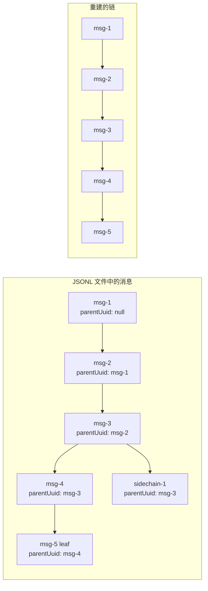
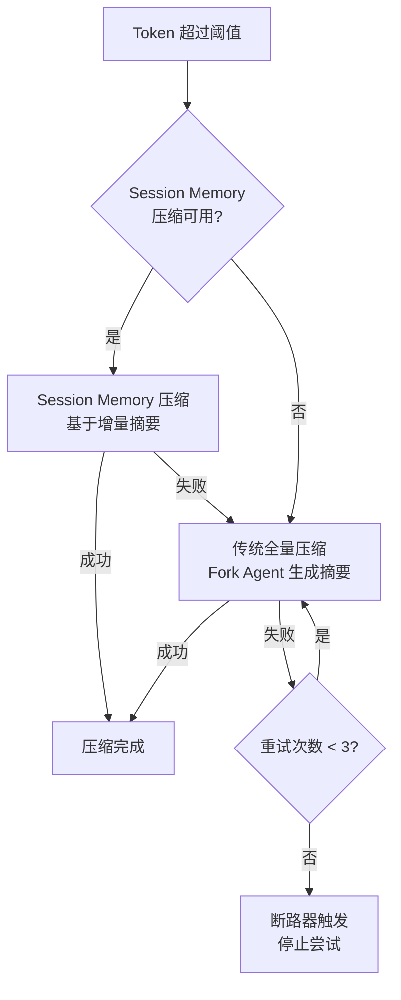
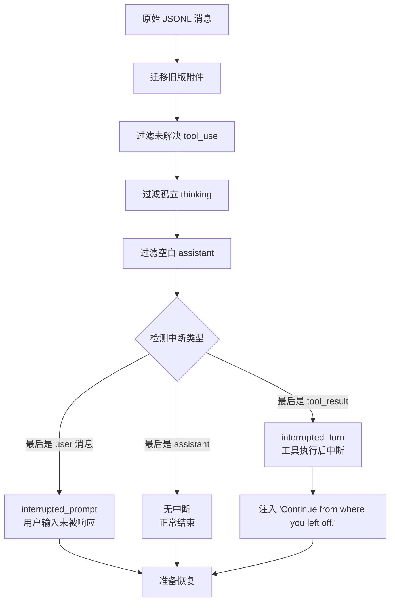

# 第 18 章：会话管理与压缩
> “大型语言模型的上下文窗口是有限的，但用户的工作流是无限的。如何在有限中容纳无限，是 Agent 工程的核心挑战。”当一个开发者与 Claude Code 持续工作数小时，对话历史可能积累到数十万 Token。一旦超出模型的上下文窗口限制，对话将无法继续。Claude Code 通过一套精密的会话压缩体系解决这一问题 —— 自动检测阈值、智能裁剪历史、保留关键上下文，并在需要时恢复先前的会话。本章将深入这一机制的每个层面。

## 引导思考

| 思考维度 | 内容 |
|----------|------|
| **它为什么存在** | <ul><li>模型上下文窗口就 200K，但用户干起活来可能是一整天的对话——怎么在有限里装无限，这章就是答案</li><li>既要不丢关键上下文又要自动压缩，还得支持断了续上——一个都不能少</li></ul> |
| **它解决什么问题** | <ul><li>对话超限了自动压缩历史释放 token 空间——不用用户手动点"清除历史"</li><li>写到一半电脑崩了、终端关了，--resume 能续上完整会话状态</li><li>断路器限制最多重试 3 次压缩——之前有个用户压了 3272 次都没成功，浪费了 250K API 调用/天</li></ul> |
| **它在系统中的位置** | <ul><li>嵌入在主循环层，每个轮次跑完检查要不要压缩</li><li>Transcript 文件是会话的持久化存储——支持恢复和事后审计</li></ul> |
| **它如何工作** | <ul><li>JSONL 一行一条消息追加写文件，每条消息带 parentUuid 形成链式结构</li><li>token 超了先走 MicroCompact（只替换旧工具输出摘要），不行再走全量压缩（Fork 一个 Agent 做总结）</li><li>中断恢复通过五层过滤管道识别中断类型，然后注入"请继续"提示</li></ul> |
| **它如何实现** | <ul><li>阈值公式：有效窗口 = 上下文窗口 - 输出预留 - 安全缓冲</li><li>MicroCompact 按时间裁剪旧工具输出，被清掉的内容用特殊标记占位</li><li>断路器限 3 次连续失败就停手——BQ 数据证明这消除了每天十万级别的浪费调用</li></ul> |
| **不同平台如何做** | <ul><li><strong>Cursor Agent</strong>：会话存 IDE 本地存储，用户手动点 Clear History——没有自动压缩</li><li><strong>OpenClaw</strong>：纯 JSON 日志，超了窗口直接丢掉最旧消息，不支持中断恢复</li><li><strong>Harness Agent</strong>：数据库持久化，支持滑动窗口裁剪和 LLM 摘要压缩</li></ul> |
| **优势是什么？** | <ul><li><strong>优势</strong><ul><li>JSONL 崩溃安全天然支持分支会话</li><li>MicroCompact + 全量压缩双策略保证成功率</li><li>PTL 降级给极端情况留了逃生通道</li></ul></li></ul> |

---

## 18.1 会话持久化 —— Transcript 机制

### 18.1.1 JSONL 日志格式
Claude Code 将每条消息以 JSON Lines 格式追加写入磁盘文件，即所谓的 Transcript 文件。这是一种只追加的日志结构：
每条消息是一行 JSON，包含消息内容、UUID、时间戳和父消息引用。这种格式有几个重要的工程优势：
1. **崩溃安全**：只追加写入，即使进程崩溃也不会损坏已有数据2. **链式结构**：`parentUuid` 字段形成消息链，支持分支会话3. **增量写入**：无需重写整个文件
### 18.1.2 会话链重建
从 JSONL 文件恢复消息时，系统需要重建消息链。`loadMessagesFromJsonlPath` 实现了这一逻辑：
`leafUuids` 是所有没有被其他消息引用为 parent 的 UUID 集合 —— 即链的末端。系统选择最新的非侧链叶节点作为起点，向上回溯重建主会话链。


<div class="thinking-note">
### 思考笔记

- JSONL（JSON Lines）格式是对话日志的天然选择：每行一条独立 JSON，追加写不涉及文件重写，崩溃安全。
- JSONL vs SQLite 的选择反映了"简单优先"的哲学——不需要数据库引擎，不依赖外部库，一个文件就能搞定持久化。
- 预写（pre-write）transcript 在消息产生前就写入磁盘——这是"先记日志再执行"的防御性编程模式，确保即使后面崩溃也有记录。
- fire-and-forget 的异步录制和预写模式看似矛盾，实则是两个不同场景：预写保底，异步补全。

</div>

---
## 18.2 自动压缩 —— Token 触发的历史裁剪

### 18.2.1 阈值计算
自动压缩的核心是阈值检测。当对话的 Token 数量逼近上下文窗口限制时，系统自动触发压缩：
对于一个 200K 上下文窗口的模型，计算过程如下：

### 18.2.2 压缩决策流程
`shouldAutoCompact` 函数实现了复杂的决策逻辑，包含多个递归守卫和实验性特性开关：

### 18.2.3 断路器模式
一个精巧的工程细节是连续失败的断路器：
注释中引用了真实的数据 —— “BQ 2026-03-10: 1,279 sessions had 50+ consecutive failures (up to 3,272)”，说明在没有断路器之前，某些会话在上下文不可恢复时会无限重试压缩，浪费约 250K API 调用/天。断路器限制为 3 次后，这些浪费被消除。

### 18.2.4 压缩执行
实际的压缩过程分为两个策略，按优先级尝试：


<div class="thinking-note">
### 思考笔记

- 上下文窗口不是无限制的——自动压缩机制是 LLM 应用中必不可少的能力，否则长对话会因 token 超限而强制中断。
- MicroCompact + 全量压缩双策略是"快失败 + 慢成功"的组合：MicroCompact 快速释放空间尝试解决，不行再走全量压缩的重型方案。
- 压缩本身也要消耗 API token——这是一个"用 token 换 token"的权衡：花一些 token 压缩历史，换来更大的可用窗口。
- 摘要压缩不可避免会丢失细节——这是所有 AI Agent 系统在上下文管理中面临的根本矛盾：信息完整性和 token 经济性不可兼得。

</div>

---
## 18.3 Snip 压缩 —— HISTORY_SNIP 特性

### 18.3.1 MicroCompact 机制
在触发全量压缩之前，Claude Code 先尝试一种更轻量的压缩方式 —— MicroCompact（微压缩），又称 Snip：
MicroCompact 的核心思想是：许多工具调用的原始输出（文件内容、命令输出、搜索结果）占据大量 Token，但在后续对话中已不再需要。系统可以将这些输出替换为简短的摘要标记，释放 Token 空间而不丢失关键语义。

### 18.3.2 时间维度的压缩策略
MicroCompact 采用基于时间的配置：
越老的工具输出越可能被压缩。`TIME_BASED_MC_CLEARED_MESSAGE` 标记（`'[Old tool result content cleared]'`）替换被清除的内容，让模型知道该位置曾有内容但已被清理。

### 18.3.3 缓存微压缩
对于内部使用的 `CACHED_MICROCOMPACT` 特性，系统维护了一个更精细的状态：
这些模块通过 `feature()` 宏进行条件加载 —— 在外部构建中，整个模块会被死代码消除，避免未使用的代码进入产品包。


<div class="thinking-note">
### 思考笔记

HISTORY_SNIP 是"有损压缩"在对话历史中的应用——移除冗余以换取更大的可用窗口。

- Snip 不是简单丢弃消息，而是智能选择"什么可以安全移除"。
- 被 snipped 的消息可以通过 --resume 恢复——transcript 中保留了完整记录。
- 压缩边界标记告诉系统"从这里开始压缩"——只压缩最旧的部分。
- 目标不是"最小化 token"，而是"在预算内最大化信息密度"。

</div>

---
## 18.4 压缩边界 —— compact_boundary 标记

### 18.4.1 CompactBoundary 消息
压缩的结果需要在消息流中标记一个清晰的边界。`SystemCompactBoundaryMessage` 类型承担了这一职责：

### 18.4.2 消息分组 —— API 轮次边界
压缩前需要将消息按 API 轮次分组，确保在安全的边界处切割：
分组以“新的 assistant 响应开始“为边界。同一个 API 响应中的多个消息（如流式传输的多个内容块）通过 `message.id` 识别 —— 它们共享同一个 ID，因此会被归入同一组。

### 18.4.3 压缩摘要生成
压缩的核心是通过一个分叉的 Agent 生成对话摘要。摘要 Prompt 要求模型产出结构化的九段式总结：
摘要使用 `<analysis>` 和 `<summary>` XML 标签包裹。`<analysis>` 是模型的“草稿本“，最终会被 `formatCompactSummary()` 剥离 —— 它的存在是为了提升摘要质量（让模型先思考再总结），但不占用后续对话的 Token。

### 18.4.4 PTL 重试机制
当压缩请求本身超出上下文窗口时（压缩需要发送全部消息给模型），系统有一个降级策略：
这是一个“有损但解除阻塞“的逃生通道 —— 当用户在极端情况下被卡住时，丢弃最老的上下文比完全无法继续要好。


<div class="thinking-note">
### 思考笔记

compact_boundary 标记是压缩算法的"路标"——记录哪些消息被摘要化了、摘要从哪开始。

- 微压缩边界（microcompact_boundary）和全量压缩边界（compact_boundary）区分了压缩深度。
- 压缩边界的定位决定了后续查询的上下文起点——边界之前是摘要，之后是完整消息。
- 多次压缩会形成多级压缩边界——最近的边界对应最近的压缩。
- 压缩边界的维护是"增量的"——不需要每次压缩都重建整个历史。

</div>

---
## 18.5 会话恢复 —— –resume 实现

### 18.5.1 恢复入口
`loadConversationForResume` 是会话恢复的统一入口，支持多种来源：

### 18.5.2 反序列化与中断检测
恢复过程中最复杂的部分是检测会话是否在中途被中断：

### 18.5.3 终端工具结果检测
一个微妙的边界情况处理 —— 当最后一条消息是 `tool_result` 时，需要判断这是否是正常的轮次结束（如 Brief 模式下 SendUserMessage 是最后一步），还是真正的中断：

### 18.5.4 技能状态恢复
压缩后，之前通过 `/skill` 加载的技能内容会丢失。恢复时需要从消息中重建技能状态：

### 18.5.5 Session Memory 压缩
Session Memory 是一种实验性的增量压缩策略。与传统的全量压缩不同，它在会话进行过程中持续维护一个“会话记忆“摘要：
当 Session Memory 压缩可用时，它优先于传统压缩执行。优势在于摘要是增量维护的，无需每次重新总结整个对话。


<div class="thinking-note">
### 思考笔记

--resume 是 Claude Code 最强大的"断点续传"功能——上次聊到一半，今天继续。

- Resume 的核心是 transcript 中记录的完整消息历史——每条消息的 UUID 和父链保证了恢复的确定性。
- 入口点存档记录了从对话开始到当前消息的完整路径——恢复时从入口点开始重放。
- 恢复时会跳过已经被压缩的消息——用摘要替换完整的压缩内容。
- 恢复的挑战：如果代码库在这期间发生了变化，恢复后的上下文可能已过时。

</div>

---
## 18.6 压缩后的上下文重建

### 18.6.1 Post-Compact 消息构建
压缩完成后，需要构建新的消息列表：
顺序至关重要：boundary 标记在最前（标明这是一个压缩恢复点），摘要紧随其后（提供上下文），保留的消息原样保持，最后是重新注入的附件（MCP 指令、技能列表等）。

### 18.6.2 摘要格式化
原始摘要包含 `<analysis>` 和 `<summary>` 标签。在发送给用户之前，`formatCompactSummary` 会清理格式：


<div class="thinking-note">
### 思考笔记

压缩后的上下文重建是 Resume 流程中反向操作的教科书案例——把压缩的消息还原为可用的上下文。

- 重建不是简单地把压缩摘要展开，而是基于摘要 + 剩余完整消息重新构建推理上下文。
- 摘要丢失的细节不可恢复——这是有损压缩的本质：压缩后的上下文永远不如原始上下文完整。
- 重建策略在不同章节之间自适应——代码分析场景需要更多上下文，简单问答场景需要更少。
- 重建后的上下文可能触发新的压缩——如果重建后 token 仍然超限，循环压缩机制再次启动。

</div>

---
## 本章小结
会话管理与压缩是 Claude Code 最体现“工程深度“的模块之一。从 JSONL 链式日志结构保证崩溃安全，到基于 Token 阈值的自动压缩触发，从按 API 轮次的安全分组到 PTL 降级重试，从中断检测的五层过滤管道到技能状态的跨压缩恢复 —— 每一个细节都在解决真实的用户痛点。
断路器模式的引入尤其值得品味。一行 `if (consecutiveFailures >= 3)` 的简单检查，基于 BQ 数据中 1,279 个异常会话的观察，消除了每天 250K 次浪费的 API 调用。这就是数据驱动工程的典范。
下一章我们将进入 Claude Code 的界面层 —— 看它如何在终端中运行一个完整的 React 应用。



```mermaid
%%{init: {"theme": "base", "themeVariables":{"primaryColor":"#3b82f6","primaryTextColor":"#1e293b","primaryBorderColor":"#60a5fa","lineColor":"#94a3b8","secondaryColor":"#f1f5f9","tertiaryColor":"#ffffff","fontFamily":"-apple-system, BlinkMacSystemFont, 'Segoe UI', 'PingFang SC', sans-serif"}}}%%
graph TD
    subgraph "Group 1 (API Round 1)"
        U1[User: "读取 main.ts"]
        A1[Assistant id=abc: tool_use Read]
        R1[User: tool_result]
        A2[Assistant id=abc: "文件内容是..."]
    end

    subgraph "Group 2 (API Round 2)"
        U2[User: "修改第 10 行"]
        A3[Assistant id=def: tool_use Edit]
        R2[User: tool_result]
        A4[Assistant id=def: "已修改"]
    end
```


