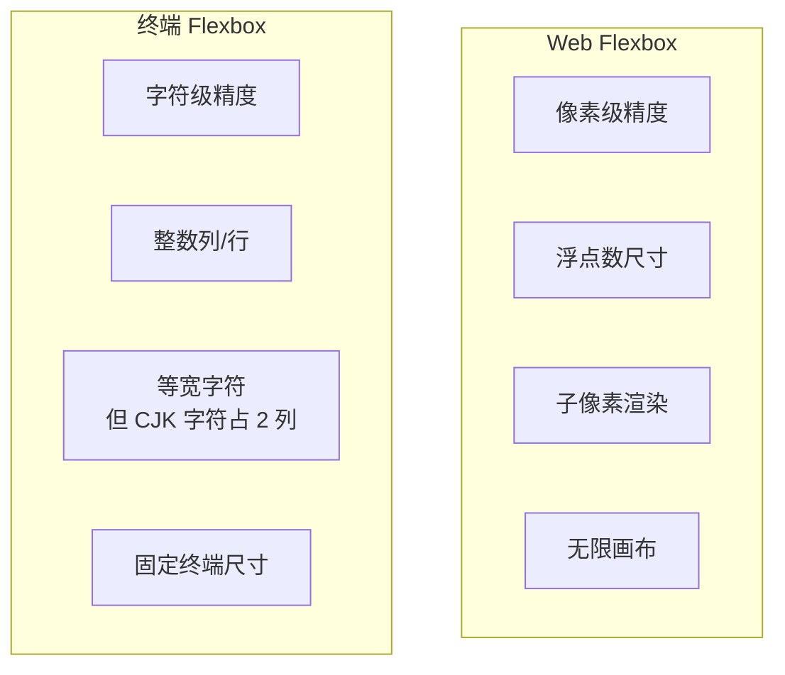
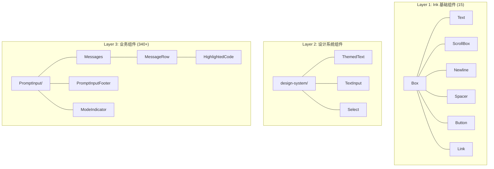
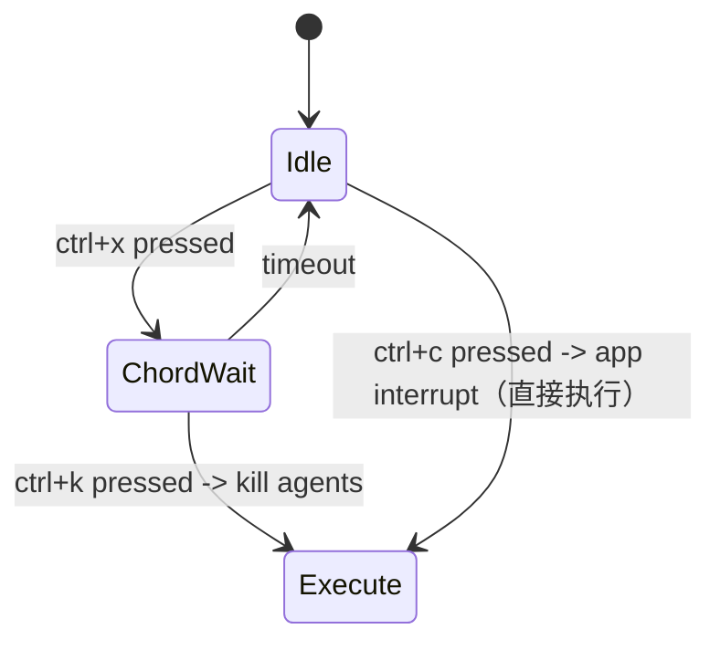
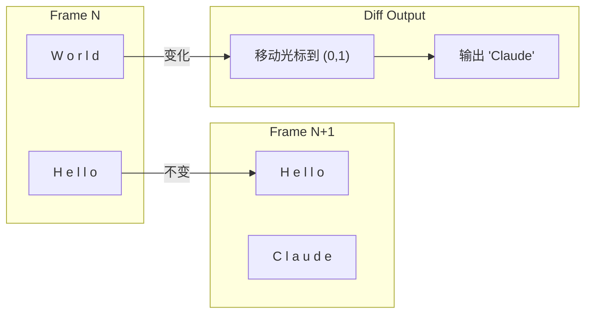

# 第 19 章：React + Ink 终端 UI
> “当我们说 Claude Code 是一个 React 应用时，这不是比喻 —— 它真的是一个 React 应用，只不过渲染目标不是浏览器 DOM，而是终端字符矩阵。”Claude Code 做出了一个大胆的架构决策：使用 React 和 Ink 框架在终端中构建完整的用户界面。这意味着组件化、响应式更新、Hooks、Context、虚拟 DOM diff —— 所有 React 生态的能力都被带入了终端世界。本章将深入剖析这一架构的工作原理。

## 引导思考

| 思考维度 | 内容 |
|----------|------|
| **它为什么存在** | <ul><li>Claude Code 真的是个 React 应用——只不过渲染目标不是浏览器 DOM 而是终端字符矩阵</li><li>组件化、响应式、Hooks、虚拟 DOM diff——所有 React 生态的能力都被搬进了终端</li></ul> |
| **它解决什么问题** | <ul><li>终端里做 flexbox 布局、焦点管理、键盘事件、颜色高亮——这些都是 Web 开发者的日常，但在终端里都得重新实现</li><li>差异化输出减少闪烁——每次只输出 ANSI diff 而不是全屏重绘</li><li>340+ 组件的规模说明这不是玩具——生产级终端富应用是真的</li></ul> |
| **它在系统中的位置** | <ul><li>终端输出渲染层，在 React 组件树和终端 ANSI 序列之间</li><li>src/ink/ 是 Ink 的完整深度定制实现（不是外部依赖），50+ 模块</li></ul> |
| **它如何工作** | <ul><li>Ink 用 react-reconciler 建 Fiber 树，通过节流的帧循环刷新到终端</li><li>Yoga WASM 算 Flexbox 布局——是的，终端的 flexbox 也是 Yoga 算的</li><li>writeDiffToTerminal 比较前后两帧差异，只输出变化部分的 ANSI 序列</li></ul> |
| **它如何实现** | <ul><li>ink.tsx 约 1720 行，用 ConcurrentRoot 支持 Suspense 和 startTransition</li><li>Screen 字符矩阵用对象池（CharPool/StylePool/HyperlinkPool）优化内存</li><li>Chord 键前缀状态机支持 Emacs 风格的两键序列</li></ul> |
| **不同平台如何做** | <ul><li><strong>Cursor Agent</strong>：WebView 里标准 HTML/CSS/JS——没有终端渲染的烦恼</li><li><strong>OpenClaw</strong>：用 React + Ink 标准版，没做深度定制</li><li><strong>Harness Agent</strong>：纯 Web UI（React + Tailwind），不涉及终端</li></ul> |
| **优势是什么？** | <ul><li><strong>优势</strong><ul><li>深度定制 Ink 给了完全控制权——从 Yoga WASM 到 Kitty 协议</li><li>React 生态无缝迁移，340+ 组件复用</li><li>差异化输出 + 对象池让终端体验流畅</li></ul></li></ul> |

---

## 19.1 Ink 框架 —— 在终端中运行 React 的原理

### 19.1.1 架构概览
Ink 是一个将 React 渲染到终端的框架。Claude Code 不仅使用了 Ink，还对其进行了深度定制 —— `src/ink/` 目录包含了完整的 Ink 实现，而非作为外部依赖引入：

### 19.1.2 渲染管线
整个渲染管线可以类比浏览器的渲染流程：

### 19.1.3 Ink 主类
`src/ink/ink.tsx` 中的 `Ink` 类是渲染循环的核心。它使用 `react-reconciler` 创建 Fiber 树，并通过节流的帧循环将变更刷新到终端：
关键设计：使用 `ConcurrentRoot` 而非 `LegacyRoot`，这意味着 React 的并发特性（Suspense、startTransition、useDeferredValue）在终端中同样可用。REPL 组件大量使用了 `useDeferredValue` 来延迟非关键更新。

### 19.1.4 Alt-Screen 模式
Claude Code 运行在终端的备用屏幕（Alt-Screen）中。这是一种终端特性，允许程序拥有独立的屏幕缓冲区，退出时自动恢复原始内容：
进入/退出 Alt-Screen 通过 DEC 私有模式序列控制：

### 思考笔记

- Ink 是一个"在终端里运行 React"的框架，原理是用 Yoga（Facebook 的跨平台 Flexbox 布局引擎）来计算终端元素的布局。
- 为什么是 React？不是终端需要 React，而是 Claude Code 的 340+ 组件已经用 React 写了——Ink 让这些组件可以不加修改地在终端中运行。
- Yoga WASM 的 freeRecursive 手动释放是一个重要的内存管理细节：WebAssembly 内存不被 JS GC 管理，不主动释放会造成内存泄漏。
- 结论：Ink 不是"在终端里装了个 React"，而是"让 React 组件树渲染成终端字符序列"——这是一个完全不同的问题域。

---
## 19.2 Yoga 布局 —— Flexbox 在终端的适配

### 19.2.1 Yoga 布局引擎
Yoga 是 Facebook 开发的跨平台 Flexbox 布局引擎，最初用于 React Native。Claude Code 将其编译为 WASM 并集成到终端渲染中。每个 `Box` 组件对应一个 Yoga 节点：

### 19.2.2 终端 Flexbox 约束
终端 Flexbox 与 Web Flexbox 有关键差异：
终端中一个“字符“是最小的布局单元。CJK 字符（中日韩）占据 2 列宽度，这在宽度计算中必须特殊处理。`src/ink/stringWidth.ts` 和 `src/ink/line-width-cache.ts` 专门处理这一问题。

### 19.2.3 Yoga 节点生命周期
注意 `freeRecursive()` 调用 —— Yoga 节点存在于 WASM 内存中，不受 JavaScript GC 管理，必须手动释放。`clearYogaNodeReferences` 在释放前清除所有引用，防止其他代码在并发操作中访问已释放的 WASM 内存。

### 思考笔记

Yoga 通过 WASM 在终端中运行 Flexbox 布局——比自建布局引擎更标准、更可靠。

- WASM Yoga 让 CSS Flexbox 规范在终端中可用——不需要重新实现一遍。
- Yoga 节点的 freeRecursive 手动释放是 WASM 内存的特殊要求——JS GC 管不到 WebAssembly。
- 终端中的 Flexbox：没有像素级精度，只有字符级精度。
- Yoga 的跨平台特性让布局在 macOS、Linux、Windows 终端中表现一致。

---
## 19.3 组件体系 —— 340+ 组件的设计分层

### 19.3.1 组件层次结构
Claude Code 的组件分为三个层次：

### 19.3.2 Ink 基础组件
`src/ink/components/` 中的基础组件是整个 UI 的构建块：
**Box** —— 终端中的 `
`，支持 Flexbox 布局：
**ScrollBox** —— 可滚动容器，这是终端 UI 中最复杂的组件之一。它需要处理虚拟化（不渲染屏幕外的内容）、滚动条、鼠标滚轮事件：
**Text** —— 终端中的文本节点，支持颜色、加粗、斜体、下划线、链接等样式。

### 19.3.3 业务组件矩阵
`src/components/` 目录包含 340+ 个业务组件，覆盖了应用的每个功能面：

### 19.3.4 VirtualMessageList —— 虚拟列表
对话界面使用虚拟列表优化性能，只渲染可见区域的消息：
虚拟列表维护搜索高亮状态，支持 `/` 搜索和 `n`/`N` 跳转 —— 这是仿 Vim 的交互模式。`WeakMap` 用于缓存每条消息的搜索文本（小写化后），避免重复计算。

### 思考笔记

- 340+ 组件的设计分层遵循"基础 → 组合 → 页面"的三层架构——基础组件（Text、Box）由 Ink 提供，组合组件（ProgressBar、TaskList）由 Claude Code 封装，页面组件（REPL、PermissionDialog）是最终产品。
- 差异化输出（diff output）是最值得学习的设计：不仅显示最终的 UI 状态，还计算当前帧和上一帧的差异，只输出变化的部分。终端 I/O 慢，减少输出就是优化体验。
- 对象池复用组件实例——不是每次渲染都新建组件，而是回收复用。这减少了终端渲染的抖动和闪烁。
- 终端 I/O 抽象层让 Claude Code 能支持多种终端协议（xterm、kitty、Windows Terminal），不需要为每种终端写不同的渲染逻辑。

---
## 19.4 键盘事件 —— 全局快捷键系统

### 19.4.1 键绑定架构
Claude Code 实现了一套完整的键绑定系统，支持上下文感知、用户自定义和组合键：

### 19.4.2 上下文分层
键绑定按上下文（Context）组织，不同的 UI 状态激活不同的绑定集：

### 19.4.3 Chord 键（组合键序列）
注意 `'ctrl+x ctrl+k': 'chat:killAgents'` —— 这是 Emacs 风格的 chord 键，需要按顺序按下两个组合键。实现上，系统维护一个 chord 前缀状态：

### 19.4.4 平台适配
键绑定包含平台特定的适配：
代码中引用了具体的 Node.js/Bun 版本号（`satisfies(process.versions.bun, '>=1.2.23')`），说明团队对终端兼容性问题有深入的追踪。

### 19.4.5 保留快捷键
某些快捷键（`ctrl+c`、`ctrl+d`）使用特殊的双击时间窗口处理，且不允许用户覆盖：

### 思考笔记

全局快捷键系统让终端工具拥有媲美 IDE 的键盘交互体验——不只是"打字"，而是"操控"。

- 快捷键注册从 REPL 到所有子组件共享——焦点变化不影响快捷键响应。
- 斜杠命令（/skills、/plan）的解析也是快捷键——一个 / 字符切换到命令模式，和 Vim 的 : 如出一辙。
- 快捷键设计的核心原则：常用操作有快捷键，不常用的走斜杠命令。
- Vim 模式的状态机（normal/insert/visual）是快捷键系统的巅峰——每种模式下按键有不同语义。

---
## 19.5 终端 I/O —— 抽象层设计

### 19.5.1 ANSI 解析器
`src/ink/termio.ts` 导出了一个完整的 ANSI 转义序列解析器，灵感来自 ghostty、tmux 和 iTerm2：

### 19.5.2 CSI/OSC/DEC 序列
终端 I/O 层按序列类型组织：
关键序列示例：

### 19.5.3 Screen 字符矩阵
`src/ink/screen.ts` 实现了一个高性能的屏幕缓冲区，使用对象池（Pool）优化内存分配：

### 19.5.4 差异化输出
`writeDiffToTerminal` 实现了终端的增量更新 —— 比较前后两帧的 Screen，只输出变化的部分：
这种差异化更新是终端应用流畅的关键。不同于 Web 浏览器的增量 DOM 更新，终端中每次“全屏重绘“意味着输出整个屏幕的字符序列，会导致明显的闪烁。差异化只在必要位置发送 ANSI 序列，最小化输出量。

### 19.5.5 Kitty 键盘协议
Claude Code 支持 Kitty 键盘协议，这是一种现代终端扩展，能区分按键修饰符的组合：
Kitty 协议允许区分 `ctrl+shift+f` 和 `ctrl+f` —— 在传统终端中这两者会产生相同的控制字符。Claude Code 利用这一能力实现了更丰富的快捷键（如 `cmd+shift+f` 用于全局搜索）。

### 思考笔记

终端 I/O 抽象层让 Claude Code 支持多种终端协议——不依赖单一终端的能力。

- 抽象层屏蔽了不同终端（xterm、kitty、Windows Terminal）的协议差异。
- 差异化输出（计算当前帧和上一帧的差异，只输出变化部分）减少终端 I/O。
- 对象池复用组件实例——不是每次渲染都新建组件，减少抖动和闪烁。
- 终端 I/O 的优化原则：终端渲染比 DOM 渲染更昂贵，每次输出都是真实 I/O。

---
## 本章小结
React + Ink 的终端 UI 架构是 Claude Code 最富创新性的技术决策之一。它证明了 React 的组件模型和渲染管线可以适配到任何输出目标 —— 浏览器 DOM、Native View、甚至字符矩阵。
深度定制的 Ink 框架（而非作为外部依赖使用）给予了团队完全的控制权：从 Yoga WASM 内存管理到 Kitty 键盘协议支持，从差异化终端输出到对象池内存优化。340+ 个业务组件的规模也说明，这不是一个“玩具级“的终端 UI，而是一个生产级的富应用。
下一章我们将聚焦 REPL 组件 —— 这个 5000 行的巨型组件如何组织代码、处理输入、渲染消息、管理权限对话。

```mermaid
%%{init: {"theme": "base", "themeVariables":{"primaryColor":"#3b82f6","primaryTextColor":"#1e293b","primaryBorderColor":"#60a5fa","lineColor":"#94a3b8","secondaryColor":"#f1f5f9","tertiaryColor":"#ffffff","fontFamily":"-apple-system, BlinkMacSystemFont, 'Segoe UI', 'PingFang SC', sans-serif"}}}%%
flowchart LR
    JSX[React JSX<br/>组件树] --> Reconciler[React Reconciler<br/>Fiber 树 diff]
    Reconciler --> DOM[Ink DOM<br/>虚拟节点树]
    DOM --> Yoga[Yoga Layout<br/>Flexbox 计算]
    Yoga --> Render[renderNodeToOutput<br/>遍历节点树]
    Render --> Screen[Screen<br/>字符矩阵]
    Screen --> Diff[终端 Diff<br/>最小更新]
    Diff --> Terminal[ANSI 输出<br/>终端显示]
```

