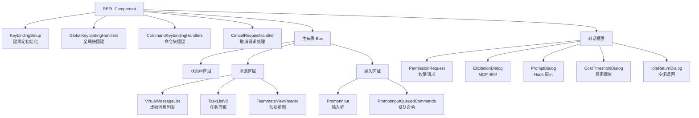
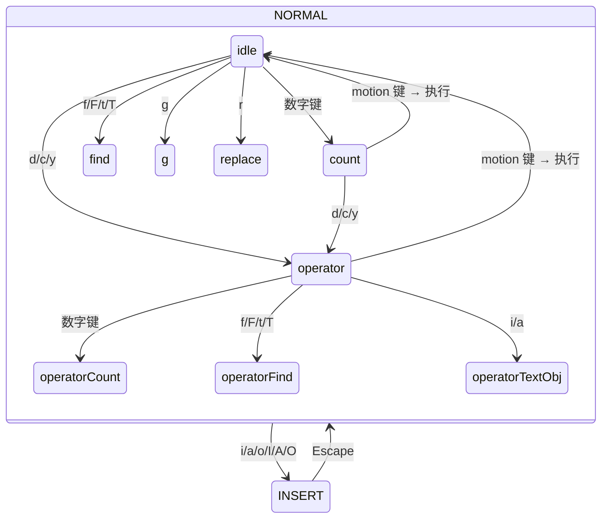
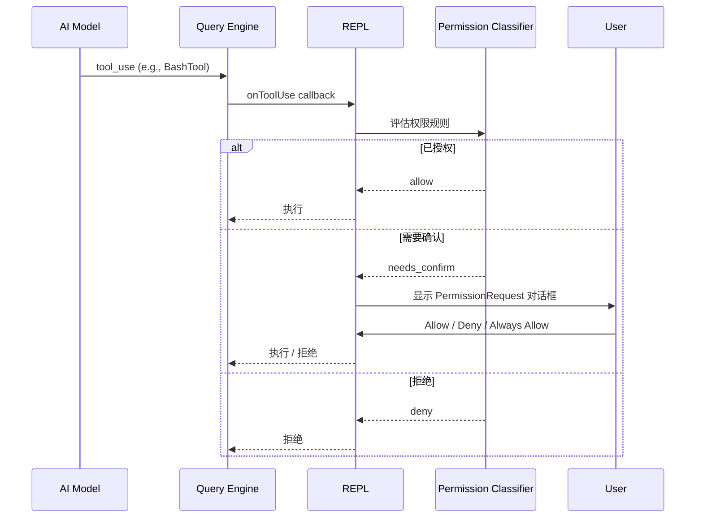
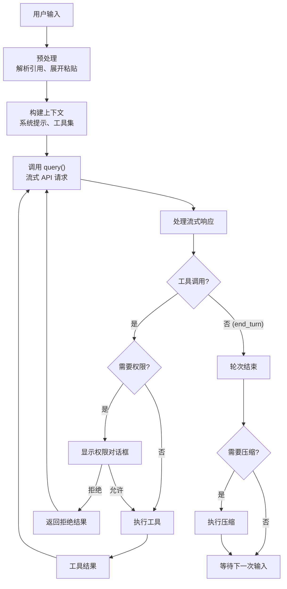

# 第 20 章：REPL 实现
> “REPL —— Read-Eval-Print Loop，一个看似简单的概念，在 Agent 系统中却演化为一个包含查询循环、权限协商、推测执行、多 Agent 路由的复杂有机体。”`src/screens/REPL.tsx` 是 Claude Code 的主界面组件，5000+ 行代码使其成为整个代码库中最大的单个文件。它不仅仅是一个“输入-输出“界面，而是整个应用的中枢神经系统 —— 管理着消息流、工具调用、权限协商、会话恢复、多 Agent 协调等几乎所有核心功能。本章将解构这一巨型组件的内部结构。

## 引导思考

| 思考维度 | 内容 |
|----------|------|
| **它为什么存在** | <ul><li>REPL 是 Claude Code 的主界面——5000+ 行代码让它成了整个代码库里最大的单文件</li><li>它不只是一个输入输出界面，是整个应用的中枢神经系统</li></ul> |
| **它解决什么问题** | <ul><li>管理消息流的双向管道：用户输入往下走、模型响应往上走、工具结果往侧边走——全得经过 REPL</li><li>权限确认可能来自本地 UI 也可能来自远程 Bridge——用 claim() 机制在两者间竞赛，先回的先得</li><li>推测执行：你在打字的时候系统已经在后台猜你要干啥了</li></ul> |
| **它在系统中的位置** | <ul><li>整个应用的门面——所有子组件（PromptInput、VirtualMessageList、PermissionRequest、TaskList）都由它协调</li><li>会话恢复、token 预算、推测执行——这些横切关注点都在 REPL 里集成</li></ul> |
| **它如何工作** | <ul><li>查询循环：用户输入 → 预解引用 → 构建上下文 → 调 API → 流式响应 → 执行工具 → 检查压缩</li><li>权限请求通过 claim() 机制在本地 UI 和远程通道间竞赛——就像分布式选举</li><li>推测执行在用户输入时后台预跑可能用到的工具</li></ul> |
| **它如何实现** | <ul><li>src/screens/REPL.tsx 5000+ 行，大量用 feature() 宏做条件编译</li><li>PromptInput 有 21 个文件，Vim 模式的状态机堪比嵌入式 mini-vim</li><li>会话恢复集成了一整套流程：加载历史 → 重建缓存 → 恢复 Agent 上下文</li></ul> |
| **不同平台如何做** | <ul><li><strong>Cursor Agent</strong>：用 VS Code WebView 面板当 Chat 界面，没有 TUI 渲染</li><li><strong>OpenClaw</strong>：REPL 大概 1000 行，功能简单不少——没有推测执行和 token 预算</li><li><strong>Harness Agent</strong>：纯 Web Dashboard + REST API，没有终端交互</li></ul> |
| **优势是什么？** | <ul><li><strong>优势</strong><ul><li>5000+ 行单文件集中体现 Agent 系统的完整复杂度</li><li>Vim 模式状态机媲美编辑器级输入体验</li><li>推测执行 + token 预算这些前沿特性都深度集成了</li></ul></li></ul> |

---

## 20.1 REPL 组件 —— 5000 行主界面的结构

### 20.1.1 导入分析
REPL 组件的导入列表本身就是一份架构文档。仅前 200 行就导入了超过 100 个模块：

### 20.1.2 条件导入与死代码消除
REPL 大量使用 `feature()` 宏进行条件导入，确保内部特性不泄露到外部构建：
这种模式的精妙之处在于：当 `feature('VOICE_MODE')` 在编译时为 `false` 时，整个 `require` 分支被消除，相关模块根本不会进入产品包。替代的空实现保持了类型兼容性，调用方无需任何条件判断。

### 20.1.3 组件结构
REPL 的渲染输出可以分解为以下布局结构：


<div class="thinking-note">
### 思考笔记

- 5000+ 行的主 REPL 组件是真正的"万法归宗"——查询引擎、工具系统、权限模型、消息系统、渲染管线，所有子系统的最终输出都汇集到这里渲染给用户。
- 单文件 vs 拆分：5000 行单文件集中体现了 Agent 系统的完整复杂度，优点是新人读完这个文件就对整体有了认知，缺点是协作困难。
- REPL 本质上是一个"状态机 + 渲染循环"：用户输入 → 状态变更 → 重新渲染。和 Web 应用的 React 渲染循环结构一致，只是输出目标从 DOM 变成了终端。
- 批量更新和防抖是终端渲染的优化关键：不像 DOM 有虚拟 diff，终端每次输出都是真实 I/O，合并更新能显著减少闪烁和延迟。

</div>

---
## 20.2 输入处理 —— PromptInput 组件

### 20.2.1 输入组件体系
`src/components/PromptInput/` 目录包含 21 个文件，构成一个完整的输入子系统：

### 20.2.2 输入模式
Claude Code 支持多种输入模式，每种模式改变输入的解释方式：
模式切换通过 `Shift+Tab`（或 Windows 上的 `Meta+M`）循环：

### 20.2.3 输入历史与搜索
REPL 维护命令历史，支持 `Up`/`Down` 浏览和 `Ctrl+R` 反向搜索：
`HistorySearchInput` 组件实现了类似 Bash 的 `Ctrl+R` 交互 —— 输入搜索词实时过滤历史记录，`Enter` 选择当前匹配项。

### 20.2.4 Vim 模式
Claude Code 内置了完整的 Vim 模式输入编辑器。状态机定义在 `src/vim/types.ts`：
Vim 模式支持完整的 motion（`h/j/k/l/w/b/e/0/$`）、operator（`d/c/y`）、text object（`iw/aw/i"/a(`）和 dot repeat（`.`），堪比一个嵌入式的 mini-vim。


<div class="thinking-note">
### 思考笔记

PromptInput 是 REPL 的用户交互前线——每一次按键都经过它处理。

- 多行输入：回车是换行还是提交？Option+Enter 区分。
- 输入历史 + 搜索 + 自动补全降低重复输入负担。
- Vim 模式的状态机确保不同模式下按键有不同语义。
- 大文本输入的渲染防抖、历史的内存限制、搜索的增量索引——性能优化贯穿全部。

</div>

---
## 20.3 消息渲染 —— 虚拟列表与 Diff 可视化

### 20.3.1 消息类型
REPL 需要渲染多种消息类型：

### 20.3.2 Diff 可视化
文件编辑操作使用结构化 Diff 展示变更：
Diff 渲染使用 `HighlightedCode` 组件配合语法高亮，在终端中实现了类似 GitHub PR 页面的 diff 视图：

### 20.3.3 流式渲染
模型响应是流式到达的。`handleMessageFromStream` 处理每个流式块，增量更新消息列表：

### 20.3.4 消息选择器
`MessageSelector` 组件允许用户通过 `Shift+Up` 导航历史消息并执行操作（编辑、重试、复制）：


<div class="thinking-note">
### 思考笔记

REPL 的消息渲染是"虚拟列表 + Diff 可视化"的组合——不是简单地在终端中显示文本。

- 虚拟列表只渲染可见区域的消息——几千条对话历史不会导致终端闪烁。
- Diff 可视化是消息渲染中最复杂的部分——新增的消息需要动画式地"出现"。
- 不同类型的消息（用户输入、AI 回复、工具结果、错误）有不同的渲染模板。
- 批量更新 + 防抖减少终端 I/O 次数——每次写终端都是真实的系统调用。

</div>

---
## 20.4 权限对话框 —— 交互式权限确认

### 20.4.1 权限请求流程
当模型请求使用工具时，REPL 需要决定是否需要用户确认。整个流程涉及多个异步参与者的竞争：

### 20.4.2 多通道权限竞争
在连接了 Claude.ai Bridge 的场景下，权限确认可以来自多个通道：
第一个响应的通道“赢得“控制权，其他通道被取消。这通过 `claim()` 机制实现 —— 类似分布式系统中的“领导选举“。

### 20.4.3 权限更新持久化
用户的权限决定可以被持久化，避免反复确认相同的操作：


<div class="thinking-note">
### 思考笔记

权限对话框是权限系统中用户交互的"前台"——规则的"后台"决策最终需要通过前台与用户沟通。

- 对话框在终端中渲染为 UI 组件——不是简单的"yes/no"文本提示，而是包含上下文信息的交互面板。
- 对话框的选项包括：允许一次、永久允许、拒绝一次、永久拒绝——覆盖了从"临时"到"永久"的所有粒度。
- 对话框的交互设计目标：让用户快速理解风险并做出明智决策——不是骚扰用户。
- 对话中的权限决策会反馈到规则系统中——"允许一次"可能被自动提升为"总是允许"。

</div>

---
## 20.5 全局快捷键 —— Vim 模式、命令快捷键

### 20.5.1 快捷键处理器层次
REPL 中有三层快捷键处理器：

### 20.5.2 Transcript 搜索
在查看转录时，REPL 支持 Vim 风格的搜索：
- `/` —— 打开搜索框- `n` —— 下一个匹配- `N` —— 上一个匹配- `g`/`G` —— 跳到开头/结尾- `j`/`k` —— 上下滚动
### 20.5.3 特殊交互模式
**Stash**。`Ctrl+S` 将当前输入“暂存“，允许用户临时输入其他内容后恢复：
**External Editor**。`Ctrl+G` 或 `Ctrl+X Ctrl+E` 打开系统编辑器编辑当前输入，这对于编写长提示尤为有用：
**Image Paste**。`Ctrl+V`（或 Windows 上 `Alt+V`）粘贴剪贴板中的图片：

### 20.5.4 Token 预算系统
REPL 集成了 Token 预算追踪：
当用户设置了输出 Token 预算时，REPL 在每个轮次结束后检查累计输出是否超出预算。这是控制 Agent 成本的重要机制。

### 20.5.5 推测执行集成
REPL 的底层集成了推测执行（Speculation）系统：
当用户输入时，系统可能已经在后台预测用户的意图并预执行。`ShimmeredInput` 以“闪烁“效果显示推测建议，用户按 Tab 接受。这类似于代码编辑器的自动补全，但作用于整个 Agent 操作序列。


<div class="thinking-note">
### 思考笔记

- Vim 模式在终端工具中的实现——不是简单的按键绑定，而是一个完整的状态机（normal/insert/visual 模式），和 Vim 保持行为一致。
- 全局快捷键注册系统从 REPL 到所有子组件共享：终端层面的快捷键不会因为焦点在不同组件间切换而失效。
- 斜杠命令（/skills、/plan、/review）的解析也是快捷键系统的一部分——一个 / 字符就切换到"命令模式"，和 Vim 的 : 如出一辙。
- 快捷键设计的核心原则：常用操作（提交、中止、翻页）有快捷键，不常用的操作（配置、帮助）走斜杠命令——频率决定交互方式。

</div>

---
## 20.6 查询循环

### 20.6.1 核心循环
REPL 的查询循环是整个应用的“心跳“。用户提交输入后，循环启动：

### 20.6.2 会话恢复集成
REPL 启动时可能需要恢复之前的会话：
恢复过程包括：加载消息历史、重建文件状态缓存、恢复 Agent 上下文（名称、颜色）、恢复 worktree 状态、重播 session hooks。


<div class="thinking-note">
### 思考笔记

REPL 的查询循环是整个系统"认知循环"的体现——输入 → 查询 → 展示 → 再输入。

- REPL 是查询引擎的外壳——submitMessage 进入引擎，返回的消息流被渲染到终端。
- 查询循环是"无限"的——用户不退出就一直在循环中，状态在每次迭代中累积。
- REPL 中的消息渲染和查询引擎的 Generator 流是"生产者-消费者"关系——引擎 yield 消息，REPL 消费并渲染。
- 退出 REPL 不丢失状态——transcript 记录了所有消息，--resume 可以恢复。

</div>

---
## 本章小结
5000 行的 REPL 组件是 Claude Code 的“大脑“。它不仅是一个用户界面，更是整个 Agent 系统的编排中心。从输入处理到消息渲染，从权限协商到推测执行，从会话恢复到多 Agent 路由 —— 所有这些功能在一个组件中交织运行。
React Compiler 的自动 memoization 使得这个巨型组件能够高效运行而无需手动优化。`feature()` 宏的条件导入确保了内部特性不泄露到外部构建。Vim 模式的完整状态机实现则体现了对开发者体验的极致追求。
下一章我们将从 UI 层上升到工程层面，探讨 Claude Code 的性能优化策略。

```mermaid
%%{init: {"theme": "base", "themeVariables":{"primaryColor":"#3b82f6","primaryTextColor":"#1e293b","primaryBorderColor":"#60a5fa","lineColor":"#94a3b8","secondaryColor":"#f1f5f9","tertiaryColor":"#ffffff","fontFamily":"-apple-system, BlinkMacSystemFont, 'Segoe UI', 'PingFang SC', sans-serif"}}}%%
stateDiagram-v2
    [*] --> Default: 启动
    Default --> Plan: Shift+Tab
    Plan --> Auto: Shift+Tab
    Auto --> Default: Shift+Tab

    Default: 默认模式（需确认工具使用）
    Plan: 计划模式（只规划不执行）
    Auto: 自动模式（自动确认所有工具）
```




