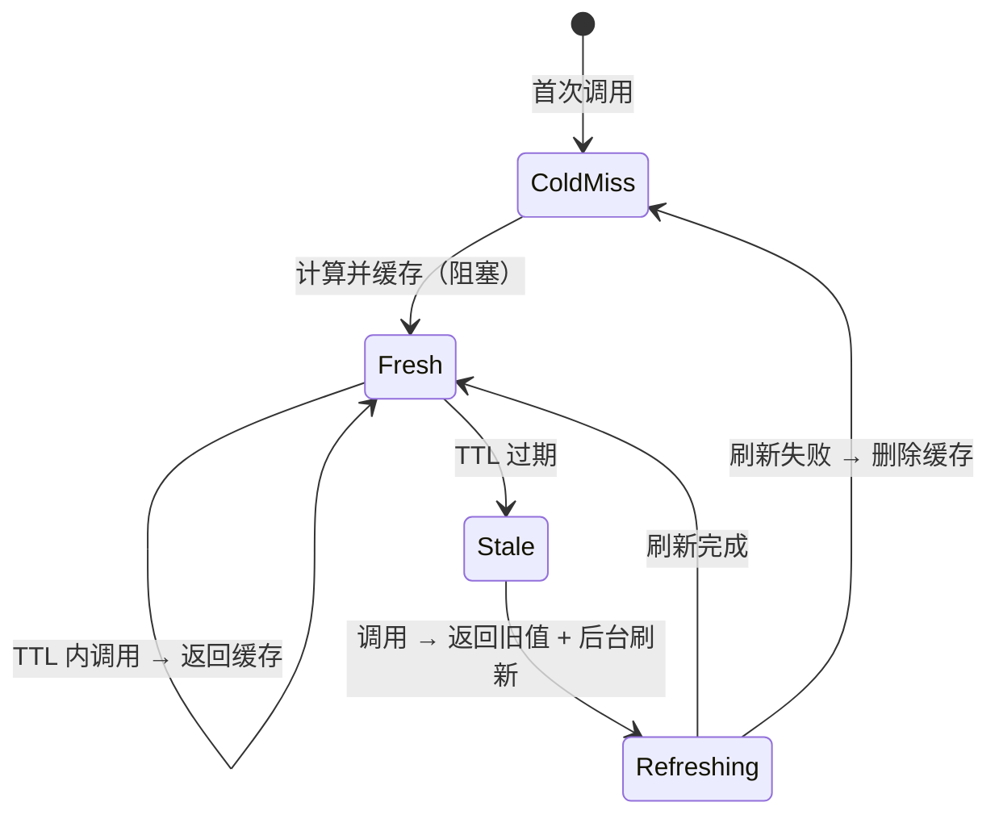
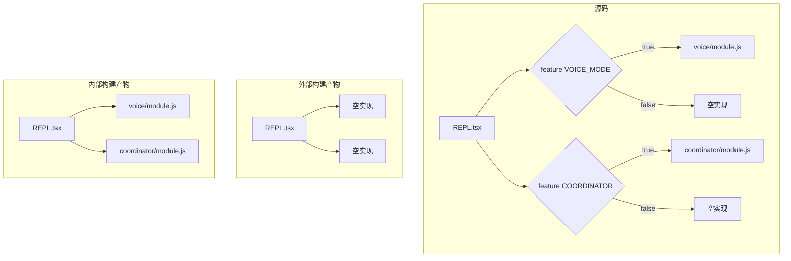
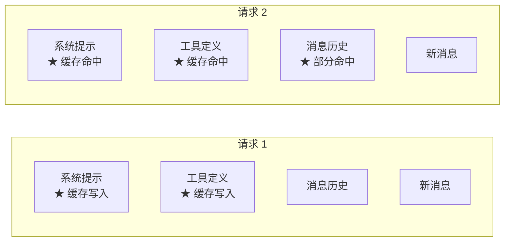
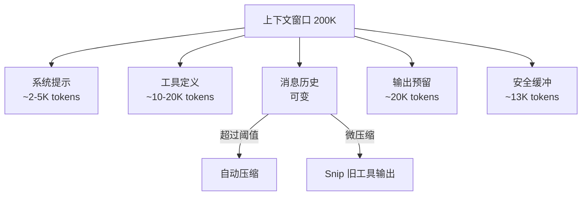

# 第 21 章：性能优化
> “在 Agent 系统中，性能不仅关乎用户体验，更关乎成本 —— 每一个浪费的 Token 都是真实的金钱。”Claude Code 运行在终端环境中，面对的性能约束与 Web 应用截然不同。它不需要考虑首屏渲染时间，但需要在数十万 Token 的对话中保持流畅的交互。它不需要优化图片加载，但需要控制每次 API 调用的 Token 预算。本章将系统性地分析 Claude Code 的性能优化策略。

## 引导思考

| 思考维度 | 内容 |
|----------|------|
| **它为什么存在** | <ul><li>终端里的 AI Agent 面临一堆独特的性能问题——几十万 token 的对话不能卡、API 调用都是钱、终端渲染不能闪</li><li>每一个浪费的 token 都是成本——性能优化就是省钱</li></ul> |
| **它解决什么问题** | <ul><li>启动慢？懒加载 + 并行预取把 300ms 内的每一毫秒都利用起来</li><li>重复计算？三层 Memoization（TTL/Async/LRU）覆盖不同场景</li><li>内部特性泄漏？feature() 编译时 DCE 让外部构建里根本不存在内部代码</li></ul> |
| **它在系统中的位置** | <ul><li>贯穿整个系统：bootstrap → 消息处理 → API 通信 → 终端渲染，哪哪都有优化空间</li><li>查询引擎里的 token 预算追踪和上下文窗口管理是性能的守门员</li></ul> |
| **它如何工作** | <ul><li>启动：条件 require() 代替 import，并行预取把 I/O 藏进模块加载窗口</li><li>运行时：memoizeWithTTL 的写透缓存 + 后台刷新 + identity guard 防竞争</li><li>编译时：feature() 宏在 Bun 打包时求值为布尔常量，假分支被整个 tree-shake 掉</li></ul> |
| **它如何实现** | <ul><li>src/utils/memoize.ts 的三种 memoization，每种都暴露 cache 管理接口</li><li>profileCheckpoint 打点系统在 300ms 启动过程里标记每个阶段耗时</li><li>src/ink/screen.ts 的 CharPool/StylePool/HyperlinkPool 用对象池减少 GC</li></ul> |
| **不同平台如何做** | <ul><li><strong>Cursor Agent</strong>：性能重心在编辑器索引层面，用向量加速代码检索而非 token 级优化</li><li><strong>OpenClaw</strong>：模块化加载 + Agent 间任务分配做负载均衡</li><li><strong>Harness Agent</strong>：基础模型的并发控制 + Harness 层缓存重试</li></ul> |
| **优势是什么？** | <ul><li><strong>优势</strong><ul><li>三层 Memoization 差异化覆盖不同场景</li><li>feature() DCE 零运行时开销且内部代码物理不存在于外部构建</li><li>BQ 数据指导优化方向——不是拍脑袋优化</li></ul></li></ul> |

---

## 21.1 启动优化 —— 并行预取 + 懒加载

### 21.1.1 Bootstrap 状态
Claude Code 的启动状态集中管理在 `src/bootstrap/state.ts` 中。这个文件开头有一个醒目的注释：
这说明团队对全局状态的扩散有明确的警惕。Bootstrap 状态包含：

### 21.1.2 条件导入与懒加载
Claude Code 大量使用条件 `require()` 代替顶层 `import`，实现真正的懒加载：
这种模式的关键优势是：
1. **启动时间减少** —— 未使用的模块不会被解析和执行2. **内存节省** —— 条件分支中的模块只在需要时占用内存3. **死代码消除** —— `feature()` 在编译时求值，假分支的 `require` 被完全移除
### 21.1.3 并行初始化
启动过程中的独立初始化步骤是并行执行的。例如设置加载、API key 验证、GrowthBook 特性开关拉取可以同时进行：

### 思考笔记

- 启动优化是"感知性能"的典型应用——不是真的让代码跑得更快，而是让用户感觉更快。并行预取把 I/O 延迟藏在模块加载后面，用户感觉不到。
- 三层 Memoization（identity guard → memoize → React Compiler）不是过度优化——每一层解决不同粒度的问题：函数级、模块级、组件级。
- 懒加载（require() vs import）的选择既是为了性能也是为了安全——不需要的功能连代码都不加载进产物，比运行时检查更安全。
- 优化的第一条原则：先测量再优化。profileCheckpoint 为每次启动生成精确的时间线，告诉工程师哪里慢——不靠猜测靠数据。

---
## 21.2 运行时优化 —— Memoization + LRU Cache

### 21.2.1 三层 Memoization 体系
Claude Code 在 `src/utils/memoize.ts` 中实现了三种不同特征的 memoization 函数，每种针对不同的使用场景：
**memoizeWithTTL —— 带 TTL 的写透缓存**
这个设计的精妙之处在于 **identity guard**。当后台刷新进行中时，如果有人调用了 `cache.clear()`，新的冷启动会创建一个新条目。后台刷新完成时，`cache.get(key) === cached` 检查确保不会用旧的刷新结果覆盖新的缓存条目。
**memoizeWithTTLAsync —— 异步版本**
异步版本增加了一个关键优化 —— `inFlight` 去重映射：
注释中解释了原因：对于 `refreshAndGetAwsCredentials` 这样的函数，并发冷启动会导致 N 个 `aws sso login` 进程同时生成。`inFlight` 去重确保相同参数只有一个计算在进行中。
**memoizeWithLRU —— 带 LRU 驱逐的 Memoization**
注释中有一个重要的历史教训：
之前使用 lodash 的 `memoize`（无限缓存），消息处理函数的缓存增长到 300MB 以上。替换为 LRU 后，缓存被限制在固定大小。

### 21.2.2 缓存管理接口
每种 memoize 都暴露了 `cache` 管理接口：
注意 `get` 使用的是 `peek()` 而非 `get()` —— 观察缓存不应改变 LRU 顺序。

### 思考笔记

运行时优化关注的是"系统运行起来之后的性能"——不是启动快，而是持续运行中的响应性。

- 三层 Memoization 不是过度设计：identity guard（函数级）、memoize（模块级）、React Compiler（组件级）。
- LRU Cache 假设"最近使用的数据最可能再次被用"——在 Agent 系统中成立。
- 对象池减少频繁创建/销毁导致的 GC 压力和渲染抖动。
- 核心原则：缓存尽可能靠近数据源——越早缓存，越少重复计算。

---
## 21.3 Feature Flag —— 编译时死代码消除

### 21.3.1 feature() 宏
`feature()` 是 Claude Code 最重要的编译时优化工具：

### 21.3.2 消除效果
在外部构建中，所有 `feature('ANT_ONLY_FEATURE')` 会被替换为 `false`，触发 JavaScript 打包器的死代码消除（DCE）。这不仅移除了条件分支内的代码，还移除了仅被该分支引用的 `require` 目标模块：

### 21.3.3 字符串保护
敏感字符串（如内部特性名称、UUID）被放入 `excluded-strings.txt`，确保它们不会出现在外部构建中。`feature()` 包裹的代码块内的字符串字面量会被自动排除。

### 思考笔记

Feature Flag 在性能层面的作用不只是代码消除——它是"零开销抽象"的工程实践。

- feature() 编译时 DCE 实现真正的零开销——没有 dead code、没有运行时判断、没有多余的字节在产物中。
- 对比运行时条件（if/else + process.env）：代码仍然在产物中，分支预测有成本。
- Feature Flag 对构建的影响：不同 flag 组合需要不同的构建产物——CI 需要覆盖更多配置。
- 从性能角度看，Feature Flag 是 "用构建复杂度换运行时效率"的经典交易。

---
## 21.4 Prompt Cache —— 共享机制

### 21.4.1 API 级缓存
Claude API 支持 Prompt Caching —— 当连续请求的前缀相同时，API 会重用已处理的上下文，大幅减少延迟和成本。Claude Code 的系统提示和工具定义被精心组织以最大化缓存命中：

### 21.4.2 Cache Break 检测
`src/services/api/promptCacheBreakDetection.ts` 追踪缓存命中率。当缓存命中率异常下降时，系统会记录事件并尝试诊断原因：
注释中引用了真实数据 —— “BQ 2026-03-01: missing this made 20% of tengu_prompt_cache_break events false positives”，说明缓存检测的精确度直接影响诊断的可靠性。

### 21.4.3 CacheSafeParams
分叉 Agent（如压缩 Agent）需要使用与父进程相同的缓存参数以命中缓存：

### 思考笔记

undefined

---
## 21.5 Token 预算 —— 控制策略

### 21.5.1 Token 追踪
Bootstrap 状态中维护了精细的 Token 统计：
REPL 在每个轮次中追踪输出 Token：

### 21.5.2 上下文窗口管理
上下文窗口是最关键的 Token 预算。其管理涉及多个层次：

### 21.5.3 成本控制
REPL 集成了成本阈值对话框：
当会话成本达到预设阈值时，系统暂停并要求用户确认是否继续。这是防止意外高额成本的安全网。

### 21.5.4 Token 估算
精确的 Token 计数需要调用 tokenizer，代价较高。Claude Code 使用估算函数加速常见操作：
估算函数使用字符数/4 的经验公式（英文平均每个 Token 约 4 个字符），在需要精确计数时才调用完整的 tokenizer。

### 思考笔记

Token 预算控制是性能优化的"经济视角"——不是代码跑多快，而是 token 花多少。

- Token 是 AI Agent 系统的"货币"——所有操作都消耗 token，预算是"不能超支"的硬约束。
- 中文 token 估算偏差是中文用户独有的性能问题——中文字符占 token 比率和英文不同。
- Token 预算的控制策略决定了"当预算不足时先牺牲什么"——是先压缩历史还是先降级模型。
- 从性能角度看，Token 预算控制比代码优化更重要——一个无限制的循环比一段慢的代码贵得多。

---
## 21.6 渲染性能

### 21.6.1 FPS 追踪
Claude Code 追踪终端渲染的帧率指标。当帧率下降时，可以通过 DevBar 查看诊断信息。

### 21.6.2 对象池
`src/ink/screen.ts` 中的 `CharPool`、`StylePool`、`HyperlinkPool` 使用对象池模式，避免每帧创建大量临时对象导致 GC 压力。

### 21.6.3 useDeferredValue
REPL 使用 React 18 的 `useDeferredValue` 延迟非关键更新：

### 思考笔记

渲染性能关注的是"终端 UI 刷新有多快"——Ink 组件树的 diff 和终端 I/O 优化。

- 差异化输出（diff output）不是渲染"当前状态"，而是计算"当前状态和上一状态的差异"，只输出变化。
- 批量更新合并多个状态变更——不是每次状态变化都渲染，而是在帧同步点统一渲染。
- 对象池复用组件实例减少频繁创建/销毁——终端渲染中不需要每次都新建虚拟节点。
- React Compiler 的自动 memoization 在这里也起作用——不需要渲染的组件不会被渲染。

---
## 本章小结
Claude Code 的性能优化体系展现了一种务实的工程哲学。`memoizeWithTTL` 的写透缓存策略、`feature()` 的编译时死代码消除、三层 memoization 的差异化设计 —— 每一种优化都针对具体的性能瓶颈。
最深刻的教训来自真实数据：lodash memoize 的 300MB 内存泄漏引出了 LRU 限制，1,279 个异常会话引出了断路器，20% 的缓存误报引出了压缩后的基线重置。性能优化不是猜测游戏，而是数据驱动的工程实践。

```mermaid
%%{init: {"theme": "base", "themeVariables":{"primaryColor":"#3b82f6","primaryTextColor":"#1e293b","primaryBorderColor":"#60a5fa","lineColor":"#94a3b8","secondaryColor":"#f1f5f9","tertiaryColor":"#ffffff","fontFamily":"-apple-system, BlinkMacSystemFont, 'Segoe UI', 'PingFang SC', sans-serif"}}}%%
gantt
    title Claude Code 启动时间线
    dateFormat X
    axisFormat %L ms

    section 串行
    CLI 参数解析      :a1, 0, 10
    配置文件加载       :a2, after a1, 20

    section 并行
    API Key 验证      :b1, after a2, 50
    GrowthBook 拉取   :b2, after a2, 40
    MCP 服务器连接     :b3, after a2, 60
    插件加载          :b4, after a2, 30

    section 渲染
    React 树挂载      :c1, after b3, 30
```

