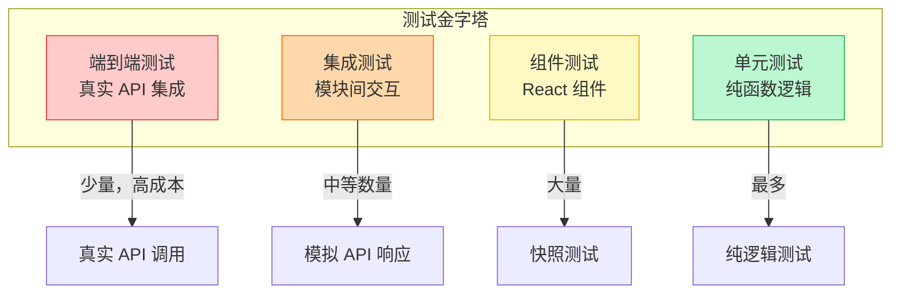
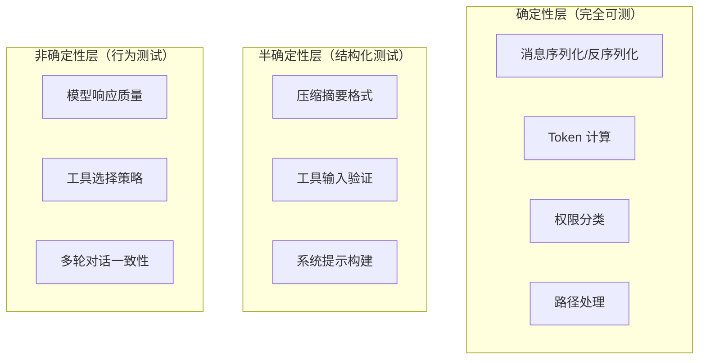
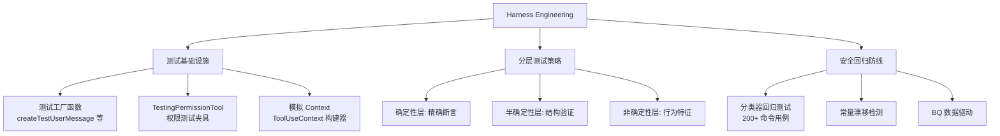

# 第 22 章：测试策略
> “测试 AI Agent 系统是软件工程中最具挑战性的任务之一 —— 当被测对象本身是非确定性的，传统的断言模型几乎全部失效。”Claude Code 面临一个独特的测试难题：它的核心行为依赖于大型语言模型的输出，而这个输出是非确定性的。如何在这种条件下构建可靠的测试体系？本章将揭示 Claude Code 的测试策略。

## 引导思考

| 思考维度 | 内容 |
|----------|------|
| **它为什么存在** | <ul><li>AI Agent 的输出是非确定性的——传统"输入 → 断言精确输出"的测试模式对 LLM 完全失效</li><li>怎么在非确定性条件下建一套可靠的测试体系——这章就是 Claude Code 的答案</li></ul> |
| **它解决什么问题** | <ul><li>纯函数（消息处理、Token 计算）→ 传统断言测试，精确验证输入输出映射</li><li>半确定性逻辑（压缩摘要格式）→ 结构验证，确保输出格式合规但不约束内容</li><li>非确定性行为（模型回复）→ 特征测试，断言结构特征而非精确内容</li></ul> |
| **它在系统中的位置** | <ul><li>四层测试金字塔：单元测试最多 → 组件测试 → 集成测试 → E2E 最少</li><li>Harness Engineering 提供专用测试基础设施——TestingPermissionTool 只在测试环境启用</li></ul> |
| **它如何工作** | <ul><li>确定性层：传统断言框架精确验证</li><li>半确定性层：Zod schema 验证输出结构</li><li>非确定性层：固定输入 + 结构断言，Mock API 注入固定响应绕开模型不确定性</li></ul> |
| **它如何实现** | <ul><li>TestingPermissionTool 仅在测试环境中启用，端到端验证权限系统行为</li><li>常量漂移检测用断言防止跨文件字符串不同步</li><li>Bash 安全分类器维护 200+ 命令用例的测试矩阵</li></ul> |
| **不同平台如何做** | <ul><li><strong>Cursor Agent</strong>：传统 VS Code 扩展测试框架，以集成测试为主</li><li><strong>OpenClaw</strong>：沙箱隔离测试，通过模拟 Agent 通信验证协调逻辑</li><li><strong>Harness Agent</strong>：确定性骨架层做完整单元测试，模型层行为验证</li></ul> |
| **优势是什么？** | <ul><li><strong>优势</strong><ul><li>分层策略精准覆盖确定性/半确定性/非确定性三层</li><li>BQ 数据驱动测试优先级，ROI 最大化</li><li>TestingPermissionTool 体现了为测试创建专用组件的理念</li></ul></li></ul> |

---

## 22.1 测试分层

### 22.1.1 测试金字塔
Claude Code 的测试分为四个层次：

### 22.1.2 单元测试策略
纯函数是最容易测试的部分。消息处理、Token 估算、路径归一化等函数有确定性的输入输出映射：

### 22.1.3 权限系统测试
权限分类器是 Claude Code 的安全关键路径，需要特别详尽的测试：

### 思考笔记

- 三层测试策略（确定性/半确定性/非确定性）反映了 AI Agent 系统的根本挑战：不是所有行为都是可预测的。
- 骨架（Skeleton）层是最聪明的设计——把"数据流"和"AI 推理"分离：骨架层确定性验证逻辑正确性，AI 层非确定性验证模型行为。
- BQ（BigQuery）数据驱动测试优先级：不是写更多的测试，而是写 ROI 更高的测试——数据告诉你哪些功能最常用、最容易出问题。
- TestingPermissionTool 为测试创建专用工具的做法值得借鉴：测试代码应该和生产代码一样有一等的工具支持。

---
## 22.2 Harness Engineering —— 测试基础设施

### 22.2.1 测试工具库
Claude Code 的测试中有一个重要的概念 —— Harness（测试夹具）。这些是可复用的测试基础设施，处理常见的测试场景：

### 22.2.2 Store 测试
Store 的测试验证状态管理的核心契约：

### 22.2.3 会话恢复测试
会话恢复涉及复杂的边界情况，需要系统性测试：

### 思考笔记

Harness Engineering 是构建 AI Agent 测试基础设施的方法论——不是"写测试"，而是"建测试系统"。

- 骨架层分离"数据流"和"AI 推理"——确定性验证逻辑，非确定性验证模型行为。
- TestingPermissionTool 为测试创建专用工具——测试代码有一等的工具支持而非 mock。
- 测试基础设施包括：数据生成、比较工具、环境管理、覆盖率追踪。
- 核心思想：不是追求 100% 代码覆盖率，而是用最合适的测试类型覆盖每个层次。

---
## 22.3 AI 系统测试

### 22.3.1 非确定性系统的测试策略
测试 AI Agent 的关键挑战在于非确定性。Claude Code 采用以下策略：
**确定性层** —— 使用传统的断言测试。消息处理、Token 计算等函数有确定性的输入输出映射。
**半确定性层** —— 使用结构验证。例如压缩摘要必须包含 `
` 标签，但标签内的内容是非确定性的。
**非确定性层** —— 使用行为特征测试。不断言精确输出，而是断言输出的结构特征（如“应该包含文件名“、“不应该包含被删除的上下文”）。

### 22.3.2 Compact 摘要测试

### 22.3.3 Feature Flag 测试
`feature()` 宏在不同构建配置下会产生不同的代码路径。测试需要覆盖两种构建：

### 22.3.4 FileStateCache 测试

### 思考笔记

- AI 系统测试最难的点在于"正确性标准模糊"——不像普通软件有明确的对错，AI 的输出在含义层面需要人工或模型判断。
- 行为特征测试（Behavior Feature Tests）通过定义"期望的行为模式"而非"期望的具体输出"来评估 AI 行为——比如"拒绝执行危险命令"而不是"输出特定字符串"。
- 分级断言（Strict/Moderate/Relaxed）承认了 AI 测试的不确定性——不同场景需要不同严格程度的验证。
- 外部评判模型（Judge Model）评审 AI 输出是测试 AI 系统的常用技术：一个模型生成，另一个模型评估。不是万能的，但比手动评审可扩展。

---
## 22.4 测试文化与实践

### 22.4.1 测试命名规范
从代码注释中可以看到测试的命名传统：
内部函数如果需要测试，会标记为 `@internal Exported for testing`，并注明正常调用方应使用的公共接口。

### 22.4.2 数据驱动的测试决策
代码中频繁出现的 BQ（BigQuery）数据引用说明团队使用生产数据指导测试优先级：

### 22.4.3 防回归测试
一些测试直接针对历史 Bug：
这种“常量一致性“测试防止了跨文件复制的字符串出现漂移。

### 思考笔记

测试文化决定了测试能不能持续——不是"要不要写测试"，而是"怎么写测试才不痛苦"。

- 测试代码的维护成本和生产代码一样高——写得不好的测试比不写测试更糟糕。
- BQ 数据驱动的优先级排序确保测试资源投入在 ROI 最高的地方。
- 确定性骨架层的测试最容易维护——不涉及模型调用，纯逻辑验证。
- AI 系统测试需要接受"不确定性"——不是所有测试都能给出是/否的结果。

---
## 22.5 Harness Engineering —— AI Agent 的质量保证方法论

### 22.5.1 什么是 Harness Engineering
Harness Engineering 是为 AI Agent 系统构建专用测试基础设施的工程实践。与传统软件测试不同，AI Agent 的核心行为依赖非确定性的模型输出，传统的“输入 → 断言精确输出“模式不再适用。Claude Code 的 Harness Engineering 包含三个支柱：

### 22.5.2 TestingPermissionTool —— 权限测试的专用夹具
`TestingPermissionTool` 是一个仅在测试环境中启用的工具，它的唯一目的是验证权限系统的端到端行为：
注册机制同样受环境门控：
这个工具的设计体现了 Harness Engineering 的核心理念：**为测试创建专用的可控组件，而非在生产代码中注入测试逻辑**。TestingPermissionTool 的 `checkPermissions` 始终返回 `ask`，使得 E2E 测试可以稳定地验证权限对话框的显示、用户确认和拒绝流程。

### 22.5.3 安全分类器的回归测试
Bash 安全分类器是 Claude Code 最关键的安全组件，其回归测试覆盖了数百个命令用例：
这种“正例 + 反例 + 绕过尝试“的测试矩阵确保了分类器在安全关键场景下的可靠性。每当生产环境发现新的绕过方式，都会立即添加对应的回归用例。

### 22.5.4 常量漂移检测（Drift Detection）
跨文件复制的常量容易出现漂移。Claude Code 使用断言测试来防止这种问题（参见第 9 章 ContentReplacementState 的 TIME_BASED_MC_CLEARED_MESSAGE）：
这是一种“编译器做不到的验证“ —— TypeScript 无法检测两个不同文件中的字符串常量是否保持同步，但测试可以。

### 22.5.5 可复现的 Agent 测试模式
测试 Agent 行为时，Claude Code 采用“固定输入 + 结构断言“模式：
对于需要更强确定性的场景，测试通过 Mock API 注入固定的 Assistant 响应，绕过模型的非确定性：

### 思考笔记

AI Agent 的质量保证方法论是"测试策略 + 工程文化 + 基础设施"的三位一体。

- 测试策略：分层覆盖，确定性层用单元测试，半确定性层用集成测试，非确定性层用行为特征测试。
- 工程文化：测试代码和生产代码同等重要——TestingPermissionTool 就是例证。
- 基础设施：骨架层、mock API、行为特征断言库——没有这些基础设施，写测试就是手工作坊。
- 质量保证不是 QA 团队的事，而是从架构层面就开始的——每层设计都要考虑"这层怎么测"。

---
## 22.6 端到端测试考量

### 22.5.1 成本与覆盖率的平衡
端到端测试需要真实的 API 调用，每次测试都产生成本。Claude Code 的策略是：
1. 单元测试覆盖所有确定性逻辑2. 集成测试使用模拟 API 响应覆盖交互逻辑3. 端到端测试仅覆盖关键用户路径（启动、查询、压缩、恢复）4. 回归测试仅在发现 Bug 后添加端到端用例
### 22.5.2 快照测试
组件渲染使用快照测试验证 UI 不发生意外变化。终端渲染的快照是 ANSI 字符串，比 HTML 快照更紧凑。

### 思考笔记

E2E 测试在 AI Agent 系统中是最昂贵也最必要的——贵在调用真模型，必要在验证真实行为。

- E2E 测试调用真实 API——每次运行都有成本，不能频繁执行。
- E2E 测试的输出是非确定性的——不能用传统的"期望输出 == 实际输出"断言。
- 行为特征测试是 E2E 的最佳实践——验证"行为模式"而非"具体输出"。
- E2E 测试的 ROI 考量：不是所有功能都需要 E2E 测试——覆盖最关键的用户路径即可。

---
## 本章小结
Claude Code 的测试策略体现了一个核心原则：**在确定性层面追求完美覆盖，在非确定性层面追求结构验证**。通过将系统分层为确定性/半确定性/非确定性三个层面，团队能够为每个层面选择最适合的测试方法。
数据驱动的测试决策（基于 BQ 生产数据）和防回归测试（基于历史 Bug）确保了测试投资的回报最大化。这不是为了测试覆盖率的数字好看，而是为了系统的实际可靠性。

