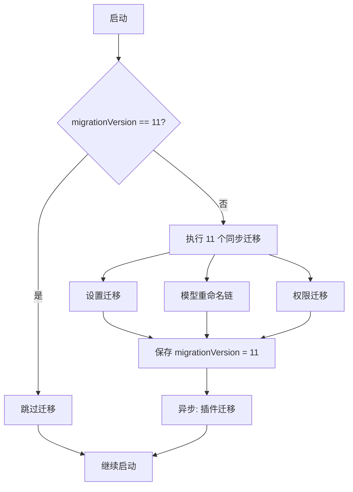

# 第 23 章：构建系统
> “构建系统是软件的骨架 —— 用户看不到它，但它决定了软件的形态、大小和到达用户手中的速度。”Claude Code 选择了 Bun 作为运行时和打包器，这一决策深刻影响了整个项目的架构。本章将分析其构建系统的设计、依赖管理策略和发布流程。

## 引导思考

| 思考维度 | 内容 |
|----------|------|
| **它为什么存在** | <ul><li>一份源码要同时服务内部员工和外部用户——两套构建配置需要精确的代码裁剪</li><li>Bun 的编译时宏能力给了 Node.js 生态做不到的死代码消除方案</li></ul> |
| **它解决什么问题** | <ul><li>双构建：内部版带 VOICE_MODE、COORDINATOR，外部版通过 DCE 把这些代码连根拔了</li><li>字符串排除：excluded-strings.txt 确保内部特性名、UUID 不出现外部产物里</li><li>迁移系统：版本号门控 + 幂等迁移保证从老版本升级不会炸</li></ul> |
| **它在系统中的位置** | <ul><li>源码 → Bun bundler → 单文件 cli.js + vendor 目录 → npm 发布</li><li>用户通过 npx @anthropic-ai/claude-code 使用，内置自动更新</li></ul> |
| **它如何工作** | <ul><li>feature() 在 bundle 时求值，假分支触发 tree-shake——同一份源码编出不同产物</li><li>迁移在 main.tsx 的 init 阶段跑，先同步迁核心配置再异步迁插件</li></ul> |
| **它如何实现** | <ul><li>feature() 通过 bun:module 的编译时宏实现，构建时被替换为布尔字面量</li><li>excluded-strings.txt + 构建后验证确保字符串不泄漏</li><li>migrations/ 下 11 个迁移文件组成模型重命名链</li></ul> |
| **不同平台如何做** | <ul><li><strong>Cursor Agent</strong>：esbuild/rollup 构建，功能开关靠运行时配置不靠 DCE</li><li><strong>OpenClaw</strong>：功能模块靠插件系统动态加载</li><li><strong>Harness Agent</strong>：标准 Node.js 构建，环境变量 + 运行时配置开关</li></ul> |
| **优势是什么？** | <ul><li><strong>优势</strong><ul><li>feature() DCE 零开销且内部代码物理不存在于外部构建</li><li>Bun 把 1884 个文件打成 ~13MB 单文件，部署简单</li><li>迁移系统幂等保证跨版本安全升级</li></ul></li></ul> |

---

## 23.1 Bun Runtime

### 23.1.1 为什么选择 Bun
Claude Code 在构建和运行时都依赖 Bun。从源码中可以看到直接使用 Bun 特有的 API：
`bun:bundle` 是 Bun 打包器的专有模块，`feature()` 函数在打包时被求值为字面量（`true` 或 `false`），实现编译时条件分支。这是 Node.js 生态中没有直接对应物的能力。
选择 Bun 的技术理由包括：
1. **启动速度** —— Bun 的 JavaScript 引擎（JavaScriptCore）启动速度快于 V82. **内置打包器** —— 无需 webpack/esbuild 等额外工具3. **编译时宏** —— `feature()` 实现了零运行时开销的特性开关4. **TypeScript 原生支持** —— 无需编译步骤即可运行 `.ts` 文件
### 23.1.2 兼容性层
尽管使用 Bun，Claude Code 仍保留了 Node.js 兼容性检查：
这说明 Claude Code 可以同时在 Bun 和 Node.js 上运行，但某些特性的可用性取决于具体的运行时版本。


<div class="thinking-note">
### 思考笔记

- Bun 作为 CLI 工具的运行时选择是典型的"平台锁定换取性能"——牺牲了 Node.js 的生态兼容性，换来了 3 倍以上的启动速度和编译时 DCE 能力。
- 1884 个 TypeScript 文件 → ~13MB 单文件二进制——这个压缩比来自 Bun 的内置打包器 + tree-shaker + 编译器，一套工具链搞定构建全流程。
- feature() 编译时 DCE 是 Bun 对比 Node.js 的最大优势：不是"运行时不加载"，而是"编译时就不存在"。这在安全和性能上都是质的飞跃。
- 绑 Bun 运行时的代价：纯 Node 环境跑不了，部分 Node API 行为差异需要 patch，调试工具链不成熟。这是一个"权衡之后接受代价"的决策。

</div>

---
## 23.2 Bundle 策略

### 23.2.1 双构建配置
Claude Code 有两种构建配置：

### 23.2.2 死代码消除（DCE）
`feature()` 宏与 Bun 打包器的 DCE 配合，实现了精确的代码裁剪：
这种模式遍布整个代码库。在 REPL.tsx 中：

### 23.2.3 字符串排除
敏感字符串的保护是构建系统的重要职责。`excluded-strings.txt` 列出了不应出现在外部构建中的字符串：
构建后验证步骤会扫描产物，确保这些字符串不存在。


<div class="thinking-note">
### 思考笔记

- 构建产物根据不同目标用户（ant/internal/external）做条件编译——同一份源码，多份产出。feature() 宏在这里起了"编译时代码开关"的作用。
- 迁移系统（migration system）集成在构建流程中：版本升级时自动执行迁移逻辑，保证旧配置兼容新版本。
- Source Map 占产物 4.6 倍体积（68MB vs 13MB）——这是调试友好性和分发效率的冲突。Claude Code 选择保留 Source Map 支持线上问题排查。
- "构建一次，到处部署"的思路让测试和生产环境保持一致——不再出现"我本地能跑"的经典问题。

</div>

---
## 23.3 依赖管理

### 23.3.1 依赖策略
从导入分析可以看到 Claude Code 的依赖策略：
关键决策：
1. **lodash-es 逐函数导入** —— 而非 `import _ from 'lodash'`，确保 tree shaking 有效2. **Ink 内部化** —— 而非作为 npm 依赖，获得完全控制权3. **Yoga WASM** —— 通过 `native-ts/yoga-layout` 加载，而非 npm 的 yoga-layout4. **Anthropic SDK** —— 使用官方 SDK，但也有自定义 API 层
### 23.3.2 循环依赖管理
代码中有多处明确处理循环依赖的注释：
循环依赖管理策略：
1. **内联常量** —— 复制小的常量值并用测试保证一致性2. **懒加载 require** —— 在函数体内而非顶层导入3. **类型独立文件** —— 将类型定义放在独立文件（如 `AppStateStore.ts` vs `AppState.tsx`）
### 23.3.3 类型与运行时分离
`AppStateStore.ts` 是纯类型和逻辑文件（不依赖 React），`AppState.tsx` 包含 React 组件。将类型从 `.tsx` 迁移到 `.ts` 是一个进行中的重构，目标是让非 React 的 `.ts` 文件不需要引入 React 依赖。


<div class="thinking-note">
### 思考笔记

依赖管理决定构建是否可重复——没有锁文件，两个月后的构建可能静默失败。

- Bun 的 bun.lock 锁文件锁定所有精确版本——比 semver ^1.2.3 更可靠。
- 最小依赖原则——40+ 内置工具不依赖外部 npm 包，减少供应链攻击面。
- 依赖树的可视化和审计工具帮助发现潜伏漏洞。
- monorepo 中多个项目共享依赖配置——公共的 TS 配置、ESLint、工具版本。

</div>

---
## 23.4 发布流程

### 23.4.1 版本管理
从代码中的版本检查可以推断发布流程的严谨性：

### 23.4.2 构建验证

### 23.4.3 NPM 发布产物分析
Claude Code 的 NPM 包 `@anthropic-ai/claude-code` 的发布产物结构揭示了构建系统的最终输出：
几个关键观察：
**单文件打包**：1884 个 TypeScript 源文件被打包为单个 `cli.js`（~13MB）。这意味着 Bun 的 bundler 进行了完整的 tree-shaking、DCE、模块拼接。
**Source Map 体积**：`cli.js.map` 是 `cli.js` 的 4.6 倍大。这是因为 Source Map 保留了原始源码的完整映射，用于 `--inspect` 调试和错误堆栈的源码定位。
**vendor 目录**：不可打包的资源（如 WASM 模块、native addon）通过 `vendor/` 目录分发，而非嵌入到 `cli.js` 中。

### 23.4.4 自动更新
Claude Code 内置了自动更新机制，支持多种安装方式：
更新检测在后台异步执行，不阻塞主交互循环。当检测到新版本时，会在 REPL 的状态栏显示更新提示，用户可以选择立即更新或稍后处理。

### 23.4.5 迁移系统 —— 跨版本数据兼容
迁移系统是 Claude Code 版本升级的关键保障。`src/main.tsx` 中定义了迁移的核心机制：
迁移系统的设计要点：
**版本门控**：`migrationVersion` 记录在全局配置中。只有当本地版本低于 `CURRENT_MIGRATION_VERSION` 时才执行迁移，避免每次启动重复运行 11 次 `saveGlobalConfig`。
**模型重命名链**：多个迁移函数形成了一条模型名称的演进链：
这确保了无论用户从哪个版本升级，模型配置都能正确迁移到最新名称。
**同步 vs 异步**：核心配置迁移是同步的（必须在 init 完成前生效），而插件迁移是异步的（`void migrateInstalledPlugins()`），避免阻塞启动。
**幂等性**：每个迁移函数内部检查是否需要执行。例如 `migrateSonnet45ToSonnet46` 只有在发现旧模型名时才修改配置。这保证了迁移可以安全地重复运行。


<div class="thinking-note">
### 思考笔记

发布流程是把源码变成用户手中可执行文件的全链路——不是"构建"，而是"交付"。

- 多环境构建（ant/internal/external）需要不同的 feature flag 组合。
- 迁移系统伴随发布流程自动执行——版本升级时自动迁移旧配置。
- 发布版本号的语义化管理和变更日志自动生成。
- 回滚策略：如果新版本出现问题，如何快速恢复到上一个稳定版本。

</div>

---
## 本章小结
Claude Code 的构建系统体现了“不多不少，恰到好处“的工程哲学：
1. **Bun 选型**：编译时宏 `feature()` 实现了零运行时开销的多构建配置，一份代码服务内外部用户2. **Bundle 策略**：DCE + 字符串排除确保外部构建不泄漏内部功能3. **依赖管理**：lodash-es 逐函数导入、Ink 内部化、循环依赖的三种处理策略4. **发布产物**：单文件 `cli.js`（13MB）+ vendor 目录，Source Map 保留完整调试能力5. **迁移系统**：版本门控 + 幂等迁移 + 模型重命名链，确保无缝升级```mermaid
%%{init: {"theme": "base", "themeVariables":{"primaryColor":"#3b82f6","primaryTextColor":"#1e293b","primaryBorderColor":"#60a5fa","lineColor":"#94a3b8","secondaryColor":"#f1f5f9","tertiaryColor":"#ffffff","fontFamily":"-apple-system, BlinkMacSystemFont, 'Segoe UI', 'PingFang SC', sans-serif"}}}%%
graph LR
    Source[源码<br/>1884 个 .ts/.tsx 文件]
    Source --> Internal[内部构建 ant]
    Source --> External[外部构建 external]

    Internal --> |feature flags ON| InternalBundle[完整功能包<br/>VOICE_MODE, COORDINATOR,<br/>PROACTIVE, etc.]

    External --> |feature flags OFF + DCE| ExternalBundle[精简包<br/>仅公开功能]
```



