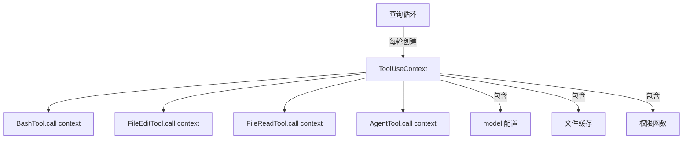
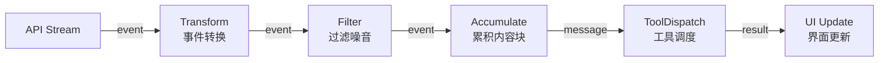
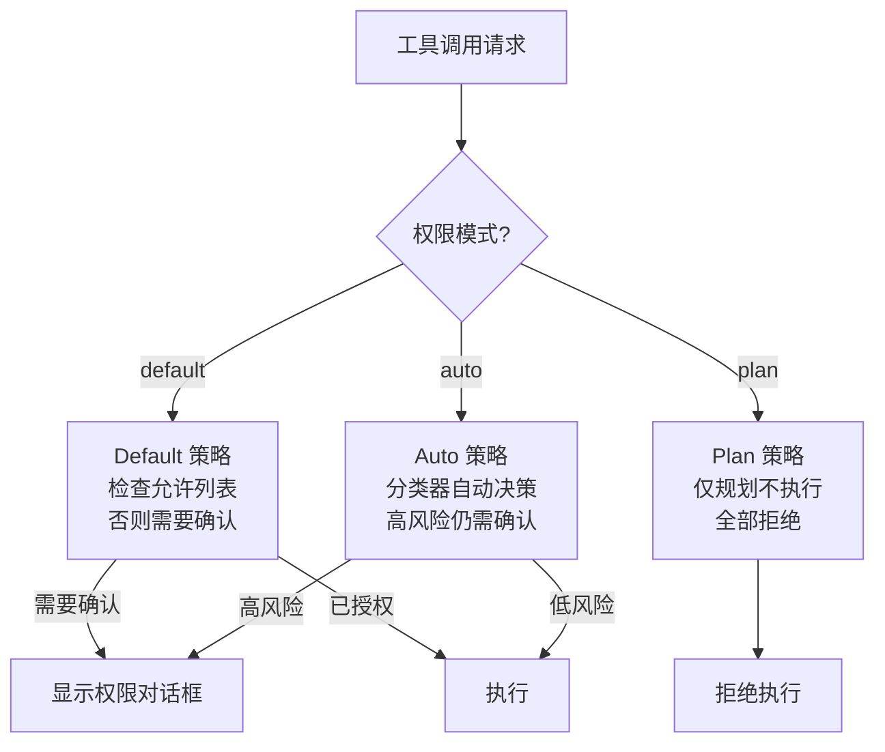
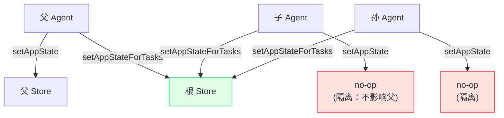

# 第 24 章：设计模式提炼
> “设计模式不是教条，而是对反复出现的问题的最佳回答的提炼。在 Claude Code 中，这些模式被重新演绎为 Agent 时代的变体。”本章从 Claude Code 的源码中提炼出最具特色的设计模式。这些模式不是照搬 GoF 经典，而是在 AI Agent 系统的独特约束下演化出的新形态。

## 引导思考

| 思考维度 | 内容 |
|----------|------|
| **它为什么存在** | <ul><li>Claude Code 源码里反复出现的解决方案值得提炼——不是照搬 GoF 经典，而是在 Agent 时代的新形态</li><li>给读者一套可复用的架构词汇，帮助理解代码里反复出现的模式</li></ul> |
| **它解决什么问题** | <ul><li>总结 9 种最具特色的设计模式和几个反模式警示</li><li>让读者从"这代码在干啥"上升到"这代码为什么这么写"</li></ul> |
| **它在系统中的位置** | <ul><li>作为整本书的提炼章——不指向具体代码，而是从源码归纳出的模式</li><li>贯穿从 L1 到 L5 每一层架构</li></ul> |
| **它如何工作** | <ul><li>依赖注入：ToolUseContext 这个 Parameter Object 替代 DI 容器，生命周期明确</li><li>失败关闭：所有安全默认值选保守策略——新功能忘配权限检查就阻塞执行</li><li>Generator 流水线：三层 AsyncGenerator 嵌套管道 yield 逐层冒泡</li></ul> |
| **它如何实现** | <ul><li>双通道模式：setAppState（隔离）vs setAppStateForTasks（穿透）解决嵌套 Agent 状态管理</li><li>编译时多态：feature() 宏构建时决定代码去留，零运行时开销</li><li>反模式警示：5000 行的 REPL 单文件和全局可变状态扩散</li></ul> |
| **不同平台如何做** | <ul><li><strong>Cursor Agent</strong>：依赖注入靠 VS Code 的 ExtensionContext 内置 DI</li><li><strong>OpenClaw</strong>：架构以分布式消息传递为主</li><li><strong>Harness Agent</strong>：Pipeline + Step 模式，更接近企业集成模式</li></ul> |
| **优势是什么？** | <ul><li><strong>优势</strong><ul><li>编译时多态零开销特性隔离</li><li>双通道精确解决嵌套 Agent 的隔离与共享</li><li>Generator 流水线天然背压 + 取消</li></ul></li></ul> |

---

## 24.1 依赖注入 —— ToolUseContext

### 24.1.1 模式描述
`ToolUseContext` 是 Claude Code 中最核心的依赖注入容器。每个工具调用都接收一个 ToolUseContext 对象，其中包含了工具执行所需的全部环境信息：

### 24.1.2 为什么不用传统 DI 框架
Claude Code 没有使用 InversifyJS 或 tsyringe 等 DI 框架。ToolUseContext 是一个显式的参数对象（Parameter Object），而非容器管理的服务。原因在于：
1. **生命周期明确** —— Context 在每个查询轮次中创建，随轮次结束销毁2. **类型安全** —— TypeScript 的结构类型系统已经提供了足够的接口抽象3. **可测试性** —— 在测试中构造 Context 对象比配置 DI 容器更直观
### 24.1.3 Context 传播
工具调用时，Context 被向下传播。子 Agent 接收父 Agent 的 Context 变体：

### 思考笔记

- ToolUseContext 40+ 字段的"参数对象模式"是依赖注入在 TypeScript 中的实践——不依赖 DI 框架，靠一个聚合对象传递所有上下文。
- 这个模式的优势：新加入的依赖不需要修改任何函数签名（加到 ToolUseContext 即可），不影响现有调用链。
- 隐式依赖的问题：一个函数接收了 ToolUseContext，你能从函数签名看出它依赖了其中的哪些字段吗？不能。这降低了代码的可读性。
- 权衡：简化变更 vs 降低可见性。Claude Code 选择了前者，因为你每天都在加新工具，而不是每天都在读同一个工具的代码。

---
## 24.2 失败关闭 —— 安全默认值

### 24.2.1 模式描述
在安全关键系统中，“失败关闭“意味着当系统无法确定正确的行为时，选择更安全（更限制性的）默认值。Claude Code 在权限系统中严格遵循这一原则。

### 24.2.2 权限默认值
默认权限模式是 `'default'` —— 需要用户确认每个工具操作。用户必须显式选择 `'auto'` 模式才能跳过确认。

### 24.2.3 Bypass 权限的保护
即使 bypass 模式在本地可用，远程设置（可能在挂载后才加载）仍可以禁用它。这是“失败关闭“在时序问题上的应用 —— 在安全信号到达前，保持最安全的状态。

### 24.2.4 断路器也是失败关闭
压缩的断路器也遵循失败关闭 —— 当压缩反复失败时，停止尝试而非无限重试。“不做事“比“做错事“更安全。

### 思考笔记

失败关闭是最重要的安全设计原则——出错时拒绝服务而非允许操作。

- buildTool 的默认值：isConcurrencySafe=false、isReadOnly=false——每个默认选最保守值。
- 安全默认 vs 安全异常——前者忘记实现在不会造成漏洞，后者忘记处理异常时会暴露漏洞。
- 权限系统的 fail-closed：规则匹配失败或分类器超时时拒绝而非允许。
- Unix 权限设计同理：文件默认 644 而非 777。

---
## 24.3 Generator 流水线 —— AsyncGenerator 组合

### 24.3.1 模式描述
Claude Code 的查询引擎使用 AsyncGenerator 模式处理流式响应。每个处理阶段是一个 generator，通过组合形成流水线。

### 24.3.2 流式处理链

### 24.3.3 流水线优势
AsyncGenerator 组合的优势在于：
1. **背压** —— 下游处理慢时自动暂停上游2. **懒求值** —— 只在需要时拉取下一个事件3. **取消** —— 可以随时终止流水线（用户按 Escape）4. **组合性** —— 每个阶段独立可测试

### 思考笔记

- AsyncGenerator 流水线是 Claude Code 数据架构的基石——从 API 流到工具执行到 UI 渲染，全部通过 Generator yield 串联。
- yield* 委托是最强大的组合机制：一个 Generator 可以将自己的产出委托给另一个 Generator，形成流水线而不损失背压控制。
- Generator 流水线 vs Observable（RxJS）：Observable 是推模式，Generator 是拉模式。推模式在背压控制上需要额外的机制（如 buffer），拉模式天然支持。
- for await...of 消费 Generator 时，消费者可以随时 break 退出——这种"随时可取消"的特性在 UI 交互中极其重要。

---
## 24.4 观察者模式 —— Hook 系统

### 24.4.1 模式描述
Claude Code 的 Hook 系统是观察者模式的一种变体。Hook 允许用户在关键事件（会话开始、压缩前后、工具调用前后）注入自定义逻辑。

### 24.4.2 会话钩子

### 24.4.3 onChange 作为观察者
Store 的 `onChange` 回调也是一种观察者实现：

### 思考笔记

Hook 系统是观察者模式的工程实现——工具执行前后触发通知，监听器执行自定义逻辑。

- Pre/Post 钩子类似 Web 框架的中间件——请求前预处理，响应后后处理。
- 钩子的同步/异步分离：大部分同步不阻塞执行，少数异步等待完成才继续。
- 钩子的组合顺序决定了执行链的行为——preA → preB → 核心逻辑 → postA → postB。
- 观察者模式在 Agent 系统中的价值：不需要修改核心代码就能在关键路径上插入逻辑。

---
## 24.5 策略模式 —— 权限分类器

### 24.5.1 模式描述
权限分类器使用策略模式 —— 根据当前权限模式选择不同的决策策略。

### 24.5.2 权限模式策略

### 24.5.3 可扩展性
新的权限模式可以通过添加新的策略实现来扩展，无需修改现有代码。`PermissionMode` 联合类型确保了所有策略都被穷尽处理：

### 思考笔记

权限分类器是策略模式的应用——不同分类策略可以在运行时切换。

- 分类器的策略包括：规则匹配优先、分类器辅助、用户确认——每种策略对应不同的安全级别。
- 策略在 auto 模式下动态选择——高风险操作走用户确认策略，低风险走自动放行策略。
- 策略的可插拔性：新的分类策略（如 ML-based）可以加入而不影响现有逻辑。
- 和 Web 框架中策略模式的区别——这里的策略不是"选一个执行"，而是"按优先级链执行"。

---
## 24.6 工厂模式 —— buildTool, createStore

### 24.6.1 Store 工厂
`createStore` 是最纯粹的工厂函数 —— 接收配置（初始状态、onChange），返回一个完整的 Store 实例：

### 24.6.2 缓存工厂

### 24.6.3 默认状态工厂
工厂模式在 Claude Code 中的应用特点是：**工厂函数通常是纯函数**（或接近纯函数），不依赖全局状态。这使得它们在测试中特别容易使用 —— 每次调用都产生一个独立的实例。

### 24.6.4 CompactionResult 构建器
这是一个构建器（Builder）变体 —— 从结构化的中间表示构建最终的消息列表。顺序封装在函数内部，调用者无需了解消息组装规则。

### 思考笔记

buildTool 和 createStore 是工厂模式的两种应用——一个创建工具实例，一个创建 Store 实例。

- buildTool 工厂把 ToolDef + TOOL_DEFAULTS 合成为完整的 Tool——"构建"而非"实例化"。
- createStore 工厂用 34 行代码创建 Zustand 风格的 Store——"工厂"在这里是函数而非类。
- 两个工厂的共通过：它们都隐藏了复杂的初始化逻辑——调用方不需要知道 Tool 或 Store 如何组装。
- 工厂模式在 Agent 系统中的价值：复杂的初始化逻辑被封装，不需要在每个创建点重复。

---
## 24.7 双通道模式 —— 隔离与共享的平衡

### 24.7.1 模式描述
当一个子系统需要同时支持“默认隔离“和“显式共享“两种语义时，Claude Code 使用双通道设计。最典型的例子是 `ToolUseContext` 中的 `setAppState` 与 `setAppStateForTasks`（参见第 7 章 §7.3.3）。

### 24.7.2 隔离通道 vs 共享通道
- **隔离通道**（`setAppState`）：子 Agent 的状态修改不泄漏到父 Agent，防止多层嵌套 Agent 之间的状态污染- **共享通道**（`setAppStateForTasks`）：穿透到根 Store，用于全局基础设施（后台任务注册、会话钩子）
### 24.7.3 模式应用矩阵

### 思考笔记

双通道模式解决了嵌套 Agent 场景下的"隔离 vs 共享"问题——setAppState 隔离子 Agent，setAppStateForTasks 穿透。

- 子 Agent 的 setAppState 只能修改自己的 Store——不影响父 Agent 的状态。
- setAppStateForTasks 可以穿透隔离，修改根 Store——用于需要子 Agent 向父 Agent 报告状态的场景。
- 双通道的默认是隔离——"默认安全，按需开放"的原则。
- 这个模式的价值：不需要为嵌套 Agent 设计复杂的"权限 propagate"机制——通道本身决定了可见性。

---
## 24.8 编译时多态 —— feature() 宏

### 24.8.1 模式描述
传统的策略模式在运行时通过接口和多态实现分支。Claude Code 使用 `feature()` 宏实现**编译时多态** —— 不同构建配置产生不同的代码，运行时无分支开销。

### 24.8.2 与运行时策略的对比
编译时多态的优势：
1. **零运行时开销** —— 无条件分支2. **安全保证** —— 内部代码物理上不存在于外部产物中3. **包大小优化** —— 未启用的模块及其依赖树被完全移除
### 24.8.3 已知的 Feature Flag 清单
从源码中提取的完整 feature flag 列表：

### 思考笔记

feature() 宏是编译时多态在 TypeScript 中的实现——不同构建产物有不同的代码路径。

- 传统多态（虚函数、接口）在运行时选择分支——编译时多态在编译时就决定了分支。
- 编译时多态的零开销优势：未选中的分支物理上不存在于产物中。
- 和模板元编程（C++ templates）的类比：都是在编译期基于条件生成不同的代码。
- 代价：需要为不同的条件组合构建不同的产物，CI/CD 变得更复杂。

---
## 24.9 反模式警示

### 24.7.1 巨型组件
REPL.tsx 的 5000 行是一个需要关注的信号。虽然 React Compiler 的自动 memoization 缓解了性能问题，但维护性仍然是挑战。团队通过将逻辑提取到 hooks（`useTasksV2WithCollapseEffect`、`useReplBridge` 等）来逐步减小主组件的体积。

### 24.7.2 全局可变状态
`src/bootstrap/state.ts` 文件头的警告说明了团队的态度：
全局状态虽然方便，但增加了不可见的耦合。团队正在将状态逐步迁移到 AppState Store 中，通过 `onChange` 机制统一管理副作用。

### 思考笔记

反模式警示不是"这些模式不好"，而是"这些模式在特定上下文下会产生问题"。

- TOOL_DEFAULTS 的 spread 操作在类型层面需要 BuiltTool 的类型体操——运行时简单，类型系统复杂。
- REPL 5000 行单文件的"上帝组件"反模式——React Compiler 缓解了维护问题但未从根本上解决。
- ToolUseContext 40+ 字段的隐式依赖——函数签名上看不出具体依赖了哪些字段。
- bootstrap/state 全局可变状态增加了耦合——不是不能用，是要控制使用范围和变更频率。

---
## 本章小结
Claude Code 的设计模式展现了一种实用主义的工程审美。ToolUseContext 的显式依赖注入避免了框架的复杂性，`feature()` 宏的策略模式实现了编译时多态，AsyncGenerator 流水线为流式处理提供了优雅的抽象。
最值得注意的是“失败关闭“原则的无处不在 —— 从默认权限模式到断路器，从 bypass 权限的动态禁用到 identity guard 的并发保护。在一个运行着实际代码的 AI Agent 中，安全不是可选项，而是设计的起点。

