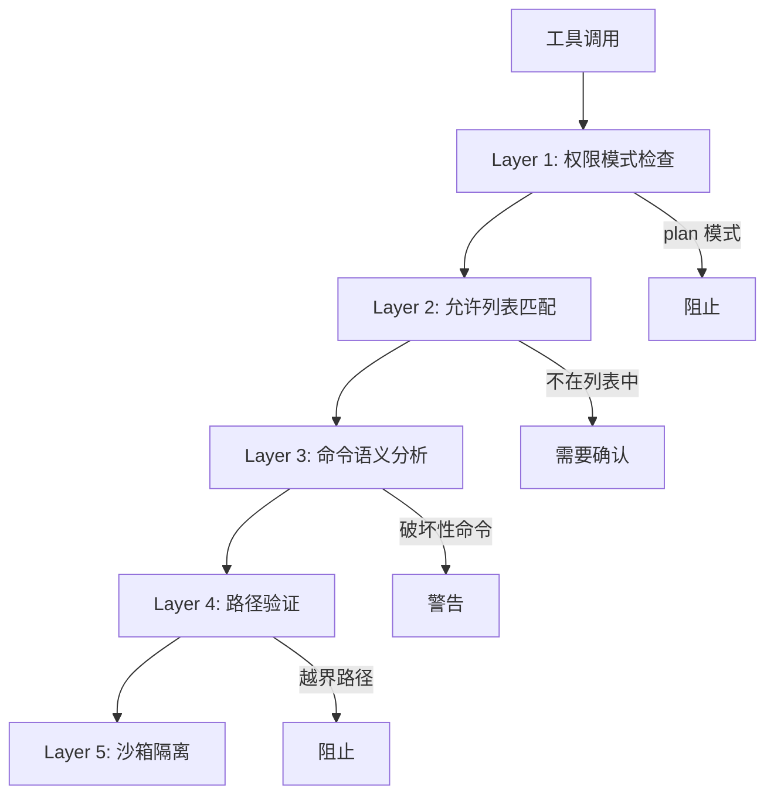
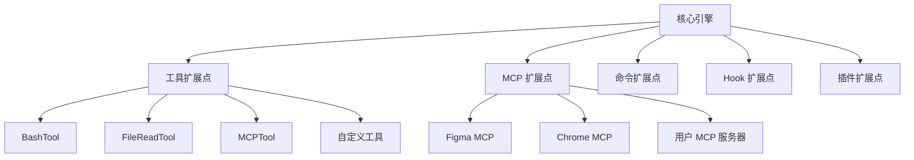
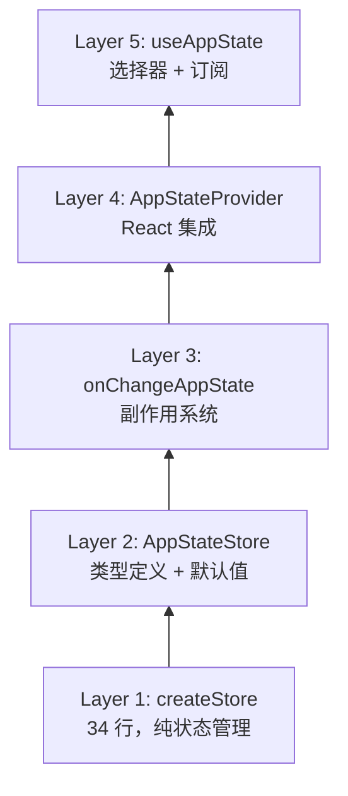
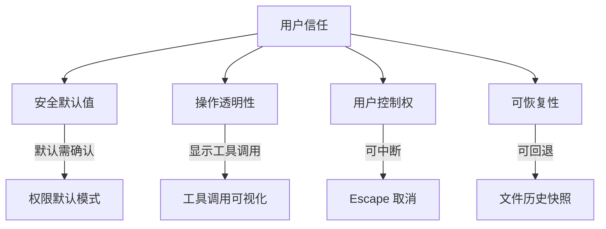
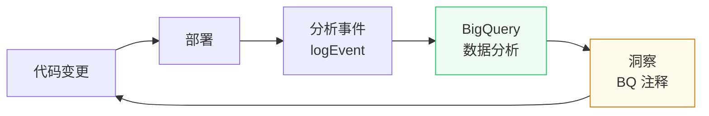
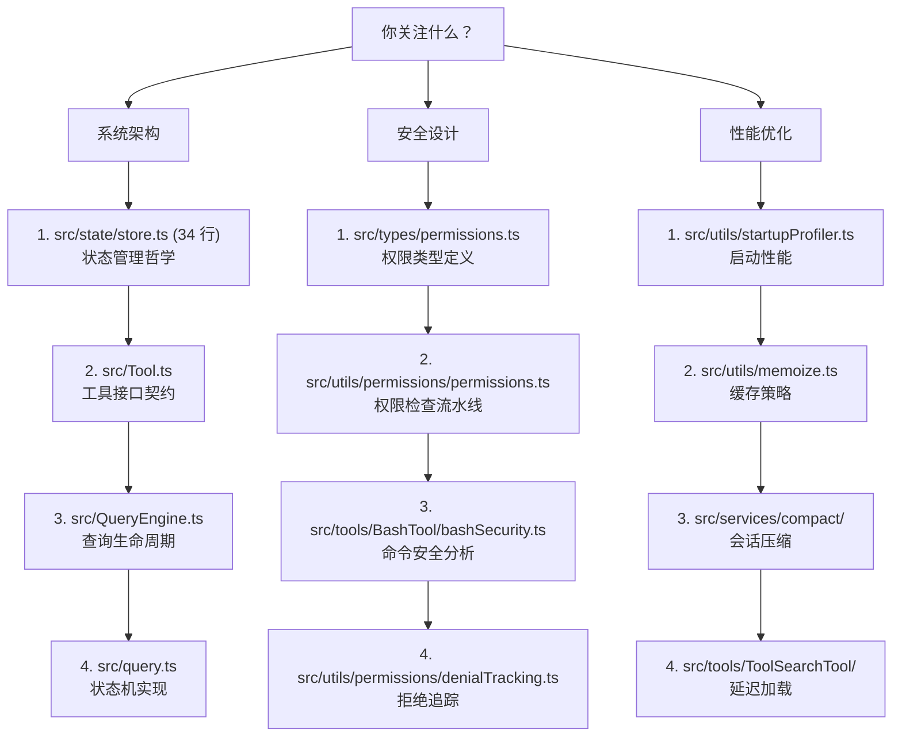

# 第 25 章：工程哲学
> “代码是一种思想的结晶。当我们审视一个大型系统的架构时，我们看到的不仅是技术决策，更是一种工程文化的表达。”通过前 24 章对 Claude Code 源码的深入分析，我们可以提炼出其背后的工程哲学。这些原则不是事后总结的空洞口号，而是从代码中浮现的、经过实践检验的设计信条。

## 引导思考

| 思考维度 | 内容 |
|----------|------|
| **它为什么存在** | <ul><li>前 24 章看的是代码和技术决策，最后一章提炼背后的工程文化——代码怎么写不只是技术问题，更是价值观的表达</li><li>这些原则不是空话，是从 49 万行代码里浮现出来的设计信条</li></ul> |
| **它解决什么问题** | <ul><li>统一理解整个代码库的视角：为什么 Claude Code 是这么设计的</li><li>提炼 5 条生产级 AI Agent 法则——崩溃假设、非确定性接受、成本约束、上下文管理、信任保护</li></ul> |
| **它在系统中的位置** | <ul><li>不与具体代码文件对应，而是全书的升华和总结</li><li>和第 1 章首尾呼应——从整体到细节再回到整体</li></ul> |
| **它如何工作** | <ul><li>安全优先：默认拒绝 + 多层防线 + 动态降级——安全是起点不是补丁</li><li>渐进式复杂性：34 行的 Store（简单）→ 五层架构（复杂）→ 界面渐进暴露</li><li>数据驱动：BQ 注释贯穿源码——每个优化都有生产数据支撑</li></ul> |
| **它如何实现** | <ul><li>BQ 注释作载体的数据驱动文化（例：BQ-2026-03-10 的 1279 个异常会话 → 引入断路器）</li><li>Plugin-First 思维：工具、MCP、命令都提供扩展点不是硬编码</li><li>可组合性胜过单体：Store + onChange + Selector 的组合胜过大而全的框架</li></ul> |
| **不同平台如何做** | <ul><li><strong>Cursor Agent</strong>：AI First IDE，融入开发者工作流，安全靠 VS Code 沙箱</li><li><strong>OpenClaw</strong>：分布式 Agent 协作哲学，多节点安全和容错是核心</li><li><strong>Harness Agent</strong>：DevOps 企业工程，合规性和审计压过一切</li></ul> |
| **优势是什么？** | <ul><li><strong>优势</strong><ul><li>安全不可协商 + 多层防御</li><li>数据驱动而非直觉驱动</li><li>可组合原语胜过大而全框架</li></ul></li></ul> |

---

## 25.1 安全优先

### 25.1.1 安全是设计的起点，不是事后补丁
在 Claude Code 的架构中，安全不是一个独立的模块，而是渗透在每个设计决策中的基本原则。
**默认拒绝**。权限系统的默认模式是 `'default'`（需要确认），不是 `'auto'`（自动允许）。用户必须显式选择更宽松的模式。这意味着任何新功能如果遗忘了权限检查，其行为是“阻塞等待确认“而非“静默执行“。
**多层防线**。一个工具调用需要通过多层检查：
**动态降级**。即使某个安全检查在启动时可用，后续加载的远程配置仍可以禁用它（`isBypassPermissionsModeDisabled`）。安全级别只能提升，不能降低。

### 25.1.2 安全边界的显式表达
代码中的安全边界不是隐含的约定，而是类型系统强制的契约：
这个类型名本身就是一份声明 —— 每个使用者都必须确认数据不包含代码或文件路径。类型名的冗长是故意的，它迫使开发者在使用时停下来思考。

### 思考笔记

- "安全不可协商"（Security is non-negotiable）是 Claude Code 的首要工程原则——不是"安全很重要"，而是"安全是前提"。
- 多层防御（Defense in Depth）是安全设计的核心思想：没有一层防御是完美的，但层层叠加让攻击成本指数级上升。
- 纵深防御在 Bash 安全中体现得最极致：解析器 → 模式检测 → 路径校验 → 沙箱，攻破一层还有下一层。
- 安全 vs 体验的平衡是 AI Agent 系统中最难的权衡——auto 模式（分类器自动放行）就是这个权衡的最佳答案。

---
## 25.2 可扩展性

### 25.2.1 Plugin-First 思维
Claude Code 的工具系统、MCP 服务器、命令系统都是可扩展的。核心并不“硬编码“功能，而是提供扩展点：

### 25.2.2 AppState 的“有机增长“
AppState 的 450 行类型定义看似庞大，但它的增长是有机的 —— 每个字段都对应一个具体的功能需求，而非预先设计的空壳。注释清楚地解释了每个字段的来由：

### 25.2.3 编译时可扩展性
`feature()` 宏提供了编译时的可扩展性 —— 不同构建可以包含不同的功能集，而源码保持统一。这比运行时特性开关更高效，因为不满足的代码路径被完全消除。

### 思考笔记

可扩展性不是"加功能的能力"，而是"在加功能时不破坏现有功能的能力"。

- Tool 接口的统一抽象让 40+ 内置 + 不限量 MCP 工具共存——新工具只需实现接口。
- Skill 和插件系统让用户不需要修改源码就能扩展功能——平台思维 vs 应用思维。
- MCP 协议的可扩展性最有说服力——任何遵守 MCP 协议的服务都能成为其能力。
- 可扩展性的代价：接口一旦稳定，修改成本急剧升高。

---
## 25.3 可观测性

### 25.3.1 日志与追踪
Claude Code 集成了 OpenTelemetry 追踪：

### 25.3.2 分析事件
关键操作都附带分析事件：

### 25.3.3 数据驱动的改进
代码注释中反复引用的 BQ（BigQuery）数据分析，展示了一个完整的可观测性闭环：
示例：
- “BQ 2026-03-10: 1,279 sessions had 50+ consecutive failures” → 引入断路器- “BQ 2026-03-01: 20% false positives in cache break detection” → 修复基线重置
### 25.3.4 调试日志
`logForDebugging` 函数提供了条件调试日志，仅在 verbose 模式下可见：

### 思考笔记

可观测性不是"加日志"，而是"在不修改代码的前提下理解系统内部状态"。

- profileCheckpoint 的内建可观测性——所有启动阶段都在代码层面做了打点。
- Statsig 数据分析驱动优化——不是"觉得这里慢"就优化，而是"数据说有 0.5% 的用户在这里遇到延迟"。
- 可观测性的三个支柱：日志（事件）、指标（数值）、追踪（链路）。
- 在 AI Agent 系统中，可观测性更难——因为模型决策不透明，"为什么模型选择了这个工具"常常无法回答。

---
## 25.4 渐进式复杂性

### 25.4.1 简单的事情保持简单
Store 的 34 行实现是这一原则的极致体现。它没有中间件、没有 devtools、没有时间旅行调试。当你只需要一个状态容器时，34 行就够了。

### 25.4.2 复杂的事情被分层管理
当简单不够时，复杂性被分层注入：
每一层只添加它负责的复杂性。Layer 1 不知道 React，Layer 2 不知道副作用，Layer 3 不知道 UI。

### 25.4.3 特性的渐进式暴露
用户界面也遵循渐进式复杂性：
- **默认**：简单的输入框和消息列表- **Shift+Tab**：权限模式切换- **Ctrl+T**：任务面板- **Vim 模式**：完整的 Vim 编辑- **配置文件**：键绑定自定义、主题、插件新用户不需要了解 Vim 模式就能使用 Claude Code。专家用户可以逐步发现高级功能。

### 思考笔记

- 渐进式复杂性（Gradual Complexity）的核心理念：系统应该简单到足以让你快速上手，又复杂到足以应对最极端的需求。
- 默认设置应该是针对 95% 用户的——复杂的配置项存在但不是必须，用户按需解锁更高级的功能。
- 这个原则在权限模式中最明显：default（全部询问）→ accept（逐步信任）→ auto（智能判断）→ allow（全部放行），用户从最简单开始，需要时再升级。
- 工程哲学层面的启示：好的系统不是功能最多的系统，而是"在你需要的时候它就在那里，在你不需要的时候它不打扰你"的系统。

---
## 25.5 生产级 Agent 工程法则

### 25.5.1 法则一：永远假设会崩溃
JSONL 只追加日志保证崩溃安全。`filterUnresolvedToolUses` 处理崩溃后的残留状态。`deserializeMessages` 的五层过滤管道清理各种异常数据。

### 25.5.2 法则二：非确定性是常态，不是异常
AI 模型的输出是非确定性的。Claude Code 的设计接受这一现实：
- 压缩摘要使用结构化 Prompt 而非精确模板- 权限系统不依赖模型的“承诺“- 断路器处理“有时失败“的操作
### 25.5.3 法则三：成本是一等约束
每个 API 调用都有真实成本。Token 预算追踪、自动压缩、MicroCompact 的工具输出裁剪 —— 所有这些都是成本优化措施。`CostThresholdDialog` 是最后的安全网。

### 25.5.4 法则四：上下文是最宝贵的资源
200K Token 的上下文窗口看似很大，但在数小时的编码会话中会迅速耗尽。Claude Code 围绕上下文管理构建了一整套体系：
- **精确注入** —— 只注入相关的 CLAUDE.md 和上下文- **及时裁剪** —— MicroCompact 移除过时的工具输出- **智能压缩** —— 分层压缩策略（Session Memory → 全量压缩）- **增量保持** —— Partial Compact 保留最近的消息原文
### 25.5.5 法则五：用户信任是最难获得也最易失去的
权限系统的严格默认、成本阈值警告、自动更新的用户确认 —— 所有这些都在保护用户信任。一次意外的 `rm -rf` 就能毁掉所有积累的信任。

### 25.5.6 法则六：可组合性胜过单体
Store + onChange + Selector 的组合胜过一个大而全的状态管理框架。AsyncGenerator 的组合胜过一个复杂的事件总线。`feature()` + DCE 的组合胜过运行时条件分支。
选择小的、可组合的原语，而非大的、不可分割的框架。

### 思考笔记

生产级 Agent 系统需要的不仅是"能跑"，更是"能持续跑"——稳定性、可维护性、可调试性。

- 错误恢复链不是"好用的功能"而是"生存必需品"——在 7×24 运行中，错误是常态而非异常。
- 安全不可协商——Bash 安全的 18 个文件不是过度设计，而是生产级系统的门槛。
- 渐进式发布（feature flag）让新功能从内测到外测逐步开放——出现问题的影响面可控。
- 数据驱动决策：不靠"我觉得"，而靠"数据显示"——BQ 的 0.5% 采样率就是这种文化的体现。

---
## 25.6 数据驱动的工程文化

### 25.6.1 BQ 注释：代码与生产数据的桥梁
Claude Code 源码中最独特的文化标识之一是遍布各处的 BQ（BigQuery）注释。这些注释将代码变更与真实的生产数据直接关联：
这些注释不仅是历史记录，更是**设计决策的证据链**。每个优化都有数据支撑，每个安全措施都有事故教训。

### 25.6.2 量化一切
Claude Code 团队对性能的量化精度令人印象深刻：
这不是“我觉得这可能有性能问题“式的优化，而是“数据显示这里每周浪费 X 十亿 token“式的精准打击。

### 25.6.3 反馈闭环
这个闭环确保了工程决策不是基于直觉，而是基于证据。当一个优化被提出时，它必须回答：“数据说什么？”

### 思考笔记

数据驱动的工程文化不是"多写测试"，而是"用数据指导所有决策"——从功能优先级到性能优化。

- BQ 数据驱动的测试优先级——不是写所有测试，而是写 ROI 最高的测试。
- 0.5% 采样率的 profileCheckpoint 在不影响用户体验的前提下收集启动性能数据。
- "安全隔离"和"数据收集"的平衡——用户数据被采样而非全量收集，隐私和效率兼顾。
- 数据驱动需要数据基础设施——没有数据管道和分析工具，"数据驱动"只是口号。

---
## 25.7 给后来者的建议

### 25.6.1 阅读注释
Claude Code 的代码注释不是冗余的文档，而是设计决策的记录。特别是以 “BQ”、“CC-” 开头的注释，它们连接了代码变更与真实的生产问题。

### 25.6.2 理解 feature() 的边界
在阅读代码时，`feature()` 包裹的代码块标记了内部特性的边界。外部构建中这些代码不存在，理解这一点对理解代码的“可见范围“至关重要。

### 25.7.3 从 Store 开始
如果只有时间读一个文件，读 `src/state/store.ts`。34 行代码中包含了 Claude Code 架构哲学的精华 —— 简洁、显式、可组合。

### 25.7.4 三个阅读入口
根据你的兴趣，选择不同的源码阅读路径：

### 思考笔记

如果只能从这 25 章中带走三件事——那么应该是这三件。

- 安全优先：不是一个特性，而是所有设计的前提。一个安全漏洞可能葬送整个系统。
- 数据驱动：你的直觉很可能错了。在系统部署前埋好测量点，让数据告诉你真相。
- 渐进式复杂：从最简单的方案开始，在真实使用中逐步演化。34 行的 Store 比 Redux 更适合 Claude Code。
- 这些原则不是孤立的——它们相互支撑：安全需要可观测性来验证，可观测性需要数据驱动来落地，数据驱动需要渐进式复杂来保持迭代速度。

---
## 本章小结
Claude Code 的工程哲学可以用一句话概括：**在安全的框架内，用最简单的手段解决真实的问题**。
安全是不可协商的底线。简单是持续追求的目标。真实问题（而非假想的需求）是每个设计决策的起点。数据（而非直觉）是改进的依据。
这些原则不是 Claude Code 独创的，但它在一个前所未有的领域 —— 生产级 AI Agent 工程 —— 中忠实地实践了它们。当我们回顾这个项目时，最令人敬佩的不是任何单个技术创新，而是在不确定性的海洋中保持工程纪律的能力。

