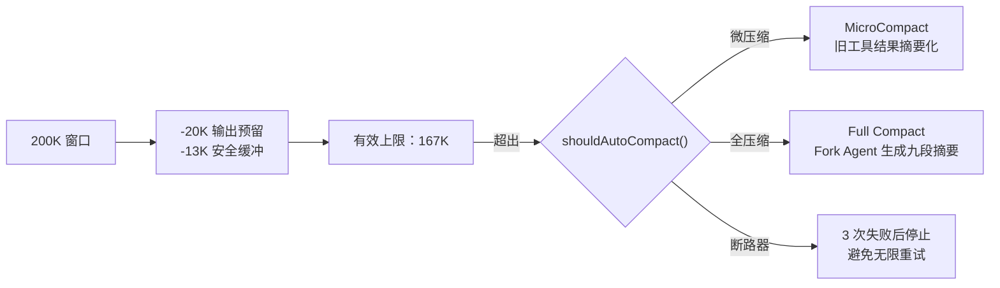
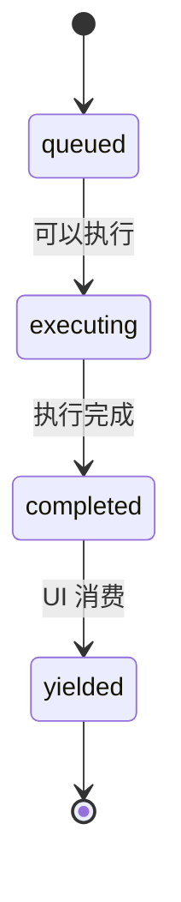
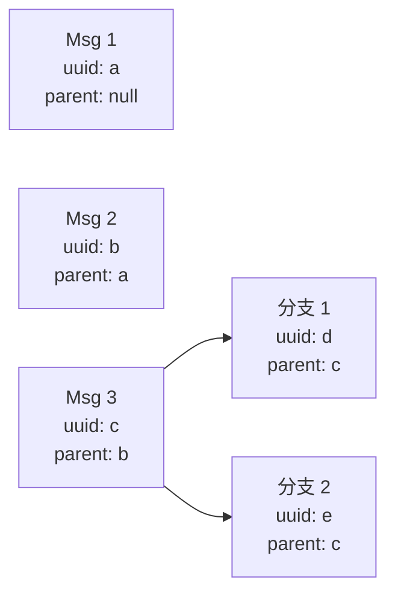
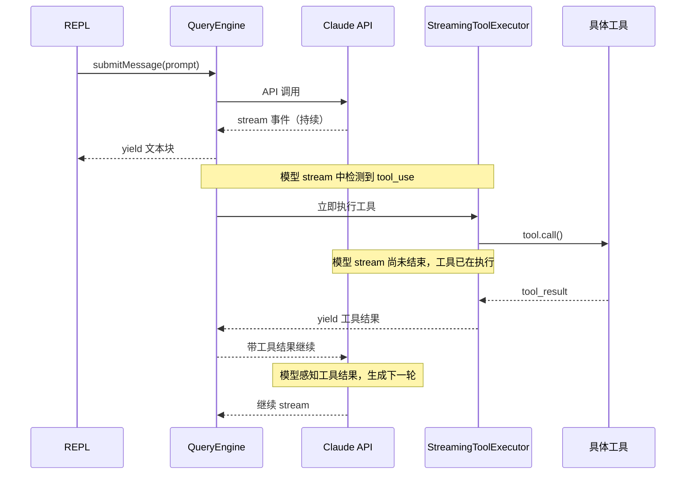

# 第 26 章：认知循环

> "构建一个 AI Agent 系统，本质上是在回答六个问题：生命周期怎么管？上下文怎么控？工具怎么调？任务怎么执？状态怎么维？循环怎么转？"

> 前 25 章从各个角度拆解了 Claude Code 的源码架构。本章换一个视角：不重复"它是什么"，而是回答"**怎么做**"。如果你要构建一个生产级 AI Agent，这六个问题就是你的设计清单。

## 引导思考

| 思考维度 | 内容 |
|----------|------|
| **它为什么存在** | <ul><li>前 25 章回答了"Claude Code 是什么"，本章回答"怎么构建一个 AI Agent"</li><li>六个问题是每个 Agent 系统的设计清单——生命周期、上下文、工具、任务、状态、循环</li></ul> |
| **它解决什么问题** | <ul><li>从源码分析跨越到架构设计——从一个读者变成一个构建者</li><li>提供可复用的模式：QueryEngine 生命周期容器、ToolUseContext 注入、StreamingToolExecutor 状态机、createStore 状态核心</li></ul> |
| **它在系统中的位置** | <ul><li>位于全书结尾，但不只是总结——是从"理解"到"构建"的桥梁</li><li>与前 25 章的关系：源码分析 → 模式提取 → 设计指南</li></ul> |
| **如何组织 Agent 生命周期** | <ul><li>用 `QueryEngine` 作为有状态的生命周期容器，`AsyncGenerator` 逐步产出而非黑盒等待</li><li>`queryLoop` 无限循环状态机，显式 Terminal vs Continue 转移</li><li>Fork 机制实现生命周期分支，共享 prompt cache</li><li>6 阶段生命周期 + 多层错误恢复（token escalate → compact → fallback）</li></ul> |
| **如何管理上下文** | <ul><li>`ToolUseContext` 40+ 字段的依赖注入容器，双通道状态隔离</li><li>三层构建：系统提示 + 用户输入 + 消息归一化</li><li>三层压缩：MicroCompact → Full Compact → 断路器</li><li>BudgetTracker 跟踪 token，子代理独立预算</li></ul> |
| **如何调用工具** | <ul><li>输入驱动属性推断——`BashTool("ls")` 只读，`BashTool("rm")` 破坏性</li><li>`buildTool()` 工厂 + fail-closed 默认值</li><li>四态并发调度 + 错误级联（仅 Bash 级联）</li><li>三层结果保护 + pre/post hooks 扩展</li></ul> |
| **如何执行任务** | <ul><li>`AgentTool` 创建子 Agent，`runAsyncAgentLifecycle` 管理完整生命周期</li><li>Handoff 分类器独立审查——信任但验证</li><li>Fork（共享上下文）vs Resume（从 transcript 重建）</li><li>技能系统 Inline/Fork 双模执行</li></ul> |
| **如何维护工作区状态** | <ul><li>34 行 `createStore` —— 函数式 updater + `Set<Listener>`</li><li>`AppState` 领域化组织，`onChangeAppState` 集中副作用</li><li>JSONL append-only + 预写 transcript 实现崩溃安全</li><li>`FileStateCache` 双重 LRU + `isPartialView` 强制预读</li></ul> |
| **如何形成持续认知循环** | <ul><li>AsyncGenerator 管道链 + 拉式背压 —— 无需显式流量控制</li><li>StreamingToolExecutor 使行动与感知重叠——减少端到端延迟</li><li>REPL 作为中枢 + 三种策略模式 + 会话恢复</li><li>BQ 反馈循环实现元认知——每次改进可追溯到生产数据</li></ul> |

---

## 26.1 如何组织 Agent 生命周期

<div class="thinking-note">
### 思考笔记

Agent 生命周期是一个容易被低估的设计维度。很多 AI Agent 实现把生命周期等同于"调一次 API 等结果"，这忽略了 Agent 系统的三个本质特征：

- **有状态** — Agent 不是一个函数调用，而是一个持续的对话。生命周期容器需要持有会话状态，状态在多次交互间持久化，而不是每次调用重建。
- **可中断** — 用户可能随时终止、模型可能出错、上下文可能溢出。生命周期不是线性的，而是需要处理各种中断和恢复。
- **可分支** — 子任务、后台任务、并行探索——一个 Agent 可能需要创建子 Agent，子 Agent 需要独立于父级的生命周期。

Claude Code 的 QueryEngine 容器 + queryLoop 状态机 + Fork 机制回答了这三个问题。下面展开具体做法。

</div>
### 用 QueryEngine 作为生命周期容器

每个 Agent 会话绑定一个 `QueryEngine` 实例。它不是一次性的函数调用，而是一个**有状态的生命周期容器**——状态在多次 `submitMessage()` 调用间持久化。

```typescript
// src/query/queryEngine.ts — 生命周期容器
export class QueryEngine {
  // 唯一入口：接收输入，返回增量消息流
  async *submitMessage(options: {
    prompt: string
  }): AsyncGenerator<Message>

  // 内部维护的消息列表——贯穿整个生命周期
  private mutableMessages: Message[]
}
```

**设计原则**：`submitMessage()` 返回 `AsyncGenerator` 而非 `Promise`。这意味着调用方可以逐步消费产出，而非等待整个周期结束。你的 Agent 也应该如此——让外部能够感知内部的进展，而不是黑盒等待。

### 用状态机驱动循环迭代

`queryLoop` 是一个无限循环状态机。每次迭代要么返回**终止原因（Terminal）**，要么返回**继续原因（Continue）**：

```typescript
// queryLoop 的转移类型
type Transition =
  // 终止态——生命周期结束
  | { reason: 'completed' }
  | { reason: 'max_turns' }
  | { reason: 'model_error' }
  | { reason: 'prompt_too_long' }
  // 继续态——进入下一轮
  | { reason: 'next_turn' }
  | { reason: 'collapse_drain_retry' }
  | { reason: 'reactive_compact_retry' }
  | { reason: 'max_output_tokens_escalate' }
```

**做法**：不要用简单的 `while(true)`，而是用显式的状态转移。每次迭代的 `Continue` 原因告诉下一轮该做什么——是继续对话、压缩上下文后重试、还是提升 token 上限。`State.transition` 字段记录上一次的原因，让不同迭代可以做出不同决策。

### 用 Fork 实现生命周期分支

Fork 机制受 Unix `fork()` 启发——子 Agent 继承父级的完整上下文，但在独立空间中执行：

```typescript
// forkSubagent.ts — 生命周期分支
async function* forkSubagent(context: ToolUseContext, agent: AgentDefinition) {
  // 1. 构建共享前缀消息（prompt cache 共享）
  const messages = buildForkedMessages(context.messages)

  // 2. 创建独立的生命周期容器
  const engine = new QueryEngine({ model: agent.model, permissionMode: 'bubble' })

  // 3. 在独立循环中执行
  for await (const event of engine.submitMessage({ prompt })) {
    yield event
  }
  // 4. 子生命周期结束，控制权返回父级
}
```

关键是**字节精确共享前缀**：所有 Fork 子代的 prompt cache 前缀完全相同。第一个子代创建 cache，后续子代命中——差异仅在于最后几十个 token。这让子 Agent 的创建成本接近于零。

### 管理生命周期的 6 个阶段

每个 Agent 实例经历六个阶段，每个阶段都有明确的职责：

| 阶段 | 做了什么 | 关键代码 |
|------|----------|----------|
| 创建 | 实例化 QueryEngine，配置参数 | `new QueryEngine(options)` |
| 上下文构建 | 组装系统提示、加载配置 | `fetchSystemPromptParts()` |
| 执行 | 循环迭代，调用 API、处理流、执行工具 | `queryLoop` |
| 观察 | 消费工具结果，编码回消息流 | `createUserMessage({tool_result})` |
| 终止 | 返回 Terminal 状态 | `yield { reason: 'completed' }` |
| 清理 | 释放控制器、发送完成通知 | `runAsyncAgentLifecycle()` |

**错误恢复策略**：`max_output_tokens` 有两阶段恢复（8K → 64K，最多 3 次重试），`prompt_too_long` 有降级链（drain collapse → reactive compact → surface error）。模型降级通过 `FallbackTriggeredError` 触发，同时剥离 thinking signature。一个 **withhold** 机制抑制错误消息 yield，直到所有恢复选项耗尽。


<div class="thinking-note">
### 思考笔记

- 六个问题（生命周期、上下文、工具、任务、状态、循环）构成了一个完整的设计清单——回答完这六个问题，你就拥有了一套 Agent 系统的架构蓝图。
- 生命周期管理的核心不是 QueryEngine，而是"状态机 + 可监督循环"——任何时候中断都不会丢状态，任何时候恢复都能从断点继续。
- QueryEngine 作为生命周期容器的设计意味着：整个 Agent 对话的完整历史（mutableMessages）始终在内存中，submiMessage 只是它的一个接口。
- 生命周期设计的关键决策：状态的归属。mutableMessages 属于 Engine，权限缓存属于 Permission，Store 属于 App——谁的状态谁管。

</div>

---
## 26.2 如何管理上下文

<div class="thinking-note">
### 思考笔记

上下文管理是 Agent 系统中最容易被忽视但也是最关键的工程问题。API 给你一个 200K 的窗口，但你怎么填满它决定了 Agent 的质量。核心矛盾是：**模型需要更多上下文才能做出更好决策，但上下文越多，成本越高、速度越慢、精度越低**。这不是一个"越多越好"的问题。

三个关键洞察：

- **上下文不是全局的，而是作用域的** — 父 Agent 和子 Agent 需要不同的上下文视野。ToolUseContext 的双通道状态隔离（`setAppState` vs `setAppStateForTasks`）解决了这个问题。
- **压缩不是事后补救，而是运行时策略** — 每次 API 调用前都应该评估上下文预算，决定保留什么、替换什么、丢弃什么。不是等超出窗口才压缩。
- **上下文预算需要显式跟踪** — `BudgetTracker` 不是可选的——没有它，你不知道什么时候会超出窗口。子代理的被显式排除在父级预算之外，避免挤占。

下面看 Claude Code 的具体做法。

</div>
### 用 ToolUseContext 作为注入容器

上下文是 Agent 的"空气"——无处不在但不能膨胀。`ToolUseContext` 是一个 40+ 字段的结构体，作为每个工具调用的依赖注入：

```typescript
// ToolUseContext — 上下文注入容器
interface ToolUseContext {
  // 配置层
  options: ToolOptions

  // 状态管理层
  abortController: AbortController
  setAppState: (updater: (prev: AppState) => AppState) => void
  setAppStateForTasks: (updater: (prev: AppState) => AppState) => void

  // UI 交互层
  write: (msg: string | Uint8Array) => void

  // 内容管理层
  readFileState: FileStateCache
  contentReplacementState: ContentReplacementState
}
```

**关键设计**：状态管理的读写分离为两个通道。`setAppState` 在当前 Agent 作用域内隔离（子代理中变为 no-op），`setAppStateForTasks` 穿透到根 Store。这防止了嵌套 Agent 间的状态泄漏。

### 三层上下文构建

不要在一条路径里组装上下文。分三阶段：

1. **系统提示组装**：`fetchSystemPromptParts()` 加载 CLAUDE.md、AGENTS.md、内置提示、工具列表、MCP 资源、技能列表——按优先级合并
2. **用户输入处理**：`processUserInput()` 处理图片粘贴、文件引用解析、Meta 消息标记
3. **消息归一化**：`normalizeMessagesForAPI()` 将内部的 7+ 种消息类型转换为 API 可接受的 user/assistant 交替格式——包括附件重排序、连续 user 合并、system→user 转换、媒体剥离

### 用三层压缩保护上下文窗口

200K token 的窗口是有限资源。三层保护：

```typescript
// BudgetTracker 的关键阈值
const COMPLETION_THRESHOLD = 0.9    // 用到 90% 预算就停
const DIMINISHING_THRESHOLD = 500   // 连续两次续写 < 500 token 就停
```



**MicroCompact**（又称 Snip）：用 `[Old tool result content cleared]` 标记替换旧的工具输出，基于时间策略——越旧的输出越优先清除。

**Full Compact**：用 Fork Agent 生成结构化的九段对话摘要，包含 `<analysis>`（模型草稿，最终被剥离）和 `<summary>` 标签。

**断路器**：限制连续压缩失败不超过 3 次。这个设计来自生产数据——在引入断路器之前，1,279 个会话出现 50+ 次连续失败（最多 3,272 次），每天浪费约 250K API 调用。

### 子代理的 token 预算隔离

子代理被显式排除在父 Agent 的 token 预算之外：

```typescript
// BudgetTracker 中通过 agentId 排除子代理
if (options.agentId) return // 子代理不计入父级预算
```

每个子代理的 token 消耗由各自的 `agentId` 独立跟踪。这让嵌套 Agent 的上下文预算可预测，不会因为子代理的长时间运行而挤占父级的上下文窗口。


<div class="thinking-note">
### 思考笔记

- 上下文管理是 AI Agent 系统中最棘手的问题——没有之一。因为"上下文窗口有限"这个事实是所有 LLM 应用的根本约束。
- 三层压缩策略（MicroCompact → Compact → Summary）不是三个独立的方案，而是一条"由快到慢、由轻到重"的降级链——快速尝试不行就上重型方案。
- Context Budget 的概念把 token 从"技术细节"提升到了"架构层面"——每个模块都需要知道自己用了多少 token，以及当预算不够时该怎么降级。
- 上下文管理的最高境界不是压缩，而是"预测"——在 token 还没超限时就知道快超了，并提前开始准备压缩。

</div>

---
## 26.3 如何调用工具

<div class="thinking-note">
### 思考笔记

工具是 Agent 的行动单元。怎么设计工具系统，决定了 Agent 能做到什么、不能做什么。这里有两个容易被忽略的设计选择：

- **安全属性由输入决定，而非工具类型** — 同一个 `BashTool`，`ls` 是只读安全的，`rm -rf /` 是破坏性的。这一选择带来巨大灵活性：不必为每种操作创建单独的工具，由同一工具根据输入自适应行为。
- **失败关闭（fail-closed）默认值** — 工具的每个安全属性（是否可并发、是否只读、是否需要权限）都有默认值，默认值都是保守的。忘记配置安全性 = 选择了最安全的行为——这在安全工程中是明智的。
- **输入驱动属性推断** — `isConcurrencySafe(input)` 的参数是具体的工具参数，因此同一个工具在不同输入下可以表现出不同的并发安全性。这是工具系统灵活性与安全性的统一。

下面看具体实现。

</div>
### 用泛型接口定义工具

工具是 Agent 的行动单元。`Tool<Input, Output, P>` 是一个 30+ 方法的参数化接口：

```typescript
// Tool.ts — 泛型工具接口
interface Tool<Input, Output, P = undefined> {
  // 必须：输入 Schema、执行函数
  inputSchema: ZodSchema<Input>
  call(input: Input, context: ToolUseContext): Promise<Output>

  // 输入驱动的属性推断
  isConcurrencySafe(input: Input): boolean  // 同输入下是否可并发
  isReadOnly(input: Input): boolean         // 是否是只读操作
  isDestructive(input: Input): boolean      // 是否破坏性操作

  // 可选：UI 渲染
  renderToolUse?(input: Input): React.ReactNode
  renderToolResult?(output: Output): React.ReactNode
}
```

**核心原则：输入驱动的属性推断**。同一个 BashTool，执行 `ls` 时是只读且支持并发的，执行 `rm -rf /` 时是破坏性的。区别完全由**输入**决定，不是由工具类型决定。这让工具系统既能灵活复用，又能精确控制安全边界。

### 用 buildTool 工厂确保安全默认值

所有工具通过 `buildTool()` 工厂创建，自动合并安全默认值：

```typescript
const TOOL_DEFAULTS = {
  isConcurrencySafe: false,  // 默认不可并发
  isReadOnly: false,         // 默认需要写入权限
  checkPermissions: 'allow', // 默认委托给权限系统
}
```

**失败关闭（fail-closed）原则**：如果新功能忘记实现某个安全配置，默认行为是阻塞而非放行。`isConcurrencySafe` 默认 false（保守），`isReadOnly` 默认 false（保守）。

### 用四态状态机管理工具执行

`StreamingToolExecutor` 是一个四态状态机，对流式到达的工具调用进行渐进式调度：



**并发调度规则**（真值表）：

| 当前执行中的工具 | 新工具 | 行为 |
|----------|--------|------|
| 无 | 任意 | 立即执行 |
| 并发安全 | 并发安全 | 并行执行 |
| 并发安全 | 非并发安全 | 排队等待 |
| 非并发安全 | 任意 | 排队等待 |

`canExecuteTool()` 实现这个规则。`processQueue()` 遍历队列时，遇到无法执行的非并发工具会 **break**——后续工具不能跳过它先执行。

**错误级联**：只有 Bash 错误会取消兄弟工具。`this.hasErrored` 设置后，`siblingAbortController.abort('sibling_error')` 中止所有兄弟。Read、WebFetch 等独立工具的错误不会级联——"Bash 命令常有隐式依赖链（mkdir 失败 → 后续命令无意义），但 Read/WebFetch 是独立的——一个失败不应摧毁其它。"

### 三层结果大小保护

工具输出可能非常大。三层保护防止溢出：

```typescript
// 第一层：工具级阈值
const THRESHOLDS = {
  BashTool: 30_000,
  GrepTool: 20_000,
  FileReadTool: Infinity,  // 读文件结果不入磁盘，不怕循环
  FileEditTool: 100_000,
}

// 第二层：超出阈值时存到磁盘，给模型 2000 字预览
if (result.length > threshold) {
  persistToolResult(result)       // 写入 .claude/tool-results/
  return preview + '[查看完整内容](file://...)'
}

// 第三层：全局 ContentReplacementState 在每次 API 调用前运行
// 用简短摘要替换旧的不相关工具结果
enforceToolResultBudget(messages, budget)
```

### 用 pre/post hooks 扩展执行链

工具执行前后可以挂载钩子：

- **Pre-hooks**：7 种产出——`message`、`hookPermissionResult`、`hookUpdatedInput`、`preventContinuation`、`stopReason`、`additionalContext`、`stop`
- **Post-hooks**：修改工具输出（如过滤 MCP 工具的敏感信息）
- 执行超过 500ms 时 UI 显示性能摘要

## 26.4 如何执行任务

<div class="thinking-note">
### 思考笔记

任务执行是 Agent 系统从"单轮对话"跨越到"持续工作"的关键能力。单一 Agent 的能力边界是有限的——它只能在一个上下文窗口内、一个模型调用序列中工作。要让 Agent 处理复杂任务，需要**任务分解**。

Claude Code 的任务执行模型有三个层次：

- **工具调用** — 任务的最小单元：一次 read、一次 write、一次 bash。每个工具调用是一个原子操作。
- **工具序列** — 模型在同一次 queryLoop 中发出的多个工具调用，可能有并发依赖关系。StreamingToolExecutor 管理它们的调度与执行。
- **子 Agent** — 最粗粒度的任务单元：一个独自执行完整认知循环的独立 Agent。拥有自己的生命周期、token 预算、但共享父级上下文。

关键设计：Fork 机制实现"共享上下文但独立执行"——子 Agent"看到"的东西和父级一样，但它做的决策和行动是独立的。另一个值得注意的模式是 Handoff 分类器——子 Agent 完成任务后独立审查其行动，实现"信任但验证"。

</div>
### 用 AgentTool 创建子 Agent

`AgentTool` 是一个特殊工具——不执行具体操作，而是创建并运行子 Agent：

```typescript
interface AgentToolInput {
  name: string      // 子 Agent 名称
  task: string      // 任务描述
  agent?: string    // 使用的 Agent 定义（Explore / Plan / GeneralPurpose）
  workers?: string[] // 可调用的子 Agent 类型
}
```

**做法**：不要硬编码子 Agent 的逻辑。通过 Agent 定义系统（`getBuiltInAgents()`）注册不同类型的 Agent，每个 Agent 有自己的工具集、模型、权限模式。调用方按名称引用，系统按优先级链解析（built-in > plugin > user > project > flag > managed）。

### 用 runAsyncAgentLifecycle 管理后台任务

后台任务的完整生命周期：

```typescript
// agentToolUtils.ts — 后台任务生命周期
async function runAsyncAgentLifecycle(task: Task) {
  // 1. 创建进度跟踪器
  const tracker = new ProgressTracker(task.id)

  // 2. 启动周期性摘要
  const summarizer = startAgentSummarization(task.id)

  // 3. 消费消息流，更新 AppState
  for await (const event of agent.submitMessage({ prompt: task.task })) {
    updateTaskState(task.id, event)
  }

  // 4. 分类器独立审查——"信任但验证"
  const result = await classifyHandoffIfNeeded(task.id)

  // 5. 发送完成通知
  notifyCompletion(task.id, result)
}
```

**Handoff 分类器**：子 Agent 完成执行后，一个独立的分类器审查其行动，然后才将控制权返回父级。这是安全模型的关键——子 Agent 在执行时是全能的，但它做了什么需要被独立验证。

### Fork vs Resume：两种执行模式

| | Fork | Resume |
|------|------|--------|
| 何时用 | 对同一上下文做独立分支 | 从持久化的 transcript 恢复 |
| 上下文 | 继承父级完整上下文 | 从 sidechain transcript 重建 |
| 性能 | 共享 prompt cache | 需重建状态 |
| 场景 | 子任务、技能执行 | 会话恢复、中断后继续 |

Resume 在恢复前会应用三层过滤：

```typescript
// resumeAgent.ts — 恢复前的过滤管线
const filtered = pipe(
  sidechainMessages,
  filterUnresolvedToolUses,          // 移除悬空的 tool_use block
  filterOrphanedThinkingOnlyMessages, // 移除孤立 thinking 块
  filterWhitespaceOnlyAssistantMessages, // 移除空内容
)
```

### 用技能系统实现可扩展任务

技能（Skills）双模执行：

- **Inline 模式**：技能提示直接注入主对话上下文，当前轮次的模型直接执行。适合简单、快速的任务。
- **Fork 模式**：`executeForkedSkill()` 启动独立的子 Agent，拥有独立的 token 预算和执行空间。子 Agent 的消息通过进度事件流回 `SkillTool`。适合复杂、长时间运行的任务。

技能通过三种来源发现：文件系统（`~/.claude/skills/`）、代码注册的内置技能、MCP 桥接技能。技能列表有预算约束——限制为上下文窗口的 1%（`SKILL_BUDGET_CONTEXT_PERCENT = 0.01`）。

## 26.5 如何维护工作区状态

<div class="thinking-note">
### 思考笔记

状态管理是 Agent 系统的"后台基础设施"——用户看不到它，但没有它系统无法正常工作。三个容易被忽略的设计原则：

- **状态不是共享的，而是作用域的** — 子 Agent 不应该能修改父 Agent 的状态。`setAppState` 在当前 Agent 作用域内隔离，`setAppStateForTasks` 穿透到根 Store。这个区分是故意设计的——不是所有状态变更都应该全局可见。
- **状态持久化不是日志，而是链** — JSONL 格式加上 `parentUuid` 字段，让消息形成链接链。这是崩溃安全、分支恢复、增量写入的基础。每条消息都知道它的前驱是谁——恢复时只需从 leaf uuid 回溯。
- **副作用应该集中，不应该分散** — `onChangeAppState` 将所有通知路径合并为单一的"扼流点"。不是每个 `setState` 调用都自己去触发通知，而是由这个函数统一分发。降低了状态变更的推理成本——只需看这一个地方就知道状态变更会触发什么。

下面看具体做法。

</div>
### 用轻量级 Store 管理全局状态

整个状态管理核心只有 34 行：

```typescript
// src/state/store.ts — 34 行的状态核心
function createStore<T>(initial: T): Store<T> {
  let state = initial
  const listeners = new Set<Listener<T>>()
  return {
    getState: () => state,
    setState: (updater) => {
      const next = updater(state)
      if (!Object.is(state, next)) {  // 浅比较防无效更新
        state = next
        listeners.forEach(fn => fn(state))
      }
    },
    subscribe: (fn) => { listeners.add(fn); return () => listeners.delete(fn) },
  }
}
```

**设计原则**：不要用 Redux 或 MobX。一个函数式 updater + `Set<Listener>` + `Object.is` 比较就够了。React 端通过 `useSyncExternalStore` 桥接——每个调用独立订阅、独立运行 selector。调用方必须返回原始值或 memoized 值，否则 `Object.is` 会触发无限重渲染。

### 用 AppState 组织状态领域

全局状态按领域组织，不是展平的：

```typescript
// AppState — 领域化状态结构
interface AppState {
  ui: {
    mode: 'plan' | 'auto' | 'default'
    panels: Set<string>
    messages: NormalizedMessage[]
  }
  session: {
    model: string
    permissionMode: PermissionMode
    cwd: string
  }
  tools: {
    executing: Map<string, TrackedTool>
    progress: Map<string, Progress>
  }
  agents: {
    active: Map<AgentId, AgentState>
    tasks: Map<TaskId, TaskState>
  }
  bridge: {
    connected: boolean
    sessionRule?: SessionRule
  }
}
```

类型使用 `DeepImmutable<>` 包装，递归将所有属性标记为 readonly。这保证了权限上下文在工具执行的整个生命周期中不可变——任何修改尝试都会导致编译错误。

### 用 onChangeAppState 集中副作用

将之前分散在 8+ 处的通知路径合并为单一的"扼流点"：

```typescript
// src/state/onChangeAppState.ts — 集中式副作用
// 之前：8+ 处分散的 setState → 通知
// 现在：setState → onChangeAppState → 统一分发

function onChangeAppState(prev: AppState, next: AppState) {
  // 状态变更自动触发相应的副作用
  if (prev.ui.mode !== next.ui.mode) {
    notifyCCR(next.ui.mode)  // 通知 Bridge
  }
  if (prev.session.config !== next.session.config) {
    saveConfig(next.session.config)  // 持久化配置
  }
  // ... 所有副作用都在这里，不再分散
}
```

### 用 JSONL 实现崩溃安全持久化

Transcript 使用 JSONL（JSON Lines）格式——每行一个 JSON 对象，`parentUuid` 字段形成链接链：



**崩溃安全的关键**：用户消息在进入 API 调用前已预写 transcript。如果进程在 API 返回前崩溃，transcript 中的消息链仍然完整——`getLastSessionLog` 可过滤出有效会话用于恢复。

```typescript
// 用户消息 — API 调用前预写（阻塞）
if (persistSession && messages.length > 0) {
  await recordTranscript(messages)  // 阻塞写入
}

// Assistant 消息 — API 返回后写入（fire-and-forget）
if (message.type === 'assistant') {
  void recordTranscript(messages)   // 不阻塞
}
```

为什么 assistant 用 fire-and-forget？因为 `claude.ts` 的流式机制 yield 一个 assistant 消息后会 **mutate** 该消息的 `usage` 和 `stop_reason` 字段。如果 await 写入，后续的 `message_delta` 事件无法及时处理。写入队列的 100ms 延迟 jsonStringify 自然处理了这个竞态。

### 用 FileStateCache 跟踪文件状态

双重 LRU 淘汰策略——最多 100 条 + 最大 25MB：

```typescript
// FileStateCache — 文件状态跟踪
class FileStateCache {
  private maxEntries = 100
  private maxSize = 25 * 1024 * 1024  // 25MB

  get(filePath: string): FileState | undefined
  set(filePath: string, state: FileState): void

  // isPartialView 标记自动注入的文件
  // 如截断的 CLAUDE.md → 强制 Edit/Write 前完整读取
  isPartialView(filePath: string): boolean
}
```

路径经过归一化，处理同一文件被不同路径引用的情况（如 `/home/user/proj/file.ts` vs `./file.ts`）。

## 26.6 如何形成持续认知循环

<div class="thinking-note">
### 思考笔记

认知循环是前面五个问题的**整合层**。生命周期、上下文、工具、任务、状态——如果没有一个持续的循环把它们串起来，它们就是孤立的组件。理解认知循环的关键是不要把它当作串行流水线：

- **感知与行动重叠** — 模型还在 stream 输出时，工具已经在执行。`StreamingToolExecutor` 使行动与感知重叠，减少端到端延迟。模型尚未完成生成时，工具已开始执行。
- **观察反馈到下一轮感知** — 工具结果不是终点——它编码为新的消息，模型在下一轮感知它。这是循环的本质：结果不是终点，而是下一轮的起点。
- **背压是自然的控制机制** — 拉式 Generator 意味着当消费者忙时，生产者自动暂停。写 transcript 慢？API 流就慢。不需要显式流量控制。
- **REPL 作为中枢神经** — 5000+ 行的 `REPL.tsx` 管理双向消息管道、三种策略模式、消息列表、任务面板、会话恢复。
- **BQ 元认知循环** — 代码变更 → 遥测事件 → BigQuery → 洞察 → BQ 注释 → 下一次变更。每个优化决策都可追溯到生产数据。

下面看 Claude Code 的具体实现。

</div>
### 用 AsyncGenerator 管道链构建感知-行动循环

整个认知循环由嵌套的 AsyncGenerator 组成。从底层的 API SSE 流到顶层的 REPL，每一层 yield 给上一层：

```
API SSE Stream
  → queryModelWithStreaming()    // 原始流事件
    → queryLoop()                // 状态机驱动
      → query()                  // 过滤与路由
        → QueryEngine.submitMessage()  // 归一化 yield
          → REPL / SDK           // 消费
```

**拉式背压（pull-based backpressure）** 是自然的流量控制机制：当消费者繁忙时（如写入 transcript），上游 Generator 在 `yield` 处暂停，HTTP 流停止读取，API 服务器减速发送。不需要显式的流量控制逻辑。

### 让行动与感知重叠

`StreamingToolExecutor` 使工具执行与模型流式输出重叠：

```
时间线：
模型输出:  ████████████░░░░░░░░░░
工具执行:  ░░░░░░████████░░░░░░░░
下一轮:    ░░░░░░░░░░░░░░░░██████
```

模型尚未完成生成时，工具已开始执行。这是端到端延迟的关键优化——不是串行的"等模型输出完→执行工具→等下一轮"，而是交叠的"模型边输出、工具边执行、结果边回流"。



### 用 REPL 作为循环的中枢

5000+ 行的 `REPL.tsx` 是认知循环的中枢神经。它管理：

- **双向消息管道**：用户输入下行，模型响应上行，工具结果侧向
- **三种策略模式**：default（手动确认）、plan（仅计划，不执行）、auto（自动确认）
- **消息列表**：`VirtualMessageList` 管理数千条消息的高效渲染
- **任务面板**：`TaskList` 显示正在执行的子代理状态
- **会话恢复**：在启动时从磁盘重建完整认知状态——消息历史、文件缓存、Agent 上下文、工作树状态

### 用 BQ 形成元认知循环

系统的认知循环不仅在运行时存在，还体现在工程文化层面——BQ 反馈循环：

```
代码变更 → 遥测事件 → BigQuery → 洞察 → BQ 注释 → 下一次变更
```

典型例子：

- **BQ-2026-03-10**：1,279 个会话出现 50+ 次连续压缩失败 → 引入断路器
- **BQ-2026-02-15**：34M+ 次 Explore Agent 每周调用 → 添加 `omitClaudeMd: true`，每周节省 5-15 Gtoken
- **BQ-2026-01-20**：1279 个异常会话 → 引入阈值熔断

**做法**：在代码中用 BQ 注释记录每个优化决策的生产数据来源。这不只是文档——是让下一个开发者知道"这个逻辑为什么存在"。你的 Agent 系统的每一次改进，都应该能被追溯到一条生产数据。

### 认知循环的 5 条工程法则

1. **始终假设会崩溃（Assume Crash）**：JSONL append-only 日志 + 预写 transcript，进程崩了也能恢复
2. **非确定性是常态（Embrace Non-determinism）**：模型输出总在变，压缩用结构化 prompt 而非精确模板
3. **成本是第一级约束（Cost as Constraint）**：BudgetTracker、auto-compact、MicroCompact——成本意识贯穿整个循环
4. **上下文是最宝贵的资源（Context is Scarce）**：200K 窗口——精确注入、及时修剪、智能压缩、增量保留
5. **信任是最难赚取的货币（Trust is Hardest）**：权限系统严格默认值、成本阈值警告、自动更新的用户确认——每次迭代都在赚取信任


<div class="thinking-note">
### 思考笔记

- 认知循环（Cognitive Loop）是本章的收束——前五个问题回答了"怎么做"，这个问题回答的是"怎么持续地做"。
- 循环的本质不是"重复"，而是"在循环中积累"——每次查询的输出都成为下一次查询的输入，系统的认知在循环中不断深化。
- 从工程实践来看，认知循环就是"工具-API 循环"：模型决定调工具 → 执行工具 → 结果给回模型 → 模型决定下一步。这个循环是我们理解 Agent 行为的基本单位。
- 学完 26 章，你会发现 Claude Code 的所有设计都指向同一个目标：让这个认知循环尽可能高效、安全、可控地旋转下去。

</div>

---